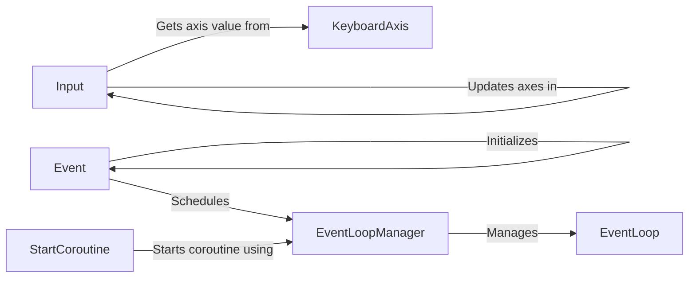

## Component Details

The Input Event Handling subsystem is responsible for capturing and processing user input from various devices like keyboard and mouse. It provides an abstraction layer for accessing input states and dispatches input events to other parts of the application. The core components work together to translate raw input data into meaningful events that drive application behavior.

### Input
The Input class provides a central interface for accessing input devices. It offers methods to query the state of axes (both virtual and raw) and manages the updating of these axes based on the current input device states. It serves as the primary point of interaction for other components needing input data.
- **Related Classes/Methods**: `pyunity.input.Input`

### KeyboardAxis
The KeyboardAxis class represents a virtual axis that is controlled by keyboard input. It maps specific keys to axis values, allowing for easy control of game elements using the keyboard. It provides a method for retrieving the current value of the axis based on the pressed keys.
- **Related Classes/Methods**: `pyunity.input.KeyboardAxis`

### Event
The Event class represents a generic event that can be scheduled and processed by the event loop. It provides a mechanism for deferring the execution of code until a later time, allowing for asynchronous operations and decoupling of components. Input events are often represented as Event objects.
- **Related Classes/Methods**: `pyunity.events.Event`

### EventLoopManager
The EventLoopManager is responsible for managing the event loop, which is the central mechanism for scheduling and processing events. It provides methods for adding events to the loop, starting the loop, and handling exceptions that may occur during event processing. It ensures that events are processed in a timely and efficient manner.
- **Related Classes/Methods**: `pyunity.events.EventLoopManager`

### EventLoop
The EventLoop class represents the actual event loop that processes events. It contains the logic for iterating through the event queue and executing the associated event handlers. It is responsible for maintaining the state of the event loop and ensuring that events are processed in the correct order.
- **Related Classes/Methods**: `pyunity.events.EventLoop`

### StartCoroutine
The StartCoroutine function is used to initiate a coroutine, which is a function that can be suspended and resumed. It allows for complex asynchronous operations to be performed in a more manageable way. It relies on the EventLoopManager to schedule the coroutine for execution.
- **Related Classes/Methods**: `pyunity.events`
