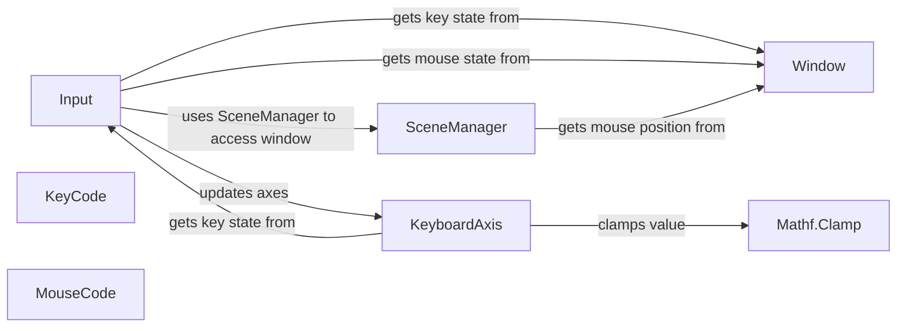

## Component Details

### Input
The Input class serves as the primary interface for accessing input data, providing static methods to query the state of keyboard keys, mouse buttons, and custom axes. It abstracts the underlying input system, allowing developers to retrieve input information without directly interacting with the window or operating system.
- **Related Classes/Methods**: `pyunity.input.Input`

### KeyboardAxis
The KeyboardAxis class represents a virtual axis that is controlled by keyboard input. It maps specific keys to positive and negative axis values, allowing for smooth and continuous input based on key presses. The class calculates the axis value based on the duration and state of the mapped keys, providing a flexible way to handle keyboard-based input.
- **Related Classes/Methods**: `pyunity.input.KeyboardAxis`

### KeyCode
KeyCode is an enumeration that defines all the possible key codes that can be detected by the input system. It provides a standardized way to refer to specific keys on the keyboard, ensuring consistency across different platforms and input devices.
- **Related Classes/Methods**: `pyunity.input.Input`

### MouseCode
MouseCode is an enumeration that defines the mouse buttons that can be detected by the input system. It provides a standardized way to refer to specific mouse buttons, ensuring consistency across different platforms and input devices.
- **Related Classes/Methods**: `pyunity.input.Input`

### SceneManager
The SceneManager class manages the active scene and its runner, providing access to the window for input querying. It acts as an intermediary between the input system and the active scene, ensuring that input events are properly routed and processed.
- **Related Classes/Methods**: `pyunity.scenes.SceneManager`

### Window
The Window class (abstracted by a provider) provides the low-level interface for accessing keyboard and mouse input from the operating system. It encapsulates the platform-specific details of input handling, allowing the rest of the engine to interact with input devices in a platform-independent manner.
- **Related Classes/Methods**: `pyunity.window.abc.Window`

### Mathf.Clamp
The Clamp function constrains a value within a specified range. It is used by the KeyboardAxis to limit the axis value between -1 and 1.
- **Related Classes/Methods**: `pyunity.values.mathf`
