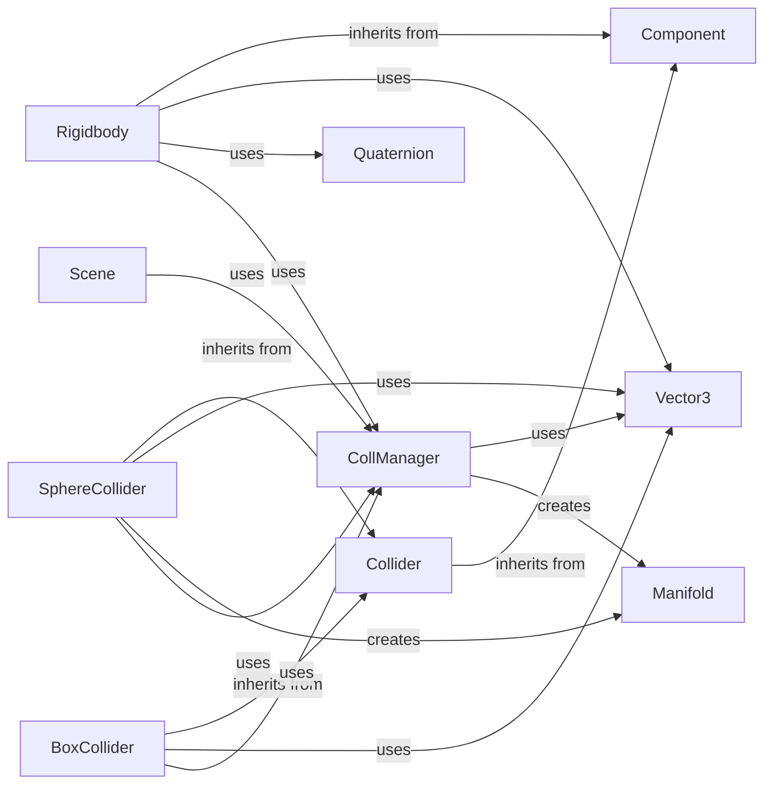

## Component Details

### Collider
The Collider component is an abstract base class for all colliders in the physics engine. It provides a common interface for collision detection and response. Different types of colliders, such as SphereCollider and BoxCollider, inherit from this class and implement specific collision detection algorithms.
- **Related Classes/Methods**: `pyunity.physics.core.Collider`

### Rigidbody
The Rigidbody component applies physics to a GameObject, allowing it to be affected by forces and collisions. It handles movement, force application, and collision responses. It uses Vector3 for position and forces, and Quaternion for rotations. It interacts with the CollManager for collision detection and resolution.
- **Related Classes/Methods**: `pyunity.physics.core.Rigidbody`

### CollManager
The CollManager component manages collision detection and resolution between colliders in the scene. It uses algorithms like GJK to determine collisions and calculate collision manifolds. It creates SupportPoint objects during collision detection and Manifold objects to represent contact information. It interacts with the Scene to access all colliders and rigidbodies.
- **Related Classes/Methods**: `pyunity.physics.core.CollManager`

### Manifold
The Manifold component represents the contact information between two colliding objects, including the contact point and normal. It is created by the CollManager after a collision is detected and used to resolve the collision by applying appropriate forces and impulses.
- **Related Classes/Methods**: `pyunity.physics.core.Manifold`

### SphereCollider
The SphereCollider component represents a sphere-shaped collider for detecting collisions with other colliders. It inherits from the Collider class and initializes its size. It uses Vector3 for its position and interacts with the CollManager for collision detection. It creates Manifold objects to represent contact information.
- **Related Classes/Methods**: `pyunity.physics.core.SphereCollider`

### BoxCollider
The BoxCollider component represents a box-shaped collider for detecting collisions with other colliders. It inherits from the Collider class and initializes its size. It uses Vector3 for its size and interacts with the CollManager for collision detection.
- **Related Classes/Methods**: `pyunity.physics.core.BoxCollider`

### Scene
The Scene component represents a scene in the PyUnity engine, managing the objects and their interactions, including updating physics. It uses the CollManager to perform collision detection and resolution for all objects in the scene.
- **Related Classes/Methods**: `pyunity.scenes.scene.Scene`

### Vector3
The Vector3 component represents a 3D vector, used for positions, sizes, and forces. It is used by Rigidbody for movement and force application, and by SphereCollider and BoxCollider for their sizes.
- **Related Classes/Methods**: `pyunity.values.vector.Vector3`

### Quaternion
The Quaternion component represents a rotation in 3D space. It is used by Rigidbody to handle rotations.
- **Related Classes/Methods**: `pyunity.values.quaternion.Quaternion`
