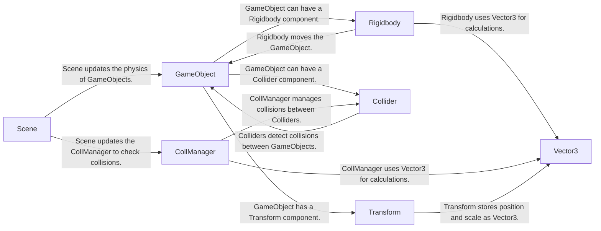

## Component Details

The Physics Simulation component is responsible for simulating the physical interactions between GameObjects within a scene. It manages collision detection, applies forces, and updates the positions and orientations of objects based on their physical properties. This system enables realistic and interactive game environments by simulating physical phenomena such as gravity, collisions, and momentum.

### GameObject
Represents a basic object in the game scene. It serves as a container for various components like Rigidbodies and Colliders, defining the object's presence and behavior within the game world.
- **Related Classes/Methods**: `pyunity.core.GameObject`

### Rigidbody
Handles the physical properties of a GameObject, such as mass, velocity, and forces. It is responsible for moving the object and applying forces to it, enabling dynamic interactions within the physics simulation.
- **Related Classes/Methods**: `pyunity.physics.core.Rigidbody`

### Collider
Represents the shape of a GameObject for collision detection. Different types of colliders exist, such as SphereCollider and BoxCollider. It enables the detection of collisions between GameObjects, triggering appropriate responses within the game.
- **Related Classes/Methods**: `pyunity.physics.core.Collider`

### CollManager
Manages the collision detection and resolution process. It uses algorithms like GJK and EPA to determine if two colliders are colliding and calculates the collision response, ensuring accurate and efficient collision handling within the simulation.
- **Related Classes/Methods**: `pyunity.physics.core.CollManager`

### Scene
Represents the current scene in the game. It is responsible for updating the physics of all GameObjects in the scene, orchestrating the overall simulation and ensuring that all physical interactions are processed correctly.
- **Related Classes/Methods**: `pyunity.scenes.scene.Scene`

### Transform
Represents the position, rotation, and scale of a GameObject. It defines the object's spatial properties within the scene, influencing its appearance and interactions with other objects.
- **Related Classes/Methods**: `pyunity.core.Transform`

### Vector3
Represents a 3D vector, used for positions, directions, and other spatial data. It provides the mathematical foundation for representing and manipulating spatial information within the physics simulation.
- **Related Classes/Methods**: `pyunity.values.vector.Vector3`
