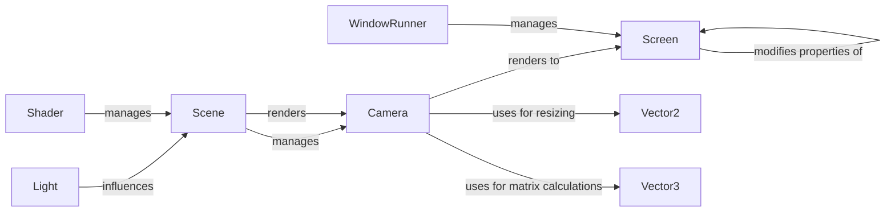

## Component Details

### Camera
The Camera component handles the rendering of the scene from a specific viewpoint. It manages the projection and view matrices, and interacts with the Screen to output the rendered image. It inherits from SingleComponent and interacts with Vector3 for matrix calculations and Scene for rendering.
- **Related Classes/Methods**: `pyunity.render.Camera`

### Light
The Light component represents a light source in the scene, influencing the appearance of objects. It inherits from SingleComponent.
- **Related Classes/Methods**: `pyunity.render.Light`

### Shader
The Shader component manages the loading, compilation, and caching of shaders, which define how objects are rendered. It interacts with the file system to load shader source code and the logger for logging.
- **Related Classes/Methods**: `pyunity.render.Shader`

### Screen
The Screen component represents the display screen and allows modification of its properties, such as resolution. It interacts with the Camera to display the rendered image and ImmutableStruct to edit the screen.
- **Related Classes/Methods**: `pyunity.render.Screen`

### WindowRunner
The WindowRunner manages the main application window and its event loop. It handles setup, rendering, and quitting the application, and interacts with the render module for compiling shaders and skyboxes. It also uses fillScreen to fill the screen with a color.
- **Related Classes/Methods**: `pyunity.scenes.runner.WindowRunner`

### Scene
The Scene class represents a scene in the application. It manages the objects and components in the scene and starts OpenGL. It renders the camera and resizes it.
- **Related Classes/Methods**: `pyunity.scenes.scene.Scene`

### Vector2
The Vector2 class represents a 2D vector, used for camera resizing and 2D matrix calculations. It is used by the Camera and the Screen.
- **Related Classes/Methods**: `pyunity.values.vector.Vector2`

### Vector3
The Vector3 class represents a 3D vector, used for camera matrix and view matrix calculations. It is used by the Camera.
- **Related Classes/Methods**: `pyunity.values.vector.Vector3`
