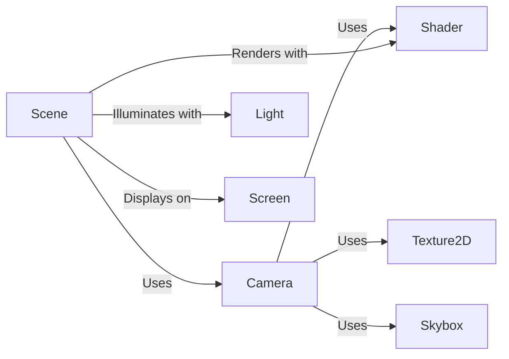

## Component Details

The Rendering Pipeline is responsible for transforming the 3D scene into a 2D image that is displayed on the screen. It involves several key components working together to handle camera setup, scene rendering, lighting, shading, and visual effects. The pipeline starts with the Camera component, which defines the viewpoint and sets up the necessary transformation matrices. The Scene component then manages the collection of objects and lights to be rendered. Shaders are used to determine the final color of each pixel, taking into account lighting from the Light components and textures from Texture2D components. Finally, the rendered image is displayed on the Screen component.

### Camera
The Camera component defines the viewpoint from which the scene is rendered. It handles setting up buffers, resizing the viewport, calculating transformation matrices, and drawing the scene from its perspective. It also manages rendering different passes like depth and 2D elements.
- **Related Classes/Methods**: `pyunity.render.Camera`

### Shader
The Shader component is responsible for compiling, loading, and using shaders for rendering. It manages the shader programs used to draw objects on the screen.
- **Related Classes/Methods**: `pyunity.render.Shader`

### Light
The Light component represents a light source in the scene. It stores information about the light's color, intensity, and position, which are used in the shader calculations to determine the final color of the rendered objects.
- **Related Classes/Methods**: `pyunity.render.Light`

### Screen
The Screen component manages the display window and allows for editing the screen's properties. It provides an interface for interacting with the display.
- **Related Classes/Methods**: `pyunity.render.Screen`

### Scene
The Scene component represents the collection of objects and lights in the environment. It is responsible for rendering all objects within the scene, potentially performing frustum culling to optimize rendering.
- **Related Classes/Methods**: `pyunity.scenes.scene.Scene`

### Texture2D
The Texture2D component represents a 2D image that can be applied to objects in the scene. It provides functionality for using the texture during rendering.
- **Related Classes/Methods**: `pyunity.files.Texture2D`

### Skybox
The Skybox component represents the background of the scene, typically a cube map that surrounds the entire environment. It handles compiling and using the skybox texture during rendering.
- **Related Classes/Methods**: `pyunity.files.Skybox`
