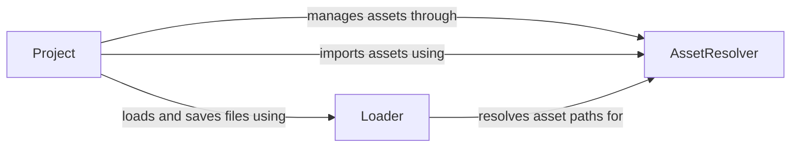

## Component Details

The Resource Management System in PyUnity handles the loading, caching, and management of assets such as meshes, textures, and materials. It provides a unified interface for accessing these assets from different sources, such as files or packages. The system revolves around the `Project` which acts as the central point for asset management, utilizing `AssetResolvers` to locate and retrieve assets from various sources, and employing the `Loader` to handle the actual loading and saving of different file types. This ensures that the rendering pipeline and other components can seamlessly access the required assets.

### Project
The Project class manages the overall project structure, including importing assets, setting asset properties, and handling project-related operations. It acts as a central point for interacting with assets within the project, providing methods for importing, saving, and accessing assets.
- **Related Classes/Methods**: `pyunity.files.Project`

### AssetResolver
The AssetResolver class (and its subclasses) is responsible for resolving asset paths and retrieving assets from different sources, such as the file system, zip archives, or packages. It provides a unified interface for accessing assets regardless of their location, abstracting the underlying storage mechanism.
- **Related Classes/Methods**: `pyunity.resources.AssetResolver`, `pyunity.resources.ZipAssetResolver`, `pyunity.resources.PackageAssetResolver`

### Loader
The Loader module contains functions for loading and saving various file types, such as scenes, prefabs, meshes (obj, stl), and materials. It handles the serialization and deserialization of game objects and their properties, enabling the persistence and retrieval of game data.
- **Related Classes/Methods**: `pyunity.loader`
