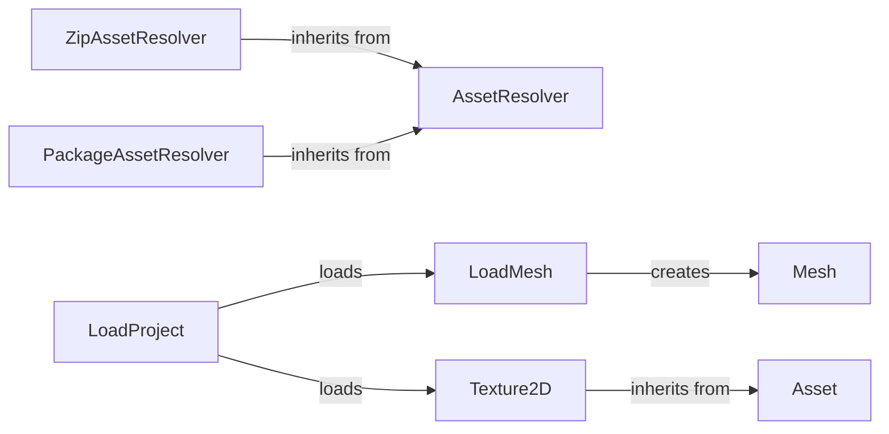

## Component Details

### AssetResolver
The AssetResolver class manages the loading and caching of assets from various sources. It provides a unified interface for accessing assets and ensures that assets are loaded efficiently by caching them. It uses a dictionary to store loaded assets and provides methods for resolving asset paths and loading assets from different locations. It supports loading from different locations like local files, zip files and packages.
- **Related Classes/Methods**: `pyunity.resources.AssetResolver`

### ZipAssetResolver
The ZipAssetResolver class is a subclass of AssetResolver that specifically handles loading assets from zip files. It inherits the caching and asset management capabilities of AssetResolver and extends them to work with zip file archives. It overrides the `resolve_path` method to handle paths within zip files.
- **Related Classes/Methods**: `pyunity.resources.ZipAssetResolver`

### PackageAssetResolver
The PackageAssetResolver class is a subclass of AssetResolver designed to load assets from Python packages. It extends the AssetResolver's functionality to handle the specific requirements of accessing resources within packages. It overrides the `resolve_path` method to handle paths within packages.
- **Related Classes/Methods**: `pyunity.resources.PackageAssetResolver`

### Texture2D
The Texture2D class represents a 2D texture asset. It handles the loading, storage, and usage of texture data, providing methods for accessing and manipulating the texture. It inherits from Asset and stores the width, height, and data of the texture.
- **Related Classes/Methods**: `pyunity.files.Texture2D`

### Mesh
The Mesh class represents a 3D mesh asset. It stores vertex and triangle data and provides methods for compiling and manipulating the mesh. It stores vertices, triangles, normals, and texture coordinates.
- **Related Classes/Methods**: `pyunity.meshes.Mesh`

### LoadMesh
The LoadMesh function is responsible for loading mesh data from a file and creating a Mesh object. It parses the file format and extracts vertex and triangle information.
- **Related Classes/Methods**: `pyunity.loader`

### LoadProject
The LoadProject function is responsible for loading an entire project, including meshes and textures. It orchestrates the loading of various assets using other components.
- **Related Classes/Methods**: `pyunity.loader`

### Asset
The Asset class serves as a base class for all assets in the PyUnity engine. It provides a common interface for asset management and defines basic properties such as name and project ID.
- **Related Classes/Methods**: `pyunity.files.Asset`
