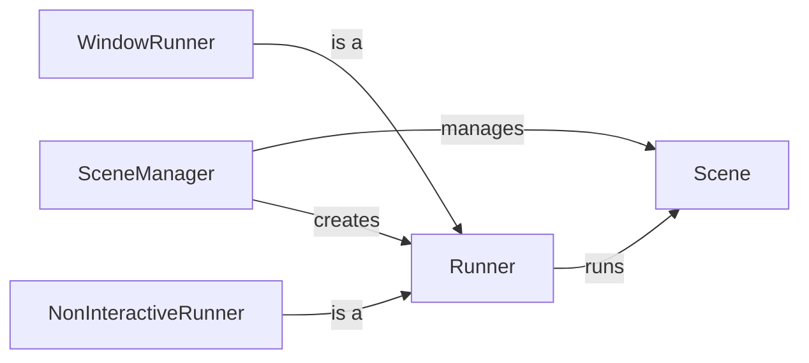

## Component Details

The Scene Management & Runtime component is responsible for managing the game's scenes and the game loop. It allows for loading, unloading, and switching between different scenes, each containing its own set of game objects and components. The SceneManager orchestrates scene transitions and resource management, while the Runner executes the game loop, updating and rendering the active scene. Different Runner implementations cater to various execution environments, such as windowed applications or headless simulations.

### SceneManager
The SceneManager is a central component responsible for managing all scenes within the game. It provides functionalities for adding, removing, loading, and retrieving scenes. It also handles the initialization of the first scene and the stopping of the game when the window is closed. The SceneManager interacts with the Scene class to manage individual scenes and with the Runner to start and stop the game loop.
- **Related Classes/Methods**: `pyunity.scenes.sceneManager`

### Scene
The Scene class represents a single scene in the game, containing all the GameObjects and Components that make up the scene. It provides methods for adding, destroying, and finding GameObjects and Components within the scene. The Scene also manages the game loop for its contained objects, updating their state and rendering them. It interacts with the SceneManager to be managed and with the GameObjects and Components within it to update and render them.
- **Related Classes/Methods**: `pyunity.scenes.scene.Scene`

### Runner
The Runner class is an abstract base class that defines the interface for running a scene. It is responsible for executing the game loop and managing the simulation. Concrete implementations of the Runner class, such as WindowRunner and NonInteractiveRunner, provide specific ways to run the game. The Runner interacts with the SceneManager to get the scene to run and with the Window (in the case of WindowRunner) to render the scene.
- **Related Classes/Methods**: `pyunity.scenes.runner.Runner`

### WindowRunner
The WindowRunner class is a concrete implementation of the Runner class that runs the game in a window. It uses OpenGL for rendering the scene. It interacts with the Window to render the scene and with the Input to handle user input, providing a visual and interactive game experience.
- **Related Classes/Methods**: `pyunity.scenes.runner.WindowRunner`

### NonInteractiveRunner
The NonInteractiveRunner class is a concrete implementation of the Runner class that runs the game without a window. This is useful for testing, debugging, or running simulations without a graphical interface. It interacts with the Scene to run the game loop without rendering, allowing for automated testing and analysis.
- **Related Classes/Methods**: `pyunity.scenes.runner.NonInteractiveRunner`
