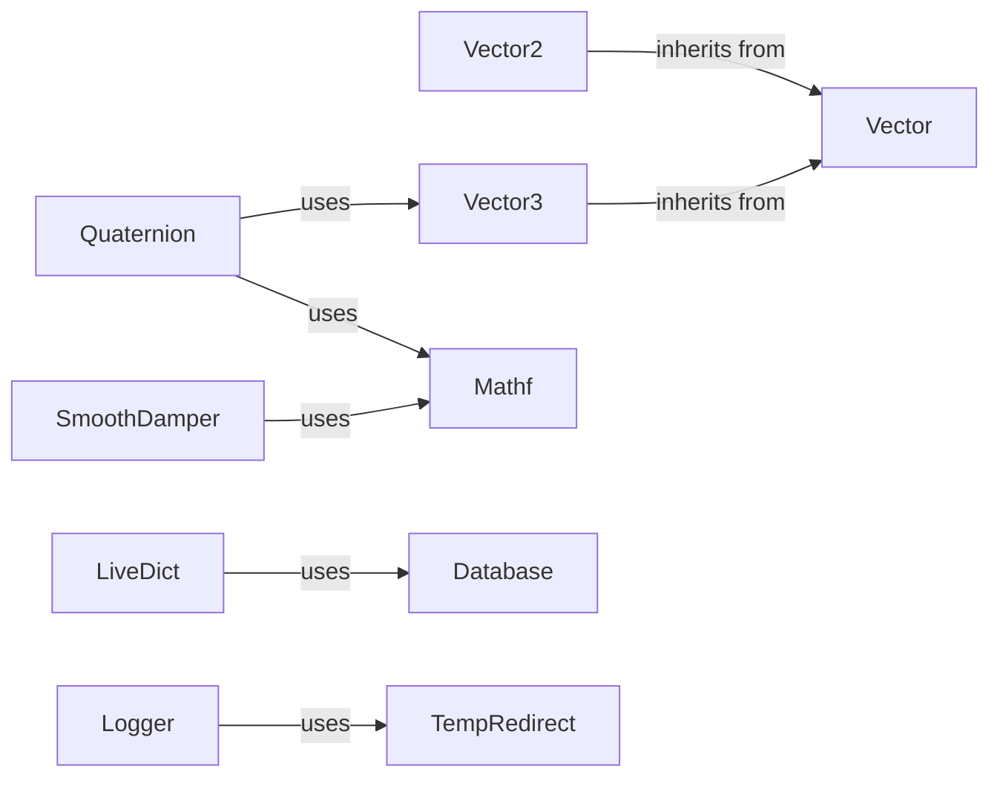

## Component Details

The Utilities and Configuration component provides fundamental data structures, mathematical functions, and configuration management for the PyUnity engine. It encompasses vector and quaternion classes for spatial calculations, a collection of math functions, and classes for managing settings and logging. This component is crucial for various engine functionalities, including scene management, physics, and rendering, by providing the necessary tools for data representation, mathematical operations, and persistent settings.

### Vector
The Vector component serves as a base class for Vector2 and Vector3, offering common vector operations such as addition, subtraction, multiplication, division, and equality checks. It provides an abstract foundation for representing 2D and 3D vectors and performing basic mathematical operations on them.
- **Related Classes/Methods**: `pyunity.values.vector.Vector`

### Vector2
The Vector2 component represents a 2D vector with x and y components. It includes methods for vector operations, normalization, distance calculation, clamping, and predefined vectors like zero, one, left, right, up, and down. It inherits from the Vector class.
- **Related Classes/Methods**: `pyunity.values.vector.Vector2`

### Vector3
The Vector3 component represents a 3D vector with x, y, and z components. It includes methods for vector operations, normalization, distance calculation, clamping, cross product, and predefined vectors like zero, one, forward, back, left, right, up, and down. It inherits from the Vector class.
- **Related Classes/Methods**: `pyunity.values.vector.Vector3`

### Quaternion
The Quaternion component represents a quaternion for rotations. It includes methods for quaternion operations like multiplication, division, subtraction, normalization, conjugation, vector rotation, and conversions from axis-angle, between vectors, and Euler angles. It also provides an identity quaternion and uses Vector3 and mathf.
- **Related Classes/Methods**: `pyunity.values.quaternion.Quaternion`

### Mathf
The mathf component provides a collection of mathematical functions like Acos, Asin, Atan, Atan2, Ceil, Cos, Exp, Floor, InverseLerp, Lerp, Log, Sin, Sqrt, and Tan. These functions offer basic mathematical operations used throughout the engine.
- **Related Classes/Methods**: `pyunity.values.mathf`

### SmoothDamper
The SmoothDamper component provides a class for smoothly damping a value over time. It includes the SmoothDamp function for achieving this effect and uses mathf.
- **Related Classes/Methods**: `pyunity.values.mathf.SmoothDamper`

### LiveDict
The LiveDict component is a dictionary-like class that triggers events when items are set, deleted, or popped. It's used for live settings updates and uses Database.
- **Related Classes/Methods**: `pyunity.settings.LiveDict`

### Database
The Database component is a class for managing settings data. It allows updating and refreshing settings from a data source.
- **Related Classes/Methods**: `pyunity.settings.Database`

### Logger
The Logger component provides logging functionalities, including logging messages, exceptions, and tracebacks. It supports saving logs to a file and redirecting output streams. It uses TempRedirect.
- **Related Classes/Methods**: `pyunity.pyunity.logger`

### TempRedirect
The TempRedirect component is a context manager for temporarily redirecting output streams.
- **Related Classes/Methods**: `pyunity.logger.TempRedirect`
