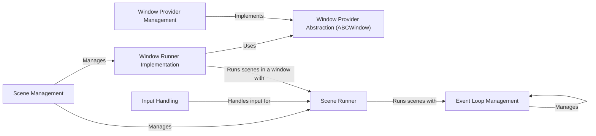

## Component Details

### Window Provider Abstraction (ABCWindow)
This component defines the abstract base class for all window providers. It ensures that concrete window providers adhere to a common interface, facilitating platform independence. It manages the registration of subclasses, allowing the system to discover available window providers.
- **Related Classes/Methods**: `repos.pyunity.pyunity.window.abc.ABCWindow`

### Window Provider Management
This component is responsible for managing the selection and configuration of window providers. It includes functionalities for retrieving, setting, and customizing window providers, ensuring that the appropriate provider is used based on the current settings and user preferences. It handles error conditions and logs relevant information.
- **Related Classes/Methods**: `repos.pyunity.pyunity.window:GetWindowProvider`, `repos.pyunity.pyunity.window:SetWindowProvider`, `repos.pyunity.pyunity.window:CustomWindowProvider`, `repos.pyunity.pyunity.window.providers`

### Event Loop Management
This component manages the event loops within the PyUnity environment. It handles scheduling, starting, updating, and exception handling for event loops, ensuring that events are processed efficiently and reliably. It provides a mechanism for shutting down the event loop when necessary.
- **Related Classes/Methods**: `repos.pyunity.pyunity.events.EventLoopManager`, `repos.pyunity.pyunity.events.EventLoop`

### Scene Management
This component manages the scenes within the PyUnity environment, including loading, starting, and stopping scenes. It coordinates the scene runner and handles the overall flow of the application. It also manages the window lifecycle.
- **Related Classes/Methods**: `repos.pyunity.pyunity.scenes.sceneManager`

### Scene Runner
This abstract component defines the interface for running scenes. It provides methods for opening, loading, starting, changing, and quitting scenes. It also manages the event loop associated with the scene.
- **Related Classes/Methods**: `repos.pyunity.pyunity.scenes.runner.Runner`

### Window Runner Implementation
This component is a concrete implementation of the Scene Runner that manages a window for rendering a scene. It handles window setup, loading, starting, and quitting, as well as managing shaders and skyboxes. It interacts with the rendering components to display the scene in the window.
- **Related Classes/Methods**: `repos.pyunity.pyunity.scenes.runner.WindowRunner`

### Input Handling
This component provides access to input devices such as the keyboard and mouse. It allows querying the state of keys and axes, and updating the axes based on input events. It provides a way for the application to respond to user input.
- **Related Classes/Methods**: `repos.pyunity.pyunity.input.Input`, `repos.pyunity.pyunity.input.KeyboardAxis`
