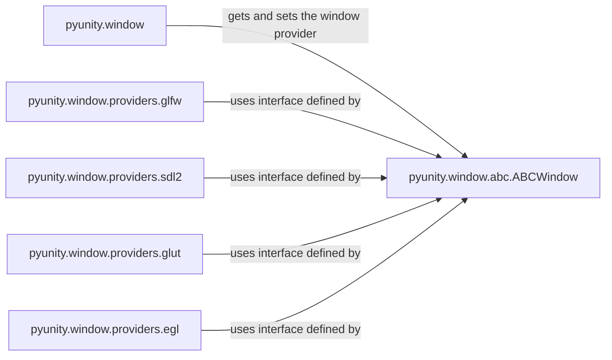

## Component Details

The Windowing Abstraction component in PyUnity is responsible for managing the game window and providing a platform-independent interface for interacting with different windowing systems. It allows the engine to run on various operating systems without requiring significant code modifications. The core of this abstraction is the `ABCWindow` class, which defines the common interface for all window providers. Concrete implementations, such as GLFW, SDL2, GLUT, and EGL, inherit from `ABCWindow` and provide the actual windowing functionality. The `pyunity.window` module serves as the entry point for setting and getting the current window provider, enabling the engine to switch between different windowing backends seamlessly. The rendering pipeline utilizes this abstraction to display the rendered scene on the created window.

### pyunity.window
This module acts as the central point for managing window providers. It allows setting and retrieving the active window provider, enabling dynamic switching between different windowing backends. It also provides a mechanism for using a custom window provider.
- **Related Classes/Methods**: `pyunity.window:GetWindowProvider`, `pyunity.window:SetWindowProvider`, `pyunity.window:CustomWindowProvider`

### pyunity.window.abc.ABCWindow
This abstract base class defines the interface that all window providers must implement. It specifies the essential methods for window management, such as refreshing the window, closing it, and handling input events (keyboard and mouse). Concrete window providers inherit from this class and provide platform-specific implementations of these methods.
- **Related Classes/Methods**: `pyunity.window.abc.ABCWindow:__init_subclass__`

### pyunity.window.providers.glfw
This module provides a concrete implementation of the windowing interface using the GLFW library. It handles window creation, input event processing, and framebuffer size changes. It initializes GLFW and creates a window using GLFW functions. It also sets up callbacks for handling window events.
- **Related Classes/Methods**: `pyunity.window.providers.glfw.window.Window:__init__`, `pyunity.window.providers.glfw.window.Window:refresh`, `pyunity.window.providers.glfw.window.Window:updateFunc`, `pyunity.window.providers.glfw.window.Window:framebufferSizeCallback`

### pyunity.window.providers.sdl2
This module provides a concrete implementation of the windowing interface using the SDL2 library. It handles window creation, input event processing, and window refreshing. It initializes SDL2 and creates a window using SDL2 functions. It also sets up callbacks for handling window events.
- **Related Classes/Methods**: `pyunity.window.providers.sdl2.window.Window:refresh`, `pyunity.window.providers.sdl2.window.Window:updateFunc`

### pyunity.window.providers.glut
This module provides a concrete implementation of the windowing interface using the GLUT library. It handles window creation, input event processing, and starts the GLUT main loop. It initializes GLUT and creates a window using GLUT functions. It also sets up callbacks for handling window events.
- **Related Classes/Methods**: `pyunity.window.providers.glut.window.Window:start`

### pyunity.window.providers.egl
This module provides a concrete implementation of the windowing interface using EGL. It supports Win32 platforms. It includes classes and functions for initializing EGL, creating surfaces, and managing the EGL context.
- **Related Classes/Methods**: `pyunity.window.providers.egl.egl:setupPlatform`, `pyunity.window.providers.egl.egl:setupWin32Platform`, `pyunity.window.providers.egl.window:getEglCfg`, `pyunity.window.providers.egl.window.Window:__init__`, `pyunity.window.providers.egl.window.Window:quit`
