```mermaid
graph LR
    Core_Engine_Scene_Management["Core Engine & Scene Management"]
    Rendering_Pipeline["Rendering Pipeline"]
    Resource_Management["Resource Management"]
    Input_Handling["Input Handling"]
    Physics_Engine["Physics Engine"]
    GUI_System["GUI System"]
    Audio_System["Audio System"]
    File_System_Project_Management["File System & Project Management"]
    Window_Event_Management["Window & Event Management"]
    Core_Engine_Scene_Management -- "manages entities within scenes" --> Core_Engine_Scene_Management
    Core_Engine_Scene_Management -- "renders the scene" --> Rendering_Pipeline
    Rendering_Pipeline -- "uses assets for rendering" --> Resource_Management
    Input_Handling -- "controls GameObjects" --> Core_Engine_Scene_Management
    Physics_Engine -- "simulates physics for GameObjects" --> Core_Engine_Scene_Management
    GUI_System -- "creates GUI elements within the scene" --> Core_Engine_Scene_Management
    Audio_System -- "plays audio for GameObjects" --> Core_Engine_Scene_Management
    File_System_Project_Management -- "saves and loads GameObjects and Components" --> Core_Engine_Scene_Management
    Window_Event_Management -- "provides the window for rendering" --> Rendering_Pipeline
    Window_Event_Management -- "triggers events on GameObjects" --> Core_Engine_Scene_Management
    GUI_System -- "receives input events" --> Input_Handling
    Physics_Engine -- "triggers events on collision" --> Window_Event_Management
    Core_Engine_Scene_Management -- "schedules events for scene" --> Window_Event_Management
    Rendering_Pipeline -- "schedules render events" --> Window_Event_Management
    Audio_System -- "schedules audio events" --> Window_Event_Management
    File_System_Project_Management -- "schedules file events" --> Window_Event_Management
    Window_Event_Management -- "provides input events from the window" --> Input_Handling
    Window_Event_Management -- "manages the window for the scene" --> Core_Engine_Scene_Management
    File_System_Project_Management -- "imports assets into the project" --> Resource_Management
    File_System_Project_Management -- "uses window for file dialogs" --> Window_Event_Management
    Core_Engine_Scene_Management -- "loads and saves scenes" --> File_System_Project_Management
    Resource_Management -- "loads assets from files" --> File_System_Project_Management
    click Core_Engine_Scene_Management href "https://github.com/CodeBoarding/GeneratedOnBoardings/blob/main/pyunity/Core Engine & Scene Management.md" "Details"
    click Rendering_Pipeline href "https://github.com/CodeBoarding/GeneratedOnBoardings/blob/main/pyunity/Rendering Pipeline.md" "Details"
    click Resource_Management href "https://github.com/CodeBoarding/GeneratedOnBoardings/blob/main/pyunity/Resource Management.md" "Details"
    click Input_Handling href "https://github.com/CodeBoarding/GeneratedOnBoardings/blob/main/pyunity/Input Handling.md" "Details"
    click Physics_Engine href "https://github.com/CodeBoarding/GeneratedOnBoardings/blob/main/pyunity/Physics Engine.md" "Details"
    click GUI_System href "https://github.com/CodeBoarding/GeneratedOnBoardings/blob/main/pyunity/GUI System.md" "Details"
    click Audio_System href "https://github.com/CodeBoarding/GeneratedOnBoardings/blob/main/pyunity/Audio System.md" "Details"
    click File_System_Project_Management href "https://github.com/CodeBoarding/GeneratedOnBoardings/blob/main/pyunity/File System & Project Management.md" "Details"
    click Window_Event_Management href "https://github.com/CodeBoarding/GeneratedOnBoardings/blob/main/pyunity/Window & Event Management.md" "Details"
```

## Component Details

### Core Engine & Scene Management
This component forms the heart of the engine, managing the game world's structure and entities. It encompasses the creation, manipulation, and organization of GameObjects, Components, and Transforms within different scenes. It handles scene loading, unloading, and switching, providing the foundation for building and managing interactive game environments.
- **Related Classes/Methods**: `pyunity.core.GameObject`, `pyunity.core.Component`, `pyunity.core.Transform`, `pyunity.scenes.sceneManager`, `pyunity.scenes.scene`

### Rendering Pipeline
This component is responsible for visually representing the game world on the screen. It manages cameras, lights, shaders, and screen output to create the final rendered image. It handles the complex process of transforming 3D data into a 2D image, applying lighting and shading effects, and displaying it on the screen.
- **Related Classes/Methods**: `pyunity.render.Camera`, `pyunity.render.Light`, `pyunity.render.Shader`, `pyunity.render.Screen`

### Resource Management
This component efficiently handles the loading, caching, and management of game assets. It resolves asset paths, loads meshes, textures, materials, and other resources, and caches them for optimal performance. It ensures that the engine can quickly access and utilize the necessary assets to create a visually rich and engaging game experience.
- **Related Classes/Methods**: `pyunity.resources.AssetResolver`, `pyunity.files.Mesh`, `pyunity.files.Texture2D`, `pyunity.files.Material`

### Input Handling
This component captures and processes user input from various sources, such as keyboard and mouse. It provides functionalities for detecting key presses, mouse clicks, and axis movements, allowing the game to respond to user actions and create interactive gameplay experiences.
- **Related Classes/Methods**: `pyunity.input.Input`, `pyunity.input.KeyboardAxis`

### Physics Engine
This component simulates realistic physical interactions between objects in the game world. It manages colliders, rigidbodies, and collision detection, enabling realistic movement, collisions, and other physics-based effects. It adds depth and realism to the game by simulating the laws of physics.
- **Related Classes/Methods**: `pyunity.physics.core.Collider`, `pyunity.physics.core.Rigidbody`, `pyunity.physics.core.CollManager`

### GUI System
This component provides tools for creating interactive user interfaces within the game. It includes classes for creating buttons, text fields, checkboxes, and other GUI elements, allowing developers to build menus, settings panels, and other interactive elements to enhance the user experience.
- **Related Classes/Methods**: `pyunity.gui.Gui`, `pyunity.gui.Button`, `pyunity.gui.Text`, `pyunity.gui.Canvas`

### Audio System
This component manages audio playback and sound effects within the game. It includes classes for managing audio clips, audio sources, and audio listeners, allowing developers to add sound effects, music, and other audio elements to create an immersive and engaging audio experience.
- **Related Classes/Methods**: `pyunity.audio.AudioSource`, `pyunity.audio.AudioListener`, `pyunity.audio.AudioClip`

### File System & Project Management
This component handles file operations and project management tasks. It provides functionalities for loading and saving projects, scenes, and assets, as well as managing the project structure and persisting game data. It ensures that the game's data is properly stored and retrieved, allowing developers to easily manage their projects and assets.
- **Related Classes/Methods**: `pyunity.files.Project`, `pyunity.files.File`, `pyunity.loader`

### Window & Event Management
This component provides an abstraction layer for creating and managing windows and events. It supports multiple window providers and manages the event loop, allowing the engine to run on different platforms and respond to user and system events. It ensures that the game can run smoothly and efficiently on various platforms and handle user interactions and system events effectively.
- **Related Classes/Methods**: `pyunity.window`, `pyunity.window.providers`, `pyunity.events`