```mermaid
graph LR
    Core_Abstraction["Core Abstraction"]
    Scene_Management_Runtime["Scene Management & Runtime"]
    Rendering_Pipeline["Rendering Pipeline"]
    Resource_Management_System["Resource Management System"]
    Input_Event_Handling["Input Event Handling"]
    Physics_Simulation["Physics Simulation"]
    Graphical_User_Interface["Graphical User Interface"]
    Windowing_Abstraction["Windowing Abstraction"]
    Utilities_and_Configuration["Utilities and Configuration"]
    Core_Abstraction -- "provides base entities for" --> Scene_Management_Runtime
    Core_Abstraction -- "provides base entities for" --> Physics_Simulation
    Core_Abstraction -- "provides base entities for" --> Rendering_Pipeline
    Scene_Management_Runtime -- "manages" --> Core_Abstraction
    Rendering_Pipeline -- "renders" --> Scene_Management_Runtime
    Resource_Management_System -- "loads assets for" --> Rendering_Pipeline
    Resource_Management_System -- "loads assets for" --> Core_Abstraction
    Input_Event_Handling -- "provides input to" --> Core_Abstraction
    Physics_Simulation -- "simulates physics for" --> Core_Abstraction
    Graphical_User_Interface -- "renders" --> Rendering_Pipeline
    Windowing_Abstraction -- "provides a window for" --> Rendering_Pipeline
    Rendering_Pipeline -- "uses" --> Utilities_and_Configuration
    Physics_Simulation -- "uses" --> Utilities_and_Configuration
    Graphical_User_Interface -- "uses" --> Utilities_and_Configuration
    Input_Event_Handling -- "handles events for" --> Graphical_User_Interface
    Utilities_and_Configuration -- "manages settings for" --> Rendering_Pipeline
    Utilities_and_Configuration -- "logs messages from" --> Core_Abstraction
    Utilities_and_Configuration -- "logs messages from" --> Scene_Management_Runtime
    Utilities_and_Configuration -- "logs messages from" --> Rendering_Pipeline
    Utilities_and_Configuration -- "logs messages from" --> Resource_Management_System
    Utilities_and_Configuration -- "logs messages from" --> Input_Event_Handling
    Utilities_and_Configuration -- "logs messages from" --> Physics_Simulation
    Utilities_and_Configuration -- "logs messages from" --> Graphical_User_Interface
    Utilities_and_Configuration -- "logs messages from" --> Windowing_Abstraction
    Scene_Management_Runtime -- "uses" --> Input_Event_Handling
    Physics_Simulation -- "uses" --> Input_Event_Handling
    click Core_Abstraction href "https://github.com/CodeBoarding/GeneratedOnBoardings/blob/main/pyunity/Core Abstraction.md" "Details"
    click Scene_Management_Runtime href "https://github.com/CodeBoarding/GeneratedOnBoardings/blob/main/pyunity/Scene Management & Runtime.md" "Details"
    click Rendering_Pipeline href "https://github.com/CodeBoarding/GeneratedOnBoardings/blob/main/pyunity/Rendering Pipeline.md" "Details"
    click Resource_Management_System href "https://github.com/CodeBoarding/GeneratedOnBoardings/blob/main/pyunity/Resource Management System.md" "Details"
    click Input_Event_Handling href "https://github.com/CodeBoarding/GeneratedOnBoardings/blob/main/pyunity/Input Event Handling.md" "Details"
    click Physics_Simulation href "https://github.com/CodeBoarding/GeneratedOnBoardings/blob/main/pyunity/Physics Simulation.md" "Details"
    click Graphical_User_Interface href "https://github.com/CodeBoarding/GeneratedOnBoardings/blob/main/pyunity/Graphical User Interface.md" "Details"
    click Windowing_Abstraction href "https://github.com/CodeBoarding/GeneratedOnBoardings/blob/main/pyunity/Windowing Abstraction.md" "Details"
    click Utilities_and_Configuration href "https://github.com/CodeBoarding/GeneratedOnBoardings/blob/main/pyunity/Utilities and Configuration.md" "Details"
```

## Component Details

PyUnity is a Python-based game engine designed for simplicity and ease of use. It provides a set of tools and components for creating 2D and 3D games. The engine is structured around a core abstraction that manages game objects and components, a scene management system for organizing game levels, a rendering pipeline for displaying the game, and various other components for handling input, physics, and user interfaces. The engine also includes a resource management system for loading and managing assets, and a windowing abstraction for cross-platform compatibility.

### Core Abstraction
This component provides the fundamental building blocks for creating games, including GameObjects, Components, and the Transform component. It manages the entities in a PyUnity scene and their basic properties like position, rotation, and scale. It serves as the base for all other components.
- **Related Classes/Methods**: `pyunity.core.GameObject`, `pyunity.core.Component`, `pyunity.core.Transform`

### Scene Management & Runtime
This component handles the organization and management of game scenes, including loading, unloading, and switching between scenes. It also manages the game objects within each scene and their lifecycle. The Runner class is responsible for executing the game loop and managing the simulation.
- **Related Classes/Methods**: `pyunity.scenes.sceneManager`, `pyunity.scenes.scene.Scene`, `pyunity.scenes.runner.Runner`

### Rendering Pipeline
This component is responsible for drawing the scene to the screen. It uses a Camera to determine the viewpoint and renders all visible GameObjects. It also handles lighting, shading, and other visual effects. It relies on the Utilities and Configuration module for vector and matrix calculations.
- **Related Classes/Methods**: `pyunity.render.Camera`, `pyunity.render.Shader`, `pyunity.render.Light`, `pyunity.render.Screen`

### Resource Management System
This component handles the loading, caching, and management of assets such as meshes, textures, and materials. It provides a unified interface for accessing these assets from different sources, such as files or packages. It is used by the Rendering Pipeline and other components to load necessary assets.
- **Related Classes/Methods**: `pyunity.resources.AssetResolver`, `pyunity.files.Project`, `pyunity.loader`

### Input Event Handling
This component manages user input from the keyboard, mouse, and other input devices. It provides a simple interface for querying the state of these devices and responding to user actions. It uses the Event System to dispatch input events to other components.
- **Related Classes/Methods**: `pyunity.input.Input`, `pyunity.input.KeyboardAxis`, `pyunity.events.Event`

### Physics Simulation
This component simulates the physical interactions between GameObjects. It handles collisions, forces, and other physical phenomena. It allows for creating realistic and interactive game environments. It relies on the Utilities and Configuration module for vector calculations and the Input Event Handling for collision events.
- **Related Classes/Methods**: `pyunity.physics.core.Rigidbody`, `pyunity.physics.core.Collider`, `pyunity.physics.core.CollManager`

### Graphical User Interface
This component provides a set of tools for creating user interfaces within the game. It includes components such as buttons, text fields, and images. It allows for creating interactive menus, dialog boxes, and other UI elements. It is rendered by the Rendering Pipeline and uses the Input Event Handling component for user interaction.
- **Related Classes/Methods**: `pyunity.gui.Gui`, `pyunity.gui.Button`, `pyunity.gui.Text`, `pyunity.gui.Canvas`, `pyunity.gui.RectTransform`

### Windowing Abstraction
This component is responsible for creating and managing the game window. It provides an abstraction layer over different windowing systems, such as GLFW, SDL2, and GLUT. It allows the engine to run on different platforms without requiring code changes. It is used by the Rendering Pipeline to display the rendered scene.
- **Related Classes/Methods**: `pyunity.window`, `pyunity.window.abc.ABCWindow`, `pyunity.window.providers`

### Utilities and Configuration
This component provides utility functions and data structures, including vectors, quaternions, and mathematical functions. It also handles the configuration and persistence of engine settings. It is used by various components for calculations, data representation, and settings management, and logging.
- **Related Classes/Methods**: `pyunity.values.vector`, `pyunity.values.quaternion`, `pyunity.values.mathf`, `pyunity.settings.Database`, `pyunity.settings.LiveDict`, `pyunity.pyunity.logger`