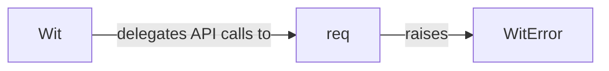

## Details

The `WitClient` subsystem primarily encompasses the core components responsible for interacting with the Wit.ai API. Its boundaries are defined by the `wit.wit` module, which contains the main client interface, the low-level request handler, and the custom error handling.

### Wit
This is the primary interface and facade for all interactions with the Wit.ai API. It encapsulates various API endpoints (e.g., message, speech) and simplifies their usage through high-level methods. It acts as the main entry point for users of the `pywit` SDK, abstracting the underlying HTTP communication.

**Related Classes/Methods**:

- <a href="https://github.com/wit-ai/pywit/blob/main/wit/wit.py#L49-L905" target="_blank" rel="noopener noreferrer">`Wit`:49-905</a>

### req
This component is responsible for executing all low-level HTTP requests to the Wit.ai API. It handles the intricacies of network communication, including constructing requests, sending them, and receiving responses. It is a critical internal component that `Wit` delegates to for actual API calls.

**Related Classes/Methods**:

- <a href="https://github.com/wit-ai/pywit/blob/main/wit/wit.py#L24-L46" target="_blank" rel="noopener noreferrer">`req`:24-46</a>

### WitError
Implemented as a custom exception class, this component defines and manages errors that occur during API interactions. It specifically handles issues originating from the `req` function or errors returned by the Wit.ai API itself, providing a structured way for the SDK to communicate problems to the consuming application.

**Related Classes/Methods**:

- <a href="https://github.com/wit-ai/pywit/blob/main/wit/wit.py#L20-L21" target="_blank" rel="noopener noreferrer">`WitError`:20-21</a>

### [FAQ](https://github.com/CodeBoarding/GeneratedOnBoardings/tree/main?tab=readme-ov-file#faq)