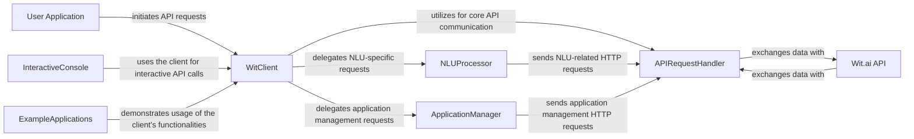

## Details

The `pywit` SDK provides a robust interface for interacting with the Wit.ai API, designed for clarity and ease of use. At its core, the `WitClient` acts as a central facade, orchestrating requests to specialized internal components like the `NLUProcessor` for natural language understanding and the `ApplicationManager` for managing Wit.ai applications. All internal communication with the external Wit.ai API is handled by the `APIRequestHandler`, which manages the low-level HTTP interactions. The SDK also includes an `InteractiveConsole` for direct testing and `ExampleApplications` to demonstrate practical usage patterns. This modular design ensures clear separation of concerns, facilitating both development and integration into external `User Applications`.

### WitClient [[Expand]](./WitClient.md)
The primary interface and facade for all interactions with the Wit.ai API. It simplifies API calls and orchestrates requests to internal modules.

**Related Classes/Methods**:

- <a href="https://github.com/wit-ai/pywit/blob/main/wit/wit.py" target="_blank" rel="noopener noreferrer">`WitClient`</a>

### APIRequestHandler
Responsible for low-level HTTP communication with the Wit.ai API, including request construction, sending, and response parsing.

**Related Classes/Methods**:

- <a href="https://github.com/wit-ai/pywit/blob/main/wit/wit.py" target="_blank" rel="noopener noreferrer">`APIRequestHandler`</a>

### NLUProcessor
Handles Natural Language Understanding functionalities, specifically processing text messages and speech through the Wit.ai API.

**Related Classes/Methods**:

- <a href="https://github.com/wit-ai/pywit/blob/main/wit/wit.py" target="_blank" rel="noopener noreferrer">`NLUProcessor`</a>

### ApplicationManager
Manages operations related to Wit.ai applications, such as creating/listing intents, entities, traits, and handling training.

**Related Classes/Methods**:

- <a href="https://github.com/wit-ai/pywit/blob/main/wit/wit.py" target="_blank" rel="noopener noreferrer">`ApplicationManager`</a>

### InteractiveConsole
Provides a command-line interface for direct, interactive testing and usage of the Wit.ai API.

**Related Classes/Methods**:

- <a href="https://github.com/wit-ai/pywit/blob/main/wit/wit.py" target="_blank" rel="noopener noreferrer">`InteractiveConsole`</a>

### ExampleApplications
A collection of sample applications demonstrating practical integration and usage patterns of the `pywit` SDK.

**Related Classes/Methods**:

- <a href="https://github.com/wit-ai/pywit/blob/main/examples/basic.py" target="_blank" rel="noopener noreferrer">`basic.py`</a>
- <a href="https://github.com/wit-ai/pywit/blob/main/examples/celebrities.py" target="_blank" rel="noopener noreferrer">`celebrities.py`</a>
- <a href="https://github.com/wit-ai/pywit/blob/main/examples/joke.py" target="_blank" rel="noopener noreferrer">`joke.py`</a>
- <a href="https://github.com/wit-ai/pywit/blob/main/examples/messenger.py" target="_blank" rel="noopener noreferrer">`messenger.py`</a>

### User Application
An external application that consumes the pywit SDK. (Note: This is an external component and does not have internal source code references within the `pywit` project.)

**Related Classes/Methods**: _None_

### Wit.ai API
The external Wit.ai service that the SDK interacts with. (Note: This is an external service and does not have internal source code references within the `pywit` project.)

**Related Classes/Methods**: _None_

### [FAQ](https://github.com/CodeBoarding/GeneratedOnBoardings/tree/main?tab=readme-ov-file#faq)