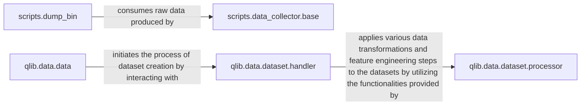

## Details

The Qlib data subsystem is structured around a clear data pipeline, beginning with raw data acquisition and culminating in prepared datasets for machine learning. The scripts.data_collector.base component is responsible for the initial collection and saving of raw financial data. This raw data is then consumed by scripts.dump_bin, which transforms it into Qlib's optimized binary format for efficient storage and retrieval. Further down the pipeline, qlib.data.data serves as the central access point for all data operations, orchestrating the loading of various data elements and initiating the dataset creation process. This process is managed by qlib.data.dataset.handler, which fetches and prepares data by applying a series of transformations and feature engineering steps provided by qlib.data.dataset.processor. This modular design ensures a robust and efficient flow from raw data to analysis-ready datasets.

### scripts.data_collector.base
Orchestrates the collection of raw financial data from external sources, manages instrument lists, normalizes datetime information, and handles the initial saving of collected data. It serves as the base for various specific data collection implementations.

**Related Classes/Methods**:

- <a href="https://github.com/microsoft/qlib/blob/main/scripts/data_collector/base.py" target="_blank" rel="noopener noreferrer">`scripts.data_collector.base`</a>

### scripts.dump_bin
Responsible for ingesting raw data (often from data collectors) and converting it into Qlib's optimized binary format. It handles the reading and writing of calendars, instruments, and features, ensuring data is stored efficiently for retrieval.

**Related Classes/Methods**:

- <a href="https://github.com/microsoft/qlib/blob/main/scripts/dump_bin.py" target="_blank" rel="noopener noreferrer">`scripts.dump_bin`</a>

### qlib.data.data
Acts as the primary high-level interface for accessing and managing data within Qlib. It handles loading calendars, instruments, features, and orchestrates the creation of datasets, abstracting the underlying storage and caching mechanisms. This component is central to providing a unified data view to other parts of the system.

**Related Classes/Methods**:

- <a href="https://github.com/microsoft/qlib/blob/main/qlib/data/data.py" target="_blank" rel="noopener noreferrer">`qlib.data.data`</a>

### qlib.data.dataset.handler
Manages the creation and processing of datasets. It orchestrates the fetching of data and the application of various data processors to prepare the data for machine learning tasks, ensuring data is in the correct format and structure for model consumption.

**Related Classes/Methods**:

- <a href="https://github.com/microsoft/qlib/blob/main/qlib/data/dataset/handler.py" target="_blank" rel="noopener noreferrer">`qlib.data.dataset.handler`</a>

### qlib.data.dataset.processor
Provides a suite of data preprocessing and feature engineering functionalities. These processors perform transformations such as normalization, denoising, and handling of missing or infinite values on the datasets, which is crucial for preparing high-quality input for AI/ML models.

**Related Classes/Methods**:

- <a href="https://github.com/microsoft/qlib/blob/main/qlib/data/dataset/processor.py" target="_blank" rel="noopener noreferrer">`qlib.data.dataset.processor`</a>

### [FAQ](https://github.com/CodeBoarding/GeneratedOnBoardings/tree/main?tab=readme-ov-file#faq)