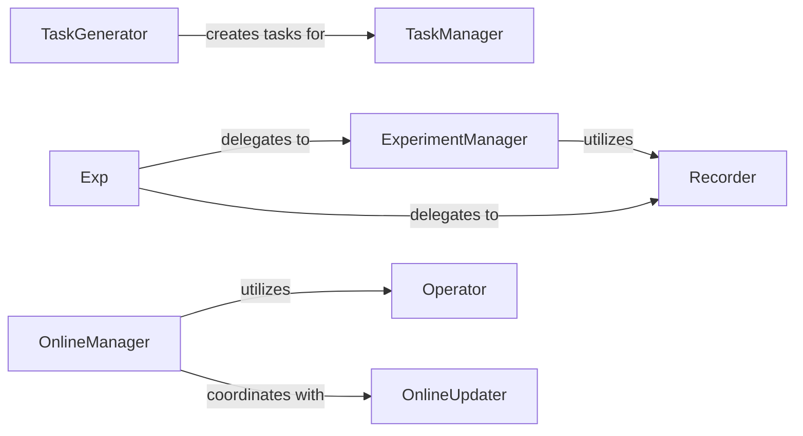

## Details

The `qlib` workflow subsystem is designed to manage the lifecycle of quantitative research experiments and online trading operations. The `Exp` component acts as a high-level entry point, abstracting interactions with the core `ExperimentManager` and `Recorder` components. `ExperimentManager` is responsible for orchestrating experiment runs, while `Recorder` handles the persistence of experiment artifacts. For task-driven workflows, `TaskGenerator` creates individual tasks that are then managed and executed by `TaskManager`. In the context of online operations, `OnlineManager` coordinates the entire process, leveraging `Operator` for execution and `OnlineUpdater` for continuous model and prediction updates. This modular design ensures clear separation of concerns and facilitates efficient management of complex quantitative workflows.

### ExperimentManager
The central orchestrator for managing the lifecycle of experiments. It handles the creation, initiation, termination, searching, and listing of experiment runs, ensuring reproducibility and tracking in quantitative research.

**Related Classes/Methods**:

- <a href="https://github.com/microsoft/qlib/blob/main/qlib/workflow/expm.py#L1-L1000" target="_blank" rel="noopener noreferrer">`ExperimentManager`:1-1000</a>

### Recorder
Manages the persistence and retrieval of experiment-related artifacts, parameters, and metrics. It ensures that all outputs and configurations of an experiment run are properly saved and can be reloaded for analysis or further use.

**Related Classes/Methods**:

- <a href="https://github.com/microsoft/qlib/blob/main/examples/workflow_by_code.py" target="_blank" rel="noopener noreferrer">`Recorder`</a>

### Exp
Serves as a high-level, user-facing facade for experiment management. It simplifies interactions with `ExperimentManager` and `Recorder`, providing a more abstract interface for users to define and run experiments.

**Related Classes/Methods**:

- <a href="https://github.com/microsoft/qlib/blob/main/examples/run_all_model.py" target="_blank" rel="noopener noreferrer">`Exp`</a>

### TaskGenerator
Responsible for generating individual tasks that constitute a larger research or deployment workflow. This often involves segmenting data or defining specific execution steps based on criteria like time.

**Related Classes/Methods**:

- <a href="https://github.com/microsoft/qlib/blob/main/qlib/workflow/task/gen.py#L1-L1000" target="_blank" rel="noopener noreferrer">`TaskGenerator`:1-1000</a>

### TaskManager
Manages the state and execution of the tasks generated by `TaskGenerator`. It provides functionalities for querying, inserting, replacing, fetching, and running these tasks, ensuring orderly workflow progression.

**Related Classes/Methods**:

- <a href="https://github.com/microsoft/qlib/blob/main/qlib/workflow/task/manage.py#L33-L480" target="_blank" rel="noopener noreferrer">`TaskManager`:33-480</a>

### Operator
Provides the fundamental execution capabilities for online serving and real-time execution of trading strategies. This includes generating, executing, updating, and simulating online operations.

**Related Classes/Methods**:

- <a href="https://github.com/microsoft/qlib/blob/main/qlib/contrib/online/operator.py#L27-L312" target="_blank" rel="noopener noreferrer">`Operator`:27-312</a>

### OnlineManager
Orchestrates the entire online workflow, from initial model training and routine updates to preparing signals for live serving. It acts as the central coordinator for continuous online operations.

**Related Classes/Methods**:

- <a href="https://github.com/microsoft/qlib/blob/main/qlib/workflow/online/manager.py#L101-L382" target="_blank" rel="noopener noreferrer">`OnlineManager`:101-382</a>

### OnlineUpdater
Manages the process of updating online predictions or models, including preparing and retrieving necessary data for continuous updates to ensure the system operates with the most current information.

**Related Classes/Methods**:

- <a href="https://github.com/microsoft/qlib/blob/main/qlib/workflow/online/update.py#L1-L1000" target="_blank" rel="noopener noreferrer">`OnlineUpdater`:1-1000</a>

### [FAQ](https://github.com/CodeBoarding/GeneratedOnBoardings/tree/main?tab=readme-ov-file#faq)