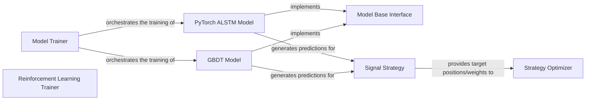

## Details

The qlib model training and strategy generation subsystem is designed around a flexible architecture that separates model implementation from training orchestration and strategy application. The Model Base Interface establishes a common contract for all predictive models, ensuring that diverse models like PyTorch ALSTM Model and GBDT Model can be seamlessly integrated. The Model Trainer component is central to the training workflow, managing the lifecycle of these models. For specialized scenarios, the Reinforcement Learning Trainer handles the unique requirements of RL-based models. Once models generate predictions, the Signal Strategy component transforms these raw signals into actionable trading decisions, incorporating risk management. Finally, the Strategy Optimizer refines these decisions by applying portfolio optimization algorithms to determine optimal asset allocations, thus completing the pipeline from prediction to actionable trading strategy.

### Model Base Interface
This component provides the fundamental abstract interface (predict method) that all predictive models within the platform must adhere to. It establishes a consistent contract for how models are expected to interact, ensuring extensibility and interchangeability of different model implementations.

**Related Classes/Methods**:

- <a href="https://github.com/microsoft/qlib/blob/main/qlib/model/base.py" target="_blank" rel="noopener noreferrer">`qlib.model.base:predict`</a>

### Model Trainer
Responsible for orchestrating the training and execution lifecycle of various machine learning models. It manages the overall training flow, including logging and task execution, by invoking the fit and predict methods of concrete model implementations.

**Related Classes/Methods**:

- <a href="https://github.com/microsoft/qlib/blob/main/qlib/model/trainer.py#L131-L206" target="_blank" rel="noopener noreferrer">`qlib.model.trainer.Trainer`:131-206</a>

### PyTorch ALSTM Model
A concrete deep learning model implementation (ALSTM) built with PyTorch, specifically tailored for generating predictions in quantitative finance. It implements the fit and predict methods defined by the Model Base Interface.

**Related Classes/Methods**:

- <a href="https://github.com/microsoft/qlib/blob/main/qlib/contrib/model/pytorch_alstm.py" target="_blank" rel="noopener noreferrer">`qlib.contrib.model.pytorch_alstm:fit`</a>
- <a href="https://github.com/microsoft/qlib/blob/main/qlib/contrib/model/pytorch_alstm.py" target="_blank" rel="noopener noreferrer">`qlib.contrib.model.pytorch_alstm:predict`</a>

### GBDT Model
A concrete implementation of a Gradient Boosting Decision Tree (GBDT) model, offering an alternative machine learning approach for prediction. Like the ALSTM model, it implements the fit and predict methods from the Model Base Interface.

**Related Classes/Methods**:

- <a href="https://github.com/microsoft/qlib/blob/main/qlib/contrib/model/gbdt.py" target="_blank" rel="noopener noreferrer">`qlib.contrib.model.gbdt:fit`</a>
- <a href="https://github.com/microsoft/qlib/blob/main/qlib/contrib/model/gbdt.py" target="_blank" rel="noopener noreferrer">`qlib.contrib.model.gbdt:predict`</a>

### Reinforcement Learning Trainer
A specialized trainer component dedicated to Reinforcement Learning (RL) models. It handles RL-specific training loops, manages interactions with the environment, and supports checkpointing for RL agents.

**Related Classes/Methods**:

- <a href="https://github.com/microsoft/qlib/blob/main/" target="_blank" rel="noopener noreferrer">`qlib.contrib.online.manager.OnlineManager`</a>

### Signal Strategy
This component translates raw model predictions (signals) into actionable trading decisions. It incorporates logic for risk management and stock filtering, consuming the predictions generated by trained models to formulate trading instructions.

**Related Classes/Methods**:

- <a href="https://github.com/microsoft/qlib/blob/main/" target="_blank" rel="noopener noreferrer">`qlib.backtest.signal.Signal`</a>

### Strategy Optimizer
Provides various portfolio optimization algorithms. Its role is to refine trading strategies by calculating optimal asset weights based on target positions or weights provided by the Signal Strategy or other strategy components.

**Related Classes/Methods**:

- <a href="https://github.com/microsoft/qlib/blob/main/" target="_blank" rel="noopener noreferrer">`qlib.contrib.strategy.weight_strategy.WeightStrategy`</a>

### [FAQ](https://github.com/CodeBoarding/GeneratedOnBoardings/tree/main?tab=readme-ov-file#faq)