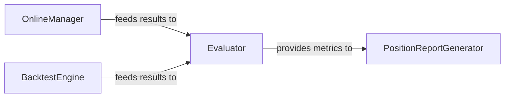

## Details

This subsystem is responsible for rigorously assessing the performance of quantitative trading strategies through historical backtesting, forward-looking simulations, and comprehensive reporting. It forms a critical feedback loop for strategy development and refinement within the Qlib platform.

### OnlineManager
Orchestrates and manages online (or near-live) trading simulations. It prepares trading signals, initiates model training (if applicable), and executes routine simulation steps, mimicking real-time trading scenarios. This component is crucial for validating strategies in a dynamic, forward-looking manner.

**Related Classes/Methods**:

- <a href="https://github.com/microsoft/qlib/blob/main/qlib/workflow/online/manager.py#L101-L382" target="_blank" rel="noopener noreferrer">`OnlineManager`:101-382</a>

### BacktestEngine
Executes historical backtests of quantitative trading strategies. It processes historical market data, applies defined trading rules, and simulates past performance, generating detailed trade records and performance data. This component is fundamental for rigorous historical validation of strategies.

**Related Classes/Methods**:

- <a href="https://github.com/microsoft/qlib/blob/main/qlib/backtest/backtest.py" target="_blank" rel="noopener noreferrer">`BacktestEngine`</a>

### Evaluator
Analyzes the performance and risk characteristics of trading strategies based on simulation results (from both `BacktestEngine` and `OnlineManager`). It calculates various financial metrics such as returns, volatility, Sharpe ratio, maximum drawdown, and other risk-adjusted performance indicators. It can also trigger backtesting for specific evaluation scenarios.

**Related Classes/Methods**:

- <a href="https://github.com/microsoft/qlib/blob/main/qlib/contrib/evaluate.py" target="_blank" rel="noopener noreferrer">`Evaluator`</a>

### PositionReportGenerator
Generates comprehensive reports and visualizations based on the detailed analysis of trading positions and overall strategy performance. This includes graphical representations of equity curves, drawdowns, and other key performance indicators, providing actionable insights into strategy efficacy.

**Related Classes/Methods**:

- <a href="https://github.com/microsoft/qlib/blob/main/qlib/contrib/report/analysis_position/report.py" target="_blank" rel="noopener noreferrer">`PositionReportGenerator`</a>

### [FAQ](https://github.com/CodeBoarding/GeneratedOnBoardings/tree/main?tab=readme-ov-file#faq)