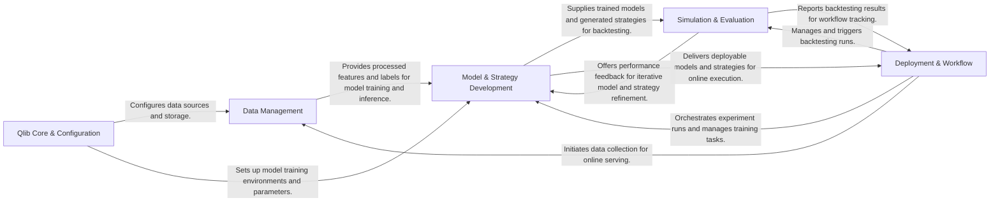

## Details

The Qlib project is structured around a robust financial quantitative research platform, enabling end-to-end workflow from data management to model deployment. The core components facilitate data ingestion and preprocessing, sophisticated model and strategy development (including reinforcement learning), rigorous simulation and evaluation through backtesting, and seamless workflow orchestration for experiment management and online deployment. This modular design ensures clear separation of concerns, promoting maintainability and extensibility, and provides a clear data flow for financial research and trading.

### Qlib Core & Configuration
The foundational layer for environment initialization and global settings.

**Related Classes/Methods**:

- <a href="https://github.com/microsoft/qlib/blob/main/qlib/__init__.py#L1-L9999" target="_blank" rel="noopener noreferrer">`qlib/__init__.py`:1-9999</a>
- <a href="https://github.com/microsoft/qlib/blob/main/qlib/config.py#L1-L9999" target="_blank" rel="noopener noreferrer">`qlib/config.py`:1-9999</a>

### Data Management [[Expand]](./Data_Management.md)
Handles data ingestion, storage, preprocessing, feature engineering, and dataset preparation.

**Related Classes/Methods**:

- <a href="https://github.com/microsoft/qlib/blob/main/scripts/data_collector/base.py#L1-L9999" target="_blank" rel="noopener noreferrer">`scripts/data_collector/base.py`:1-9999</a>
- <a href="https://github.com/microsoft/qlib/blob/main/scripts/dump_bin.py#L1-L9999" target="_blank" rel="noopener noreferrer">`scripts/dump_bin.py`:1-9999</a>
- <a href="https://github.com/microsoft/qlib/blob/main/qlib/data/dataset/processor.py#L1-L9999" target="_blank" rel="noopener noreferrer">`qlib/data/dataset/processor.py`:1-9999</a>
- <a href="https://github.com/microsoft/qlib/blob/main/qlib/data/dataset/handler.py#L1-L9999" target="_blank" rel="noopener noreferrer">`qlib/data/dataset/handler.py`:1-9999</a>
- <a href="https://github.com/microsoft/qlib/blob/main/qlib/data/data.py#L1-L9999" target="_blank" rel="noopener noreferrer">`qlib/data/data.py`:1-9999</a>

### Model & Strategy Development [[Expand]](./Model_Strategy_Development.md)
Encompasses model training (including RL), prediction generation, and trading strategy optimization.

**Related Classes/Methods**:

- <a href="https://github.com/microsoft/qlib/blob/main/qlib/model/trainer.py#L1-L9999" target="_blank" rel="noopener noreferrer">`qlib/model/trainer.py`:1-9999</a>
- <a href="https://github.com/microsoft/qlib/blob/main/qlib/contrib/model/pytorch_alstm.py#L1-L9999" target="_blank" rel="noopener noreferrer">`qlib/contrib/model/pytorch_alstm.py`:1-9999</a>
- <a href="https://github.com/microsoft/qlib/blob/main/qlib/contrib/model/gbdt.py#L1-L9999" target="_blank" rel="noopener noreferrer">`qlib/contrib/model/gbdt.py`:1-9999</a>
- <a href="https://github.com/microsoft/qlib/blob/main/qlib/rl/trainer/trainer.py#L1-L9999" target="_blank" rel="noopener noreferrer">`qlib/rl/trainer/trainer.py`:1-9999</a>
- <a href="https://github.com/microsoft/qlib/blob/main/qlib/model/base.py#L1-L9999" target="_blank" rel="noopener noreferrer">`qlib/model/base.py`:1-9999</a>
- <a href="https://github.com/microsoft/qlib/blob/main/qlib/contrib/strategy/signal_strategy.py#L1-L9999" target="_blank" rel="noopener noreferrer">`qlib/contrib/strategy/signal_strategy.py`:1-9999</a>
- <a href="https://github.com/microsoft/qlib/blob/main/qlib/contrib/strategy/optimizer/optimizer.py#L1-L9999" target="_blank" rel="noopener noreferrer">`qlib/contrib/strategy/optimizer/optimizer.py`:1-9999</a>

### Simulation & Evaluation [[Expand]](./Simulation_Evaluation.md)
Performs historical backtesting, simulates strategy performance, and generates comprehensive evaluation reports.

**Related Classes/Methods**:

- <a href="https://github.com/microsoft/qlib/blob/main/qlib/workflow/online/manager.py#L1-L9999" target="_blank" rel="noopener noreferrer">`qlib/workflow/online/manager.py`:1-9999</a>
- <a href="https://github.com/microsoft/qlib/blob/main/qlib/backtest/backtest.py#L1-L9999" target="_blank" rel="noopener noreferrer">`qlib/backtest/backtest.py`:1-9999</a>
- <a href="https://github.com/microsoft/qlib/blob/main/qlib/contrib/evaluate.py#L1-L9999" target="_blank" rel="noopener noreferrer">`qlib/contrib/evaluate.py`:1-9999</a>
- <a href="https://github.com/microsoft/qlib/blob/main/qlib/contrib/report/analysis_position/report.py#L1-L9999" target="_blank" rel="noopener noreferrer">`qlib/contrib/report/analysis_position/report.py`:1-9999</a>

### Deployment & Workflow [[Expand]](./Deployment_Workflow.md)
Manages experiment orchestration, tracks research workflows, and handles online serving and execution of strategies.

**Related Classes/Methods**:

- <a href="https://github.com/microsoft/qlib/blob/main/qlib/workflow/expm.py#L1-L9999" target="_blank" rel="noopener noreferrer">`qlib/workflow/expm.py`:1-9999</a>
- <a href="https://github.com/microsoft/qlib/blob/main/qlib/workflow/recorder.py#L1-L9999" target="_blank" rel="noopener noreferrer">`qlib/workflow/recorder.py`:1-9999</a>
- <a href="https://github.com/microsoft/qlib/blob/main/qlib/workflow/task/gen.py#L1-L9999" target="_blank" rel="noopener noreferrer">`qlib/workflow/task/gen.py`:1-9999</a>
- <a href="https://github.com/microsoft/qlib/blob/main/qlib/workflow/task/manage.py#L1-L9999" target="_blank" rel="noopener noreferrer">`qlib/workflow/task/manage.py`:1-9999</a>
- <a href="https://github.com/microsoft/qlib/blob/main/qlib/contrib/online/operator.py#L1-L9999" target="_blank" rel="noopener noreferrer">`qlib/contrib/online/operator.py`:1-9999</a>

### [FAQ](https://github.com/CodeBoarding/GeneratedOnBoardings/tree/main?tab=readme-ov-file#faq)