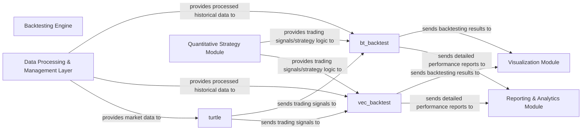

## Details

The `qstock.backtest` subsystem provides a comprehensive backtesting environment for quantitative trading strategies. It primarily consists of a `Backtesting Engine` that orchestrates simulations using both general-purpose (`bt_backtest`) and vectorized (`vec_backtest`) methodologies. The `turtle` component exemplifies a specific trading strategy implementation. This subsystem interacts with external layers for data provision, strategy definition, and result visualization and reporting.

### Backtesting Engine [[Expand]](./Backtesting_Engine.md)
The overarching component providing a robust environment for simulating the performance of trading strategies against historical market data. It orchestrates the execution of backtests using different methodologies and integrates with other parts of the quantitative analysis pipeline.

**Related Classes/Methods**:

### bt_backtest
Implements a general-purpose backtesting mechanism, likely supporting an event-driven or iterative simulation approach. It processes historical data and applies strategy logic to simulate trades.

**Related Classes/Methods**:

### vec_backtest
Provides a vectorized backtesting approach, optimized for performance by applying operations across entire datasets (e.g., using Pandas). This is crucial for efficient simulation on large historical data.

**Related Classes/Methods**:

### turtle
Represents a concrete implementation of a trading strategy (e.g., the Turtle Trading Strategy). It encapsulates the specific rules and logic for generating trading signals based on market data.

**Related Classes/Methods**:

### Data Processing & Management Layer [[Expand]](./Data_Processing_Management_Layer.md)
External component responsible for acquiring, cleaning, transforming, and providing historical financial data in a structured format suitable for backtesting.

**Related Classes/Methods**: _None_

### Quantitative Strategy Module [[Expand]](./Quantitative_Strategy_Module.md)
External component that defines and manages various trading strategies and their underlying logic, providing the rules and signals that the backtesting engine will simulate.

**Related Classes/Methods**: _None_

### Visualization Module
External component responsible for rendering backtesting results into interactive charts and graphs, aiding in visual analysis of strategy performance.

**Related Classes/Methods**: _None_

### Reporting & Analytics Module
External component that generates detailed textual and numerical reports based on backtesting results, including performance metrics, trade logs, and statistical analysis.

**Related Classes/Methods**: _None_

### [FAQ](https://github.com/CodeBoarding/GeneratedOnBoardings/tree/main?tab=readme-ov-file#faq)