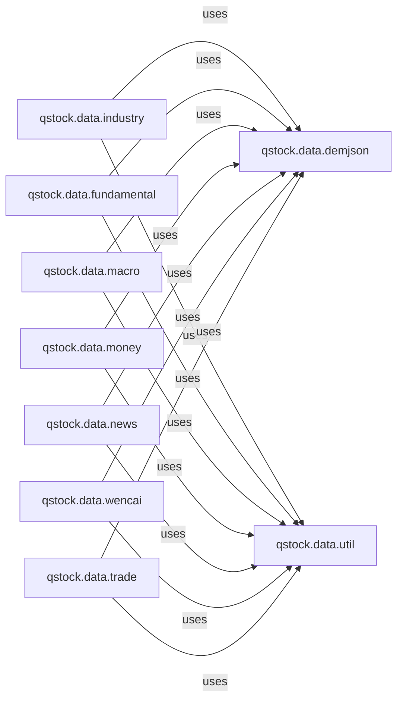

## Details

The `qstock.data` subsystem is a crucial data acquisition and processing layer within the `qstock` project, designed to provide various financial data points. It is composed of several specialized modules, each responsible for a distinct category of financial information. Central to this subsystem are `qstock.data.util` and `qstock.data.demjson`, which serve as foundational utilities. `qstock.data.util` provides common data manipulation and transformation functions, ensuring data consistency, while `qstock.data.demjson` handles robust JSON serialization and deserialization, critical for interacting with external APIs.

The specialized data modules, including `qstock.data.industry`, `qstock.data.fundamental`, `qstock.data.macro`, `qstock.data.money`, `qstock.data.news`, `qstock.data.wencai`, and `qstock.data.trade`, all depend on these core utilities. Each specialized module focuses on fetching, parsing, and organizing specific financial data types, such as industry-specific data, fundamental company information, macroeconomic indicators, money flow data, financial news, and trading data. The `qstock.data.wencai` module acts as a dedicated connector for the Wencai data platform, highlighting the subsystem's ability to integrate with specific external data sources. This modular design ensures clear separation of concerns, reusability of core utilities, and efficient management of diverse financial data streams.

### qstock.data.util
Provides common data manipulation, cleaning, and transformation functions. It acts as a shared service, ensuring data consistency and readiness across various data types.

**Related Classes/Methods**:

### qstock.data.demjson
Serves as a foundational utility for reliable JSON serialization and deserialization. It is a critical low-level service for all other `qstock.data` modules that interact with JSON-based APIs.

**Related Classes/Methods**:

### qstock.data.industry
Specializes in acquiring, parsing, and providing access to industry and concept-specific financial data, including members and historical data for various indices and concepts.

**Related Classes/Methods**:

### qstock.data.fundamental
Manages the retrieval and organization of fundamental financial data such as shareholder information, main business details, cash flow, balance sheets, and income statements.

**Related Classes/Methods**:

### qstock.data.macro
Focuses on fetching and processing macroeconomic indicators like interbank rates, PMI, CPI, GDP, and PPI.

**Related Classes/Methods**:

### qstock.data.money
Handles the collection and analysis of money flow data, including historical money flows, Northbound money, and sector/concept-specific capital movements.

**Related Classes/Methods**:

### qstock.data.news
Responsible for aggregating and providing access to financial news from diverse sources, including stock-specific news and general financial news.

**Related Classes/Methods**:

### qstock.data.wencai
Acts as a dedicated connector to the Wencai data platform, handling queries, cookie management, and result parsing from this specific data source.

**Related Classes/Methods**:

### qstock.data.trade
Provides comprehensive trading data, encompassing real-time market data, historical stock, fund, and bond information, and related company indicators.

**Related Classes/Methods**:

### [FAQ](https://github.com/CodeBoarding/GeneratedOnBoardings/tree/main?tab=readme-ov-file#faq)