```mermaid
graph LR
    Data_Acquisition_Layer["Data Acquisition Layer"]
    Data_Processing_Management_Layer["Data Processing & Management Layer"]
    Quantitative_Strategy_Module["Quantitative Strategy Module"]
    Backtesting_Engine["Backtesting Engine"]
    Visualization_Module["Visualization Module"]
    Data_Acquisition_Layer -- "Provides Raw Data" --> Data_Processing_Management_Layer
    Data_Processing_Management_Layer -- "Supplies Processed Data" --> Quantitative_Strategy_Module
    Data_Processing_Management_Layer -- "Feeds Historical Data" --> Backtesting_Engine
    Data_Processing_Management_Layer -- "Provides Charting Data" --> Visualization_Module
    Quantitative_Strategy_Module -- "Passes Strategies" --> Backtesting_Engine
    Quantitative_Strategy_Module -- "Sends Strategy Results" --> Visualization_Module
    Backtesting_Engine -- "Outputs Simulation Results" --> Visualization_Module
    click Data_Processing_Management_Layer href "https://github.com/CodeBoarding/GeneratedOnBoardings/blob/main/qstock/Data_Processing_Management_Layer.md" "Details"
    click Quantitative_Strategy_Module href "https://github.com/CodeBoarding/GeneratedOnBoardings/blob/main/qstock/Quantitative_Strategy_Module.md" "Details"
    click Backtesting_Engine href "https://github.com/CodeBoarding/GeneratedOnBoardings/blob/main/qstock/Backtesting_Engine.md" "Details"
```

## Details

The `qstock` project is structured around a clear data flow, starting with data acquisition, moving through processing and management, into quantitative strategy development and backtesting, and finally culminating in data visualization. This modular design ensures a streamlined pipeline for financial analysis, allowing for independent development and maintenance of each stage. The core interaction pathways involve the sequential flow of data from raw acquisition to refined insights and visual representation.

### Data Acquisition Layer
The entry point for external financial data, responsible for fetching raw information from diverse online sources.

**Related Classes/Methods**:

### Data Processing & Management Layer [[Expand]](./Data_Processing_Management_Layer.md)
Central hub for cleaning, transforming, and organizing raw financial data, ensuring consistency and readiness for analysis.

**Related Classes/Methods**:

### Quantitative Strategy Module [[Expand]](./Quantitative_Strategy_Module.md)
Encapsulates the core quantitative analysis logic, including algorithms for stock ranking, scoring, and implementing specific stock selection strategies.

**Related Classes/Methods**:

### Backtesting Engine [[Expand]](./Backtesting_Engine.md)
Provides a robust environment for simulating the performance of trading strategies against historical market data, crucial for validation and optimization.

**Related Classes/Methods**:

### Visualization Module
Dedicated to generating various interactive financial charts and plots, enabling users to visualize data, strategy performance, and analytical results.

**Related Classes/Methods**:

### [FAQ](https://github.com/CodeBoarding/GeneratedOnBoardings/tree/main?tab=readme-ov-file#faq)