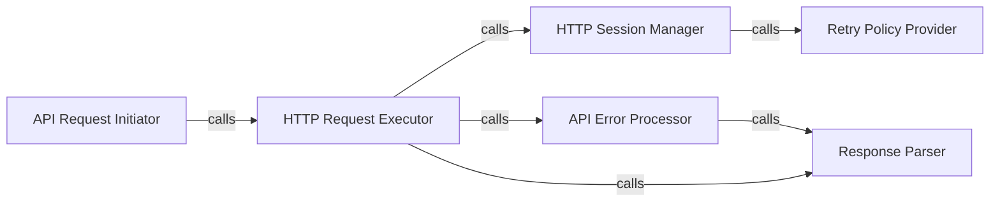

## Details

This subsystem is primarily encapsulated within the `quandl.connection` module, handling all aspects of low-level HTTP communication with the external Quandl RESTful API. Its boundaries are defined by the functions and classes responsible for session management, request execution, error handling, and response parsing related to the API.

### API Request Initiator
Serves as the initial entry point for all API calls. It prepares the request parameters, including URL, method, and data, before delegating the actual execution. This component acts as a facade for the underlying connection logic.

**Related Classes/Methods**:

- <a href="https://github.com/quandl/quandl-python/blob/master/quandl/connection.py#L17-L38" target="_blank" rel="noopener noreferrer">`quandl.connection.request`:17-38</a>

### HTTP Request Executor
Responsible for the actual dispatch of HTTP requests over the network. It manages the immediate response flow, integrating with session management for connection reuse and error processing for response validation.

**Related Classes/Methods**:

- <a href="https://github.com/quandl/quandl-python/blob/master/quandl/connection.py#L40-L56" target="_blank" rel="noopener noreferrer">`quandl.connection.execute_request`:40-56</a>

### HTTP Session Manager
Provides and configures the persistent HTTP session (e.g., using `requests.Session`). It ensures efficient connection reuse, manages default headers, and applies retry policies to enhance connection reliability.

**Related Classes/Methods**:

- <a href="https://github.com/quandl/quandl-python/blob/master/quandl/connection.py#L58-L64" target="_blank" rel="noopener noreferrer">`quandl.connection.get_session`:58-64</a>

### Retry Policy Provider
Defines and supplies the retry strategy for network operations. This component enhances the resilience of API calls against transient network issues or rate limiting by configuring retries with exponential backoff.

**Related Classes/Methods**:

- <a href="https://github.com/quandl/quandl-python/blob/master/quandl/connection.py#L66-L79" target="_blank" rel="noopener noreferrer">`quandl.connection.get_retries`:66-79</a>

### API Error Processor
Centralizes the logic for identifying, interpreting, and handling errors returned by the Quandl API. It ensures that API-specific error codes and messages are correctly processed and propagated to the calling layers.

**Related Classes/Methods**:

- <a href="https://github.com/quandl/quandl-python/blob/master/quandl/connection.py#L88-L114" target="_blank" rel="noopener noreferrer">`quandl.connection.handle_api_error`:88-114</a>

### Response Parser
Focuses on deserializing raw API responses, particularly for extracting structured data, including error details, from the HTTP response body (e.g., JSON).

**Related Classes/Methods**:

- <a href="https://github.com/quandl/quandl-python/blob/master/quandl/connection.py#L81-L86" target="_blank" rel="noopener noreferrer">`quandl.connection.parse`:81-86</a>

### [FAQ](https://github.com/CodeBoarding/GeneratedOnBoardings/tree/main?tab=readme-ov-file#faq)