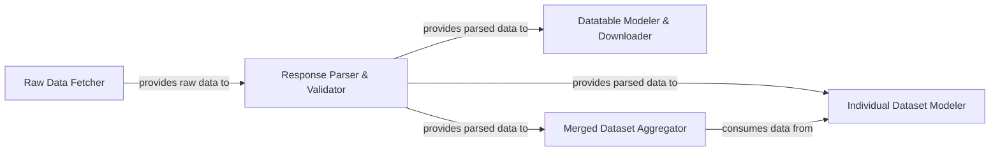

## Details

The Quandl data processing subsystem is designed to efficiently retrieve, parse, and model financial and economic data. It begins with the `Raw Data Fetcher` acquiring data directly from the Quandl API. This raw data is then channeled to the `Response Parser & Validator`, which is responsible for transforming and validating the incoming information. Subsequently, the validated data is distributed to specialized modeling components: the `Individual Dataset Modeler` for single time-series datasets, the `Datatable Modeler & Downloader` for larger, file-based datatables, and the `Merged Dataset Aggregator` for combining multiple datasets. The `Merged Dataset Aggregator` further consumes data from the `Individual Dataset Modeler` to facilitate complex aggregation operations, ensuring a unified and structured output for diverse data consumption needs.

### Raw Data Fetcher
Initiates the data retrieval process by fetching raw data directly from the Quandl API. It acts as the primary entry point for data acquisition within this subsystem.

**Related Classes/Methods**:

- <a href="https://github.com/quandl/quandl-python/blob/master/quandl/operations/get.py#L14-L28" target="_blank" rel="noopener noreferrer">`quandl.operations.get.__get_raw_data__`:14-28</a>

### Response Parser & Validator
Transforms the raw API responses into a structured list format and performs initial validation of the dataset data to ensure integrity before further processing.

**Related Classes/Methods**:

- <a href="https://github.com/quandl/quandl-python/blob/master/quandl/operations/data_list.py#L8-L13" target="_blank" rel="noopener noreferrer">`quandl.operations.data_list.create_list_from_response`:8-13</a>

### Individual Dataset Modeler
Represents and structures time-series data for individual datasets. Its data method is responsible for retrieving and structuring this data, including error handling for missing data or columns.

**Related Classes/Methods**:

- <a href="https://github.com/quandl/quandl-python/blob/master/quandl/model/dataset.py#L13-L58" target="_blank" rel="noopener noreferrer">`quandl.model.dataset.Dataset`:13-58</a>

### Datatable Modeler & Downloader
Manages the download and structuring of data specifically for datatables, which often involve larger, file-based datasets. Its download_file method orchestrates this specialized data retrieval and processing flow.

**Related Classes/Methods**:

- <a href="https://github.com/quandl/quandl-python/blob/master/quandl/model/datatable.py#L20-L93" target="_blank" rel="noopener noreferrer">`quandl.model.datatable.Datatable`:20-93</a>

### Merged Dataset Aggregator
Processes and aggregates data from multiple underlying datasets into a unified, structured format. Its data method handles complex operations like column management, ordering, and filtering across merged datasets.

**Related Classes/Methods**:

- <a href="https://github.com/quandl/quandl-python/blob/master/quandl/model/merged_dataset.py#L12-L229" target="_blank" rel="noopener noreferrer">`quandl.model.merged_dataset.MergedDataset`:12-229</a>

### [FAQ](https://github.com/CodeBoarding/GeneratedOnBoardings/tree/main?tab=readme-ov-file#faq)