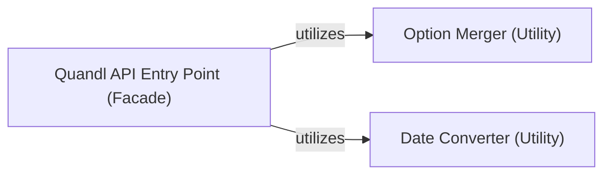

## Details

The `Quandl Client API (User Interface)` subsystem serves as the primary interaction point for users, abstracting the complexities of data retrieval and parameter preparation.

### Quandl API Entry Point (Facade)
This component acts as the primary user-facing interface, serving as a facade to simplify interactions with the Quandl API. It is responsible for initiating data requests, performing initial parsing and validation of user inputs, and orchestrating the preparation of request parameters before delegating to further internal processes (e.g., actual API calls, which are outside this specific subsystem's scope). It embodies the "Facade Pattern" by providing a simplified interface to a complex subsystem.

**Related Classes/Methods**:

- <a href="https://github.com/quandl/quandl-python/blob/master/quandl/get.py#L14-L63" target="_blank" rel="noopener noreferrer">`quandl.get.get`:14-63</a>
- <a href="https://github.com/quandl/quandl-python/blob/master/quandl/get_table.py#L9-L43" target="_blank" rel="noopener noreferrer">`quandl.get_table.get_table`:9-43</a>

### Option Merger (Utility)
A dedicated utility component focused on combining various configuration options and user-provided parameters. Its responsibility is to merge multiple dictionaries into a single, unified dictionary, ensuring that default settings are correctly overridden or extended by specific user inputs. This is crucial for flexible and configurable API requests.

**Related Classes/Methods**:

- <a href="https://github.com/quandl/quandl-python/blob/master/quandl/util.py#L29-L37" target="_blank" rel="noopener noreferrer">`quandl.util.merge_options`:29-37</a>

### Date Converter (Utility)
This utility component specializes in standardizing and converting diverse date representations (e.g., strings, datetime objects) provided by the user into a consistent and API-compatible date format. This ensures that all date-based queries are correctly interpreted and processed by the Quandl API, preventing format-related errors.

**Related Classes/Methods**:

- <a href="https://github.com/quandl/quandl-python/blob/master/quandl/util.py#L39-L50" target="_blank" rel="noopener noreferrer">`quandl.util.convert_to_dates`:39-50</a>

### [FAQ](https://github.com/CodeBoarding/GeneratedOnBoardings/tree/main?tab=readme-ov-file#faq)