```mermaid
graph LR
    User_Interaction["User Interaction"]
    Quandl_Client_API_User_Interface_["Quandl Client API (User Interface)"]
    Configuration_Manager["Configuration Manager"]
    API_Connection_Transport["API Connection & Transport"]
    Quandl_API_External_["Quandl API (External)"]
    Data_Processing_Modeling["Data Processing & Modeling"]
    Data_Transformation_Output["Data Transformation & Output"]
    Bulk_Export_Operations["Bulk & Export Operations"]
    User_Interaction -- "Initiates data/export request" --> Quandl_Client_API_User_Interface_
    Quandl_Client_API_User_Interface_ -- "Retrieves API key and settings" --> Configuration_Manager
    Quandl_Client_API_User_Interface_ -- "Submits prepared request for execution" --> API_Connection_Transport
    API_Connection_Transport -- "Communicates with" --> Quandl_API_External_
    API_Connection_Transport -- "Passes raw response to" --> Data_Processing_Modeling
    Data_Processing_Modeling -- "Provides structured data to" --> Data_Transformation_Output
    Data_Transformation_Output -- "Returns transformed data to" --> Quandl_Client_API_User_Interface_
    Quandl_Client_API_User_Interface_ -- "Returns formatted data to" --> User_Interaction
    Quandl_Client_API_User_Interface_ -- "Delegates requests to" --> Bulk_Export_Operations
    Bulk_Export_Operations -- "Requests file/export via" --> API_Connection_Transport
    Bulk_Export_Operations -- "Makes data available to" --> User_Interaction
    click Quandl_Client_API_User_Interface_ href "https://github.com/CodeBoarding/GeneratedOnBoardings/blob/main/quandl-python/Quandl_Client_API_User_Interface_.md" "Details"
    click API_Connection_Transport href "https://github.com/CodeBoarding/GeneratedOnBoardings/blob/main/quandl-python/API_Connection_Transport.md" "Details"
    click Data_Processing_Modeling href "https://github.com/CodeBoarding/GeneratedOnBoardings/blob/main/quandl-python/Data_Processing_Modeling.md" "Details"
```

## Details

This architecture overview details the high-level components of the Quandl Python library, focusing on their responsibilities and interactions to facilitate data retrieval and processing from the Quandl API. The design emphasizes clear separation of concerns, enabling efficient data flow from user request to formatted output.

### User Interaction
Represents the external user or application initiating requests and consuming the final processed data. This component is outside the direct control of the Quandl library but interacts with its public interfaces.

**Related Classes/Methods**: _None_

### Quandl Client API (User Interface) [[Expand]](./Quandl_Client_API_User_Interface_.md)
The primary user-facing interface for initiating data requests and receiving processed data. It orchestrates the overall data retrieval workflow and prepares request parameters.

**Related Classes/Methods**:

- <a href="https://github.com/quandl/quandl-python/blob/master/quandl/get.py#L14-L63" target="_blank" rel="noopener noreferrer">`quandl.get.get`:14-63</a>
- <a href="https://github.com/quandl/quandl-python/blob/master/quandl/get_table.py#L9-L43" target="_blank" rel="noopener noreferrer">`quandl.get_table.get_table`:9-43</a>
- <a href="https://github.com/quandl/quandl-python/blob/master/quandl/util.py#L29-L37" target="_blank" rel="noopener noreferrer">`quandl.util.merge_options`:29-37</a>
- <a href="https://github.com/quandl/quandl-python/blob/master/quandl/util.py#L39-L50" target="_blank" rel="noopener noreferrer">`quandl.util.convert_to_dates`:39-50</a>

### Configuration Manager
Manages global library settings, including the API key, essential for authenticating requests to the Quandl API.

**Related Classes/Methods**:

- <a href="https://github.com/quandl/quandl-python/blob/master/quandl/api_config.py" target="_blank" rel="noopener noreferrer">`quandl.api_config.api_key`</a>

### API Connection & Transport [[Expand]](./API_Connection_Transport.md)
Responsible for all low-level HTTP communication with the external Quandl RESTful API, including session management, request execution, and error handling.

**Related Classes/Methods**:

- <a href="https://github.com/quandl/quandl-python/blob/master/quandl/connection.py#L17-L38" target="_blank" rel="noopener noreferrer">`quandl.connection.request`:17-38</a>
- <a href="https://github.com/quandl/quandl-python/blob/master/quandl/connection.py#L40-L56" target="_blank" rel="noopener noreferrer">`quandl.connection.execute_request`:40-56</a>
- <a href="https://github.com/quandl/quandl-python/blob/master/quandl/connection.py#L88-L114" target="_blank" rel="noopener noreferrer">`quandl.connection.handle_api_error`:88-114</a>

### Quandl API (External)
Represents the external Quandl RESTful API service, which provides the raw financial and economic data. This component is external to the Python library.

**Related Classes/Methods**: _None_

### Data Processing & Modeling [[Expand]](./Data_Processing_Modeling.md)
Handles the initial processing of raw API responses, validates data integrity, and maps raw data into structured internal data models (datasets, datatables).

**Related Classes/Methods**:

- <a href="https://github.com/quandl/quandl-python/blob/master/quandl/model/merged_dataset.py#L32-L61" target="_blank" rel="noopener noreferrer">`quandl.model.merged_dataset.data`:32-61</a>
- <a href="https://github.com/quandl/quandl-python/blob/master/quandl/model/dataset.py#L13-L58" target="_blank" rel="noopener noreferrer">`quandl.model.dataset.Dataset`:13-58</a>
- <a href="https://github.com/quandl/quandl-python/blob/master/quandl/model/datatable.py#L20-L93" target="_blank" rel="noopener noreferrer">`quandl.model.datatable.Datatable`:20-93</a>
- <a href="https://github.com/quandl/quandl-python/blob/master/quandl/operations/get.py#L14-L28" target="_blank" rel="noopener noreferrer">`quandl.operations.get.__get_raw_data__`:14-28</a>
- <a href="https://github.com/quandl/quandl-python/blob/master/quandl/operations/data_list.py#L8-L13" target="_blank" rel="noopener noreferrer">`quandl.operations.data_list.create_list_from_response`:8-13</a>

### Data Transformation & Output
Converts internal Quandl data objects into various user-friendly formats such as pandas DataFrames, NumPy arrays, or CSV.

**Related Classes/Methods**:

- <a href="https://github.com/quandl/quandl-python/blob/master/quandl/model/data_mixin.py#L7-L35" target="_blank" rel="noopener noreferrer">`quandl.model.data_mixin.to_pandas`:7-35</a>
- <a href="https://github.com/quandl/quandl-python/blob/master/quandl/model/data_mixin.py#L37-L38" target="_blank" rel="noopener noreferrer">`quandl.model.data_mixin.to_numpy`:37-38</a>
- <a href="https://github.com/quandl/quandl-python/blob/master/quandl/model/data_mixin.py#L40-L41" target="_blank" rel="noopener noreferrer">`quandl.model.data_mixin.to_csv`:40-41</a>

### Bulk & Export Operations
Manages specialized operations for downloading large datasets or exporting datatables to files, often involving direct file transfers.

**Related Classes/Methods**:

- <a href="https://github.com/quandl/quandl-python/blob/master/quandl/bulkdownload.py#L7-L24" target="_blank" rel="noopener noreferrer">`quandl.bulkdownload.BulkDownload`:7-24</a>
- <a href="https://github.com/quandl/quandl-python/blob/master/quandl/export_table.py" target="_blank" rel="noopener noreferrer">`quandl.export_table.ExportTable`</a>

### [FAQ](https://github.com/CodeBoarding/GeneratedOnBoardings/tree/main?tab=readme-ov-file#faq)