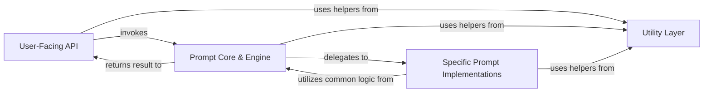

## Details

The `questionary` library employs a clear component-based architecture, centralizing user interaction through a **User-Facing API** that abstracts the complexities of terminal prompting. This API dispatches requests to the **Prompt Core & Engine**, which acts as the central control unit, orchestrating the prompt's lifecycle and integrating with `prompt_toolkit`. The core engine then delegates to specialized **Specific Prompt Implementations**, each responsible for the unique rendering and input handling of a particular prompt type (e.g., text, select, checkbox). A shared **Utility Layer** provides common helper functions and integrations, supporting all components. This design ensures modularity, allowing for easy extension with new prompt types while maintaining a consistent and robust interaction flow.

### User-Facing API
The public interface for `questionary`, providing high-level functions to initiate prompts and forms, handling initial setup and basic error management.

**Related Classes/Methods**:

- <a href="https://github.com/tmbo/questionary/blob/master/questionary/prompt.py#L25-L81" target="_blank" rel="noopener noreferrer">`questionary.prompt.prompt`:25-81</a>
- <a href="https://github.com/tmbo/questionary/blob/master/questionary/prompt.py#L84-L234" target="_blank" rel="noopener noreferrer">`questionary.prompt.unsafe_prompt`:84-234</a>
- <a href="https://github.com/tmbo/questionary/blob/master/questionary/question.py#L48-L67" target="_blank" rel="noopener noreferrer">`questionary.question.ask`:48-67</a>
- <a href="https://github.com/tmbo/questionary/blob/master/questionary/question.py#L69-L89" target="_blank" rel="noopener noreferrer">`questionary.question.unsafe_ask`:69-89</a>
- <a href="https://github.com/tmbo/questionary/blob/master/questionary/question.py#L26-L46" target="_blank" rel="noopener noreferrer">`questionary.question.ask_async`:26-46</a>
- <a href="https://github.com/tmbo/questionary/blob/master/questionary/question.py#L106-L134" target="_blank" rel="noopener noreferrer">`questionary.question.unsafe_ask_async`:106-134</a>
- <a href="https://github.com/tmbo/questionary/blob/master/questionary/form.py#L35-L117" target="_blank" rel="noopener noreferrer">`questionary.form.form`:35-117</a>
- <a href="https://github.com/tmbo/questionary/blob/master/questionary/form.py#L1-L100" target="_blank" rel="noopener noreferrer">`questionary.form.unsafe_form`:1-100</a>

### Prompt Core & Engine
The central orchestrator managing the prompt lifecycle, integrating with `prompt_toolkit`, and providing reusable building blocks and common logic for all prompt types.

**Related Classes/Methods**:

- <a href="https://github.com/tmbo/questionary/blob/master/questionary/prompt.py#L84-L234" target="_blank" rel="noopener noreferrer">`questionary.prompt.unsafe_prompt`:84-234</a>
- <a href="https://github.com/tmbo/questionary/blob/master/questionary/prompts/common.py" target="_blank" rel="noopener noreferrer">`questionary.prompts.common.Choice`</a>
- <a href="https://github.com/tmbo/questionary/blob/master/questionary/prompts/common.py#L178-L195" target="_blank" rel="noopener noreferrer">`questionary.prompts.common.Separator`:178-195</a>
- <a href="https://github.com/tmbo/questionary/blob/master/questionary/prompts/common.py#L198-L557" target="_blank" rel="noopener noreferrer">`questionary.prompts.common.InquirerControl`:198-557</a>

### Specific Prompt Implementations
Individual modules, each dedicated to a specific interactive prompt type, defining unique rendering, input processing, and validation rules.

**Related Classes/Methods**:

- <a href="https://github.com/tmbo/questionary/blob/master/questionary/prompts/text.py#L1-L100" target="_blank" rel="noopener noreferrer">`questionary.prompts.text`:1-100</a>
- <a href="https://github.com/tmbo/questionary/blob/master/questionary/prompts/password.py#L1-L100" target="_blank" rel="noopener noreferrer">`questionary.prompts.password`:1-100</a>
- <a href="https://github.com/tmbo/questionary/blob/master/questionary/prompts/confirm.py#L1-L100" target="_blank" rel="noopener noreferrer">`questionary.prompts.confirm`:1-100</a>
- <a href="https://github.com/tmbo/questionary/blob/master/questionary/prompts/select.py#L1-L100" target="_blank" rel="noopener noreferrer">`questionary.prompts.select`:1-100</a>
- <a href="https://github.com/tmbo/questionary/blob/master/questionary/prompts/rawselect.py#L1-L100" target="_blank" rel="noopener noreferrer">`questionary.prompts.rawselect`:1-100</a>
- <a href="https://github.com/tmbo/questionary/blob/master/questionary/prompts/checkbox.py#L1-L100" target="_blank" rel="noopener noreferrer">`questionary.prompts.checkbox`:1-100</a>
- <a href="https://github.com/tmbo/questionary/blob/master/questionary/prompts/autocomplete.py#L1-L100" target="_blank" rel="noopener noreferrer">`questionary.prompts.autocomplete`:1-100</a>
- <a href="https://github.com/tmbo/questionary/blob/master/questionary/prompts/path.py#L1-L100" target="_blank" rel="noopener noreferrer">`questionary.prompts.path`:1-100</a>
- <a href="https://github.com/tmbo/questionary/blob/master/questionary/prompts/press_any_key_to_continue.py#L1-L100" target="_blank" rel="noopener noreferrer">`questionary.prompts.press_any_key_to_continue`:1-100</a>

### Utility Layer
Contains general-purpose helper functions and utilities used across the library for various tasks.

**Related Classes/Methods**:

- <a href="https://github.com/tmbo/questionary/blob/master/questionary/utils.py#L35-L48" target="_blank" rel="noopener noreferrer">`questionary.utils.used_kwargs`:35-48</a>
- <a href="https://github.com/tmbo/questionary/blob/master/questionary/utils.py#L61-L63" target="_blank" rel="noopener noreferrer">`questionary.utils.missing_arguments`:61-63</a>
- <a href="https://github.com/tmbo/questionary/blob/master/questionary/utils.py#L66-L78" target="_blank" rel="noopener noreferrer">`questionary.utils.activate_prompt_toolkit_async_mode`:66-78</a>

### [FAQ](https://github.com/CodeBoarding/GeneratedOnBoardings/tree/main?tab=readme-ov-file#faq)