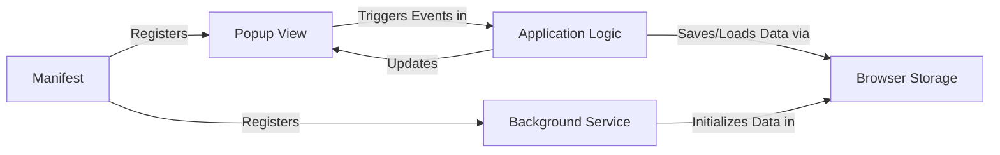

## Details

This browser extension follows a classic event-driven architecture, orchestrated by the `Manifest` file. The primary user interaction flow begins when the `Popup View` is loaded, presenting the note-taking interface. All user actions, like typing or clicking save, are handled by the `Application Logic` script. This script is the system's core, responsible for fetching data from the `Browser Storage` to display existing notes and writing new data back for persistence. A `Background Service` operates independently to manage one-time initialization tasks, such as setting up default notes upon installation.

### Manifest
The central configuration file that defines the extension's properties, permissions (`storage`), and entry points. It registers the background script and the popup view, orchestrating how all components are loaded.

**Related Classes/Methods**:

- `manifest.json`

### Popup View
The user-facing UI component, built with HTML and CSS. It defines the structure and style of the note-taking area and its controls, and is responsible for presenting the interface to the user.

**Related Classes/Methods**:

- `popup.html`
- `popup.css`

### Application Logic
The core logic of the extension, contained in a single JavaScript file. It handles all user-generated events from the Popup View, manages the application's state, and directly interfaces with the Browser Storage API to save, load, and clear notes.

**Related Classes/Methods**:

- `popup.js`

### Background Service
An independent service worker that handles extension-level events that occur outside the popup's lifecycle. Its primary role is to perform one-time setup or initialization tasks when the extension is installed or updated.

**Related Classes/Methods**:

- `background.js`

### Browser Storage
A component provided by the browser's `chrome.storage` API that acts as the data persistence layer. It provides a simple key-value store for saving and retrieving user notes.

**Related Classes/Methods**:

- `chrome.storage`

### [FAQ](https://github.com/CodeBoarding/GeneratedOnBoardings/tree/main?tab=readme-ov-file#faq)