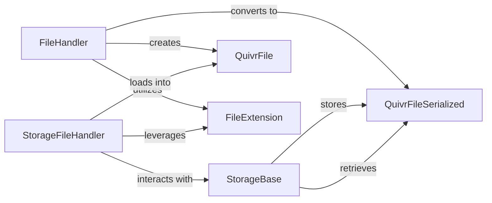

## Details

The core file handling subsystem in `quivr` is designed around a clear separation of concerns for file ingestion, in-memory representation, and storage. The `FileHandler` acts as the initial processing unit, responsible for taking raw files, identifying their `FileExtension`, and transforming them into a standardized `QuivrFile` object. For persistence or transmission, `QuivrFile` instances are converted into `QuivrFileSerialized` objects. The `StorageFileHandler` then manages the interaction with the `StorageBase`, facilitating the loading and saving of `QuivrFile` objects (often in their `QuivrFileSerialized` form) to and from the underlying storage. This architecture ensures a consistent data model (`QuivrFile`) throughout the pipeline, with a specialized serialized form for efficient storage and retrieval, all while leveraging `FileExtension` for accurate file type identification.

### FileHandler
Acts as the primary entry point for raw file ingestion. It is responsible for identifying file types, loading raw content into a standardized `QuivrFile` object, and serializing `QuivrFile` objects into `QuivrFileSerialized` for efficient storage or transmission.

**Related Classes/Methods**:

- <a href="https://github.com/QuivrHQ/quivr/blob/main/core/quivr_core/files/file.py" target="_blank" rel="noopener noreferrer">`core.quivr_core.files.file:FileHandler`</a>

### StorageFileHandler
Manages file operations specifically within the context of the storage layer. It focuses on loading files from storage into `QuivrFile` objects and identifying their extensions to ensure data integrity during storage and retrieval processes.

**Related Classes/Methods**:

- <a href="https://github.com/QuivrHQ/quivr/blob/main/core/quivr_core/storage/file.py" target="_blank" rel="noopener noreferrer">`core.quivr_core.storage.file:StorageFileHandler`</a>

### StorageBase
Provides an abstract interface and foundational capabilities for various persistent storage mechanisms. Its core role is to manage the high-level aspects of the knowledge base, such as providing metadata (e.g., total file count via `nb_files`). It serves as the base for different storage backend implementations.

**Related Classes/Methods**:

- <a href="https://github.com/QuivrHQ/quivr/blob/main/core/quivr_core/storage/storage_base.py" target="_blank" rel="noopener noreferrer">`core.quivr_core.storage.storage_base:StorageBase`</a>

### QuivrFile
Serves as the standardized in-memory data model for representing file content throughout the data pipeline, ensuring uniform processing. It includes attributes like `id`, `original_filename`, `path`, `file_sha1`, and `file_extension`. It also provides methods for serialization and deserialization.

**Related Classes/Methods**:

- <a href="https://github.com/QuivrHQ/quivr/blob/main/core/quivr_core/files/file.py" target="_blank" rel="noopener noreferrer">`core.quivr_core.files.file:QuivrFile`</a>

### QuivrFileSerialized
Represents a serialized version of `QuivrFile`, optimized for efficient storage or transmission across system boundaries. It is a `BaseModel` containing the same core attributes as `QuivrFile`.

**Related Classes/Methods**:

- <a href="https://github.com/QuivrHQ/quivr/blob/main/core/quivr_core/files/file.py" target="_blank" rel="noopener noreferrer">`core.quivr_core.files.file:QuivrFileSerialized`</a>

### FileExtension
A utility component dedicated to accurately determining the file type of an input, enabling appropriate parsing and handling. It is an `Enum` defining various supported file extensions.

**Related Classes/Methods**:

- <a href="https://github.com/QuivrHQ/quivr/blob/main/core/quivr_core/files/file.py" target="_blank" rel="noopener noreferrer">`core.quivr_core.files.file:FileExtension`</a>

### [FAQ](https://github.com/CodeBoarding/GeneratedOnBoardings/tree/main?tab=readme-ov-file#faq)