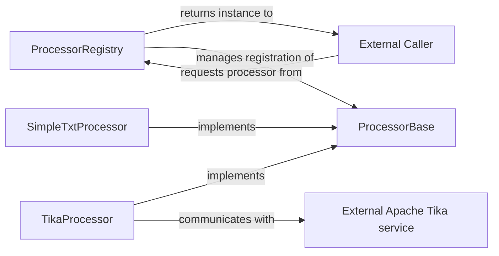

## Details

The document processing subsystem in `quivr` is designed for extensibility and efficient handling of various document types. At its core, the `ProcessorBase` abstract class establishes a common interface for all document processors, ensuring consistent behavior. Concrete implementations, such as `SimpleTxtProcessor` for plain text and `TikaProcessor` for complex formats (leveraging an external Apache Tika service), extend `ProcessorBase` to provide specialized processing logic. The `ProcessorRegistry` serves as a central hub, managing the registration of these diverse processors and dynamically providing the correct processor instance to external callers based on the document's characteristics. This architecture facilitates a plug-and-play approach, allowing new document processing capabilities to be integrated seamlessly.

### ProcessorBase
This abstract base class serves as the core interface for all document processors. It defines the `process_file` contract and handles common, format-agnostic steps like metadata retrieval and initial support checks, ensuring a consistent API for all concrete processors.

**Related Classes/Methods**:

- <a href="https://github.com/QuivrHQ/quivr/blob/main/core/quivr_core/processor/processor_base.py" target="_blank" rel="noopener noreferrer">`core.quivr_core.processor.processor_base`</a>

### ProcessorRegistry
This component acts as a central factory and management system for document processors. It's responsible for registering new processor types and dynamically selecting the appropriate processor based on file characteristics, enabling a plugin-like architecture.

**Related Classes/Methods**:

- <a href="https://github.com/QuivrHQ/quivr/blob/main/core/quivr_core/processor/registry.py" target="_blank" rel="noopener noreferrer">`core.quivr_core.processor.registry`</a>

### SimpleTxtProcessor
A concrete implementation of `ProcessorBase` specifically designed for plain text files. Its primary function is content extraction and intelligent chunking, which is crucial for preparing text for vectorization in a RAG pipeline.

**Related Classes/Methods**:

- <a href="https://github.com/QuivrHQ/quivr/blob/main/core/quivr_core/processor/implementations/simple_txt_processor.py" target="_blank" rel="noopener noreferrer">`core.quivr_core.processor.implementations.simple_txt_processor`</a>

### TikaProcessor
Another concrete implementation of `ProcessorBase`, leveraging an external Apache Tika service for processing a wide array of complex document formats (e.g., PDF, DOCX). It abstracts the complexity of interacting with external parsing tools.

**Related Classes/Methods**:

- <a href="https://github.com/QuivrHQ/quivr/blob/main/core/quivr_core/processor/implementations/tika_processor.py" target="_blank" rel="noopener noreferrer">`core.quivr_core.processor.implementations.tika_processor`</a>

### External Caller
Represents any component or system outside the immediate document processing subsystem that initiates the document ingestion and processing workflow. This could be a user interface, an API endpoint, or another part of the RAG pipeline.

**Related Classes/Methods**: _None_

### External Apache Tika service
An external, third-party service that `TikaProcessor` interacts with to perform robust parsing and content extraction from various complex document formats. It is critical for handling non-plain text files.

**Related Classes/Methods**: _None_

### [FAQ](https://github.com/CodeBoarding/GeneratedOnBoardings/tree/main?tab=readme-ov-file#faq)