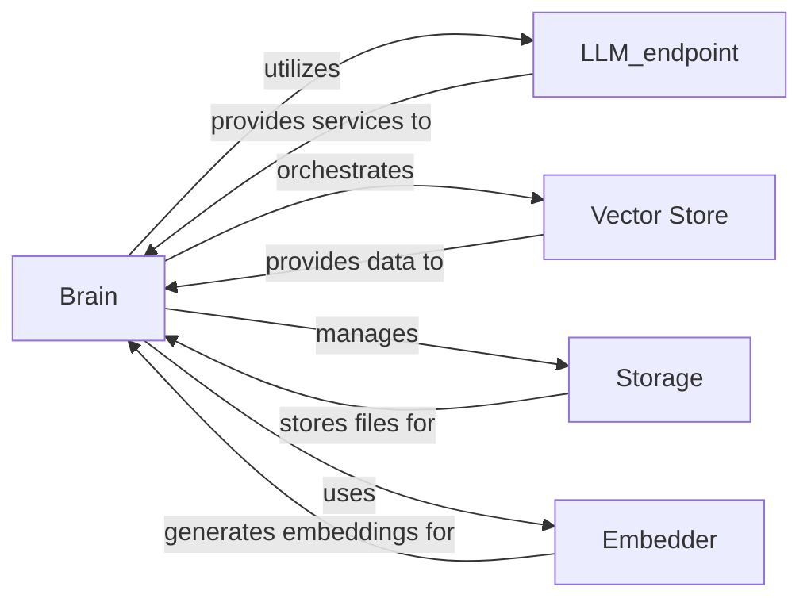

## Details

The `quivr_core` subsystem is designed around the central `Brain` component, which orchestrates the entire knowledge management and Retrieval Augmented Generation (RAG) pipeline. The `Brain` component integrates seamlessly with an `LLM_endpoint` to facilitate interactions with various Large Language Models, a `Vector Store` for efficient semantic search and document retrieval, and a `Storage` component responsible for persistent file management. An `Embedder` component is also crucial, as it transforms textual data into vector embeddings, enabling the `Vector Store` to perform similarity searches. This integrated architecture allows the `Brain` to effectively process user queries, retrieve pertinent information from its knowledge base, and generate comprehensive responses by leveraging the capabilities of the connected LLM.

### Brain
The `Brain` component serves as the central core for query processing and orchestrates the entire RAG workflow. It manages the interactions between the LLM, vector store, and file storage to provide comprehensive answers to user queries.

**Related Classes/Methods**: _None_

### LLM_endpoint
This component provides a standardized, abstracted interface for interacting with diverse Large Language Models. It encapsulates the complexities of model loading, tokenizer management, response caching, and querying LLM-specific capabilities, thereby abstracting away provider-specific details.

**Related Classes/Methods**: _None_

### Vector Store
The `Vector Store` is responsible for storing and retrieving processed documents (chunks) in a vector format, enabling efficient similarity searches based on embeddings.

**Related Classes/Methods**: _None_

### Storage [[Expand]](./Storage.md)
This component manages the storage of files associated with the `Brain`, handling operations such as uploading, retrieving, and organizing documents.

**Related Classes/Methods**: _None_

### Embedder
The `Embedder` component is responsible for generating vector embeddings from textual data, which are then used by the `Vector Store` for indexing and similarity search.

**Related Classes/Methods**: _None_

### [FAQ](https://github.com/CodeBoarding/GeneratedOnBoardings/tree/main?tab=readme-ov-file#faq)