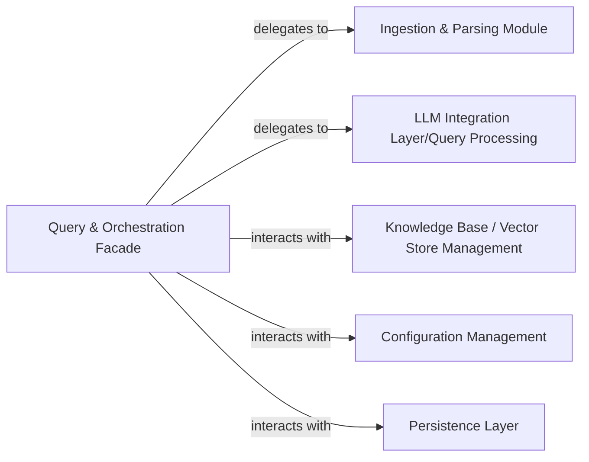

## Details

The Quivr RAG system is orchestrated by the `Query & Orchestration Facade`, serving as the central control point for all user interactions and workflow management. This facade delegates data preparation to the `Ingestion & Parsing Module`, which processes raw input for the knowledge base. For intelligent response generation, it interacts with the `LLM Integration Layer/Query Processing`, leveraging large language models. The system's core data is managed by the `Knowledge Base / Vector Store Management` component, responsible for efficient storage and retrieval. System parameters are dynamically handled by the `Configuration Management` component, ensuring adaptable operations. Finally, the `Persistence Layer` provides robust data storage for maintaining system state and historical information across sessions.

### Query & Orchestration Facade [[Expand]](./Query_Orchestration_Facade.md)
The primary entry point for user interactions, orchestrating the entire RAG workflow from data ingestion to query processing and answer generation. It manages the lifecycle of the "brain" instance and coordinates tasks across other specialized components.

**Related Classes/Methods**:

- <a href="https://github.com/QuivrHQ/quivr/blob/main/core/quivr_core/brain/brain.py" target="_blank" rel="noopener noreferrer">`core.quivr_core.brain.brain`</a>

### Ingestion & Parsing Module
Handles the processing of raw data for ingestion into the knowledge base, including both synchronous and asynchronous file processing.

**Related Classes/Methods**:

- <a href="https://github.com/QuivrHQ/quivr/blob/main/core/quivr_core/processor/processor_base.py" target="_blank" rel="noopener noreferrer">`core.quivr_core.processor.processor_base.Processor`</a>

### LLM Integration Layer/Query Processing
Manages interactions with Large Language Models (LLMs) for query processing, including retrieval, augmentation, and generation of responses. It handles both synchronous and asynchronous query execution.

**Related Classes/Methods**:

- <a href="https://github.com/QuivrHQ/quivr/blob/main/core/quivr_core/llm/llm_endpoint.py#L189-L331" target="_blank" rel="noopener noreferrer">`core.quivr_core.llm.llm_endpoint.LLMEndpoint`:189-331</a>

### Knowledge Base / Vector Store Management
Responsible for storing, managing, and retrieving information from the underlying knowledge base or vector store. This includes indexing, querying, and maintaining the data.

**Related Classes/Methods**:

- <a href="https://github.com/QuivrHQ/quivr/blob/main/core/quivr_core/rag/quivr_rag.py" target="_blank" rel="noopener noreferrer">`core.quivr_core.rag.quivr_rag.QuivrRAG`</a>

### Configuration Management
Manages the loading, parsing, and application of system configurations, ensuring the RAG pipeline operates according to defined parameters.

**Related Classes/Methods**:

- <a href="https://github.com/QuivrHQ/quivr/blob/main/core/quivr_core/config.py" target="_blank" rel="noopener noreferrer">`core.quivr_core.config.Config`</a>

### Persistence Layer
Handles the storage and retrieval of persistent data, such as the "brain" state and chat history, ensuring data integrity and continuity across sessions.

**Related Classes/Methods**:

- <a href="https://github.com/QuivrHQ/quivr/blob/main/core/quivr_core/storage/storage_base.py#L8-L92" target="_blank" rel="noopener noreferrer">`core.quivr_core.storage.storage_base.Storage`:8-92</a>

### [FAQ](https://github.com/CodeBoarding/GeneratedOnBoardings/tree/main?tab=readme-ov-file#faq)