```mermaid
graph LR
    Query_Orchestration_Facade["Query & Orchestration Facade"]
    Data_Ingestion_Storage["Data Ingestion & Storage"]
    Document_Processing_Chunking["Document Processing & Chunking"]
    RAG_Pipeline_Engine["RAG Pipeline Engine"]
    LLM_Interaction_Layer["LLM Interaction Layer"]
    RAG_Configuration_Data_Models["RAG Configuration & Data Models"]
    Query_Orchestration_Facade -- "initiates data ingestion" --> Data_Ingestion_Storage
    Query_Orchestration_Facade -- "delegates document processing tasks" --> Document_Processing_Chunking
    Query_Orchestration_Facade -- "submits user queries and receives final answers" --> RAG_Pipeline_Engine
    Data_Ingestion_Storage -- "provides raw file content for processing" --> Document_Processing_Chunking
    Document_Processing_Chunking -- "supplies processed and chunked documents" --> RAG_Pipeline_Engine
    RAG_Pipeline_Engine -- "requests language model inferences" --> LLM_Interaction_Layer
    RAG_Pipeline_Engine -- "retrieves pipeline configuration and utilities" --> RAG_Configuration_Data_Models
    RAG_Configuration_Data_Models -- "configures LLM parameters based on settings" --> LLM_Interaction_Layer
    click Query_Orchestration_Facade href "https://github.com/CodeBoarding/GeneratedOnBoardings/blob/main/quivr/Query_Orchestration_Facade.md" "Details"
    click Data_Ingestion_Storage href "https://github.com/CodeBoarding/GeneratedOnBoardings/blob/main/quivr/Data_Ingestion_Storage.md" "Details"
    click Document_Processing_Chunking href "https://github.com/CodeBoarding/GeneratedOnBoardings/blob/main/quivr/Document_Processing_Chunking.md" "Details"
    click RAG_Pipeline_Engine href "https://github.com/CodeBoarding/GeneratedOnBoardings/blob/main/quivr/RAG_Pipeline_Engine.md" "Details"
    click LLM_Interaction_Layer href "https://github.com/CodeBoarding/GeneratedOnBoardings/blob/main/quivr/LLM_Interaction_Layer.md" "Details"
```

## Details

The `quivr` project implements a modular and extensible Retrieval-Augmented Generation (RAG) pipeline, designed as an AI/ML toolkit. At its core, the **Query & Orchestration Facade** acts as the central "Brain," managing user interactions and orchestrating the entire RAG workflow. This orchestration involves initiating data flow through the **Data Ingestion & Storage** and **Document Processing & Chunking** components, which prepare raw content for the main **RAG Pipeline Engine**. The engine, leveraging frameworks like LangGraph, then orchestrates retrieval, augmentation, and generation stages, interacting with the **LLM Interaction Layer** for all language model operations. Configuration and data models for the RAG process are managed by the **RAG Configuration & Data Models** component, ensuring the pipeline's adaptability and extensibility. This architecture emphasizes clear component boundaries and a sequential data flow, making it ideal for visual representation as a directed graph, highlighting the progression from input to augmented output.

### Query & Orchestration Facade [[Expand]](./Query_Orchestration_Facade.md)
The primary entry point for user interactions, orchestrating the entire RAG workflow, from initiating data ingestion to submitting queries and returning final answers. It acts as the "Brain" of the system.

**Related Classes/Methods**:

- <a href="https://github.com/QuivrHQ/quivr/blob/main/core/quivr_core/brain/brain.py" target="_blank" rel="noopener noreferrer">`core.quivr_core.brain.brain`</a>

### Data Ingestion & Storage [[Expand]](./Data_Ingestion_Storage.md)
Manages the loading, serialization, and persistent storage of various file types, providing raw data for subsequent processing.

**Related Classes/Methods**:

- <a href="https://github.com/QuivrHQ/quivr/blob/main/core/quivr_core/files/file.py" target="_blank" rel="noopener noreferrer">`core.quivr_core.files.file`</a>
- <a href="https://github.com/QuivrHQ/quivr/blob/main/core/quivr_core/storage/file.py" target="_blank" rel="noopener noreferrer">`core.quivr_core.storage.file`</a>
- <a href="https://github.com/QuivrHQ/quivr/blob/main/core/quivr_core/storage/storage_base.py" target="_blank" rel="noopener noreferrer">`core.quivr_core.storage.storage_base`</a>

### Document Processing & Chunking [[Expand]](./Document_Processing_Chunking.md)
Transforms raw input files into a structured, chunked format suitable for the RAG pipeline, including content extraction, text splitting, and preparing documents for vectorization.

**Related Classes/Methods**:

- <a href="https://github.com/QuivrHQ/quivr/blob/main/core/quivr_core/processor/processor_base.py" target="_blank" rel="noopener noreferrer">`core.quivr_core.processor.processor_base`</a>
- <a href="https://github.com/QuivrHQ/quivr/blob/main/core/quivr_core/processor/registry.py" target="_blank" rel="noopener noreferrer">`core.quivr_core.processor.registry`</a>
- <a href="https://github.com/QuivrHQ/quivr/blob/main/core/quivr_core/processor/implementations/simple_txt_processor.py" target="_blank" rel="noopener noreferrer">`core.quivr_core.processor.implementations.simple_txt_processor`</a>
- <a href="https://github.com/QuivrHQ/quivr/blob/main/core/quivr_core/processor/implementations/tika_processor.py" target="_blank" rel="noopener noreferrer">`core.quivr_core.processor.implementations.tika_processor`</a>

### RAG Pipeline Engine [[Expand]](./RAG_Pipeline_Engine.md)
The core engine that defines, builds, and executes complex Retrieval-Augmented Generation (RAG) workflows, often leveraging frameworks like LangGraph. It integrates retrieval, augmentation, and generation stages.

**Related Classes/Methods**:

- <a href="https://github.com/QuivrHQ/quivr/blob/main/core/quivr_core/rag/quivr_rag_langgraph.py" target="_blank" rel="noopener noreferrer">`core.quivr_core.rag.quivr_rag_langgraph`</a>
- <a href="https://github.com/QuivrHQ/quivr/blob/main/core/quivr_core/rag/quivr_rag.py" target="_blank" rel="noopener noreferrer">`core.quivr_core.rag.quivr_rag`</a>

### LLM Interaction Layer [[Expand]](./LLM_Interaction_Layer.md)
Provides a standardized interface for interacting with various Large Language Models. It handles model loading, tokenization, prompt submission, and response parsing, abstracting away LLM-specific details.

**Related Classes/Methods**:

- <a href="https://github.com/QuivrHQ/quivr/blob/main/core/quivr_core/llm/llm_endpoint.py" target="_blank" rel="noopener noreferrer">`core.quivr_core.llm.llm_endpoint`</a>

### RAG Configuration & Data Models
Manages the configuration settings for the RAG pipeline, including LLM models, tools, and provides data models for chat history and other RAG-specific entities.

**Related Classes/Methods**:

- <a href="https://github.com/QuivrHQ/quivr/blob/main/core/quivr_core/rag/entities/config.py" target="_blank" rel="noopener noreferrer">`core.quivr_core.rag.entities.config`</a>
- <a href="https://github.com/QuivrHQ/quivr/blob/main/core/quivr_core/rag/entities/chat.py" target="_blank" rel="noopener noreferrer">`core.quivr_core.rag.entities.chat`</a>
- <a href="https://github.com/QuivrHQ/quivr/blob/main/core/quivr_core/rag/utils.py" target="_blank" rel="noopener noreferrer">`core.quivr_core.rag.utils`</a>

### [FAQ](https://github.com/CodeBoarding/GeneratedOnBoardings/tree/main?tab=readme-ov-file#faq)