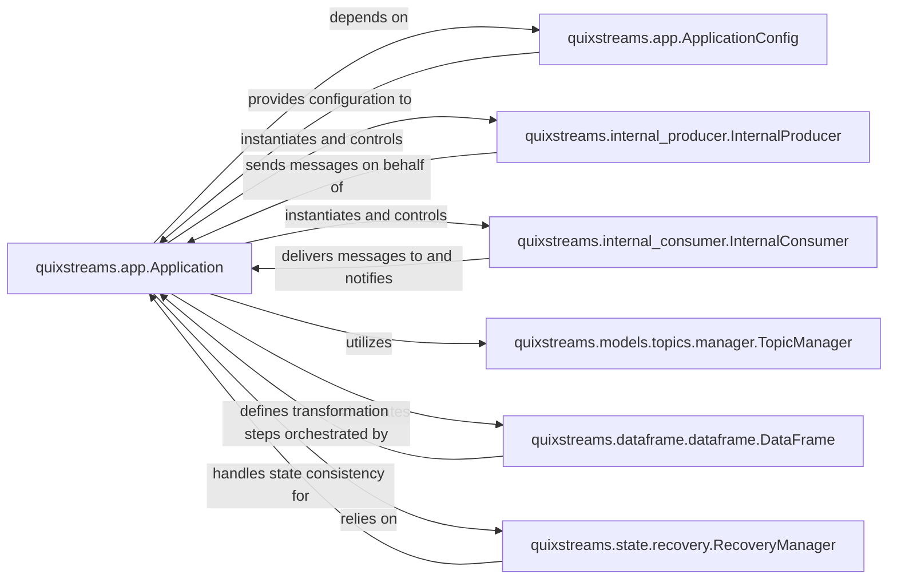

## Details

The `quixstreams` application is orchestrated by the `Application` component, which serves as the central control unit. It initializes with configurations provided by `ApplicationConfig` and manages the entire streaming data pipeline. The `Application` component directly interacts with `InternalProducer` to send processed messages to Kafka and `InternalConsumer` to receive messages, handling the low-level Kafka interactions. Data transformation logic is primarily defined using the `DataFrame` component, which offers a declarative API for stream processing, with its execution orchestrated by the `Application`. For robust state management and fault tolerance, the `Application` relies on the `RecoveryManager` to ensure data consistency during partition rebalances. Additionally, the `TopicManager` is utilized by the `Application` to manage Kafka topics, ensuring proper setup and validation for the data flow. This architecture highlights a clear separation of concerns, with the `Application` acting as the orchestrator, delegating specific responsibilities to specialized components for Kafka interaction, data transformation, state management, and topic administration.

The `quixstreams` subsystem is designed around a central `Application` component that orchestrates the entire streaming data flow. This orchestration involves several critical interaction pathways:

Application Initialization and Configuration: The `Application` component depends on `ApplicationConfig` to retrieve all necessary configuration parameters. This is a foundational interaction, as the `Application` cannot function without proper setup.
`quixstreams.app.Application` depends on `quixstreams.app.ApplicationConfig`
`quixstreams.app.ApplicationConfig` provides configuration to `quixstreams.app.Application`

Kafka Message Ingestion and Production: The `Application` directly manages the flow of messages to and from Kafka. It instantiates and controls both the `InternalConsumer` for message consumption and the `InternalProducer` for message delivery. The `InternalConsumer` delivers messages to the `Application` for processing, and the `InternalProducer` sends messages on behalf of the `Application`.
`quixstreams.app.Application` instantiates and controls `quixstreams.internal_consumer.InternalConsumer`
`quixstreams.internal_consumer.InternalConsumer` delivers messages to and notifies `quixstreams.app.Application`
`quixstreams.app.Application` instantiates and controls `quixstreams.internal_producer.InternalProducer`
`quixstreams.internal_producer.InternalProducer` sends messages on behalf of `quixstreams.app.Application`

Data Transformation and Processing: The core stream processing logic is defined using the `DataFrame` component. The `Application` orchestrates the execution of the transformations defined within the `DataFrame`, making it the primary mechanism for data manipulation.
`quixstreams.app.Application` orchestrates `quixstreams.dataframe.dataframe.DataFrame`
`quixstreams.dataframe.dataframe.DataFrame` defines transformation steps orchestrated by `quixstreams.app.Application`

State Management and Recovery: For fault tolerance and exactly-once processing, the `Application` relies on the `RecoveryManager`. This component is crucial for handling state consistency, especially during Kafka consumer partition assignments and revocations.
`quixstreams.app.Application` relies on `quixstreams.state.recovery.RecoveryManager`
`quixstreams.state.recovery.RecoveryManager` handles state consistency for `quixstreams.app.Application`

Kafka Topic Management: The `Application` utilizes the `TopicManager` to ensure that Kafka topics are correctly set up, configured, and validated, which is essential for the application's data flow.
`quixstreams.app.Application` utilizes `quixstreams.models.topics.manager.TopicManager`

### quixstreams.app.Application
The central control unit responsible for initializing, configuring, and managing the overall lifecycle of the streaming application. It orchestrates the data flow by setting up sources, sinks, and the processing engine. It handles Kafka client setup, topic management, signal handling for graceful shutdown, DataFrame execution orchestration, and partition rebalancing events.

**Related Classes/Methods**:

- <a href="https://github.com/quixio/quix-streams/blob/main/quixstreams/app.py#L88-L1122" target="_blank" rel="noopener noreferrer">`quixstreams.app.Application`:88-1122</a>

### quixstreams.app.ApplicationConfig
Stores and provides all necessary configuration parameters for the `Application` instance, ensuring consistent settings across the application's components.

**Related Classes/Methods**:

- <a href="https://github.com/quixio/quix-streams/blob/main/quixstreams/app.py#L1125-L1193" target="_blank" rel="noopener noreferrer">`quixstreams.app.ApplicationConfig`:1125-1193</a>

### quixstreams.internal_producer.InternalProducer
Abstracts the underlying Kafka producer, providing an interface for sending messages to Kafka topics, including support for transactional operations.

**Related Classes/Methods**:

- <a href="https://github.com/quixio/quix-streams/blob/main/quixstreams/internal_producer.py#L76-L325" target="_blank" rel="noopener noreferrer">`quixstreams.internal_producer.InternalProducer`:76-325</a>

### quixstreams.internal_consumer.InternalConsumer
Abstracts the underlying Kafka consumer, managing message consumption from Kafka topics, handling message buffering, and overseeing partition assignments and rebalancing.

**Related Classes/Methods**:

- <a href="https://github.com/quixio/quix-streams/blob/main/quixstreams/internal_consumer/consumer.py" target="_blank" rel="noopener noreferrer">`quixstreams.internal_consumer.consumer.Consumer`</a>

### quixstreams.models.topics.manager.TopicManager
Manages the lifecycle of Kafka topics, including their creation, configuration, and validation, ensuring that topics are properly set up for the application's data flow.

**Related Classes/Methods**:

- <a href="https://github.com/quixio/quix-streams/blob/main/quixstreams/models/topics/manager.py#L22-L474" target="_blank" rel="noopener noreferrer">`quixstreams.models.topics.manager.TopicManager`:22-474</a>

### quixstreams.dataframe.dataframe.DataFrame
Provides a high-level, declarative API for defining data transformations and operations on incoming message streams, acting as the primary mechanism for stream processing logic.

**Related Classes/Methods**:

- <a href="https://github.com/quixio/quix-streams/blob/main/quixstreams/dataframe/dataframe.py#L90-L300" target="_blank" rel="noopener noreferrer">`quixstreams.dataframe.dataframe.DataFrame`:90-300</a>

### quixstreams.state.recovery.RecoveryManager
Manages the recovery and consistency of application state, particularly when Kafka consumer partitions are assigned or revoked, which is crucial for fault tolerance and exactly-once processing guarantees.

**Related Classes/Methods**:

- <a href="https://github.com/quixio/quix-streams/blob/main/quixstreams/state/recovery.py#L306-L585" target="_blank" rel="noopener noreferrer">`quixstreams.state.recovery.RecoveryManager`:306-585</a>

### [FAQ](https://github.com/CodeBoarding/GeneratedOnBoardings/tree/main?tab=readme-ov-file#faq)