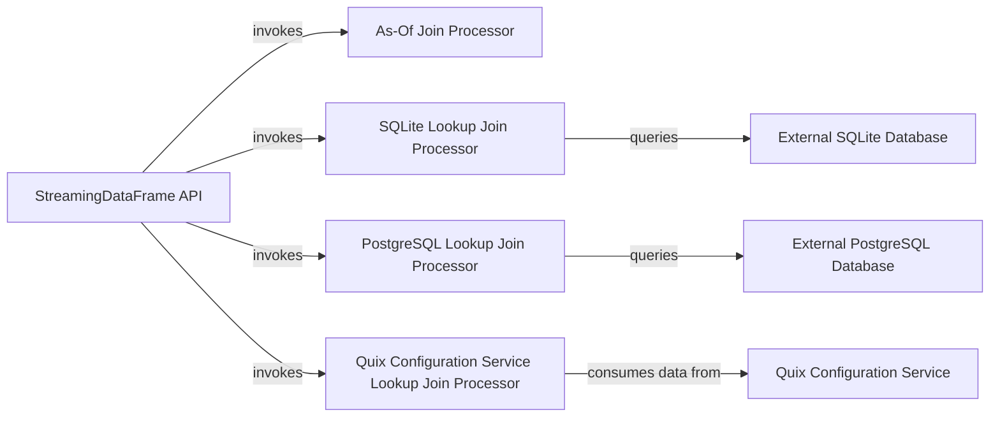

## Details

The `quixstreams.dataframe` subsystem provides a flexible framework for real-time stream enrichment through various join operations. At its core, the `StreamingDataFrame API` serves as the primary entry point, enabling users to define and execute complex joins. This API intelligently dispatches join requests to specialized processors: the `As-Of Join Processor` for temporal matching, and dedicated lookup join processors for integrating with external data sources. These lookup processors, including `SQLite Lookup Join Processor`, `PostgreSQL Lookup Join Processor`, and `Quix Configuration Service Lookup Join Processor`, are responsible for querying and consuming data from their respective external systems (`External SQLite Database`, `External PostgreSQL Database`, and `Quix Configuration Service`) to enrich the incoming data streams. This modular design ensures efficient and scalable data enrichment capabilities within the `quix-streams` ecosystem.

### StreamingDataFrame API
Serves as the public interface for users to define and initiate various join operations (e.g., join_lookup, join_asof) on StreamingDataFrame objects. It acts as an orchestrator, delegating the actual join execution to the appropriate underlying join implementation.

**Related Classes/Methods**:

- <a href="https://github.com/quixio/quix-streams/blob/main/quixstreams/dataframe/dataframe.py" target="_blank" rel="noopener noreferrer">`quixstreams.dataframe.dataframe`</a>

### As-Of Join Processor
Implements the "as-of" join logic, matching records from the left stream with the latest available records from the right stream based on timestamp, within a defined grace period. It manages the state of the right stream to facilitate this temporal matching.

**Related Classes/Methods**:

- <a href="https://github.com/quixio/quix-streams/blob/main/quixstreams/dataframe/joins/join_asof.py" target="_blank" rel="noopener noreferrer">`quixstreams.dataframe.joins.join_asof`</a>

### SQLite Lookup Join Processor
Provides the concrete implementation for performing lookup joins against an external SQLite database. It handles database connection management, constructs SQL queries based on the incoming stream data, and retrieves corresponding lookup data.

**Related Classes/Methods**:

- <a href="https://github.com/quixio/quix-streams/blob/main/quixstreams/dataframe/joins/lookups/sqlite.py" target="_blank" rel="noopener noreferrer">`quixstreams.dataframe.joins.lookups.sqlite`</a>

### PostgreSQL Lookup Join Processor
Implements lookup joins specifically for external PostgreSQL databases. Similar to the SQLite counterpart, it manages connections, generates queries, and retrieves lookup data from PostgreSQL.

**Related Classes/Methods**:

- <a href="https://github.com/quixio/quix-streams/blob/main/quixstreams/dataframe/joins/lookups/postgresql.py" target="_blank" rel="noopener noreferrer">`quixstreams.dataframe.joins.lookups.postgresql`</a>

### Quix Configuration Service Lookup Join Processor
Enables lookup joins by integrating with the Quix Configuration Service. It is responsible for fetching and maintaining up-to-date configuration data, handling versioning, and consuming configuration events to ensure real-time enrichment.

**Related Classes/Methods**:

- <a href="https://github.com/quixio/quix-streams/blob/main/quixstreams/dataframe/joins/lookups/quix_configuration_service" target="_blank" rel="noopener noreferrer">`quixstreams.dataframe.joins.lookups.quix_configuration_service`</a>

### External SQLite Database
An external data source that provides static or slowly changing reference data used for enrichment by the SQLite Lookup Join Processor. Note: This is an external component and does not have source code within the `quix-streams` project.

**Related Classes/Methods**: _None_

### External PostgreSQL Database
An external data source that provides static or slowly changing reference data used for enrichment by the PostgreSQL Lookup Join Processor. Note: This is an external component and does not have source code within the `quix-streams` project.

**Related Classes/Methods**: _None_

### Quix Configuration Service
An external service that provides real-time configuration data, often streamed, which is used for dynamic lookup and enrichment by the Quix Configuration Service Lookup Join Processor. Note: This is an external component and does not have source code within the `quix-streams` project.

**Related Classes/Methods**: _None_

### [FAQ](https://github.com/CodeBoarding/GeneratedOnBoardings/tree/main?tab=readme-ov-file#faq)