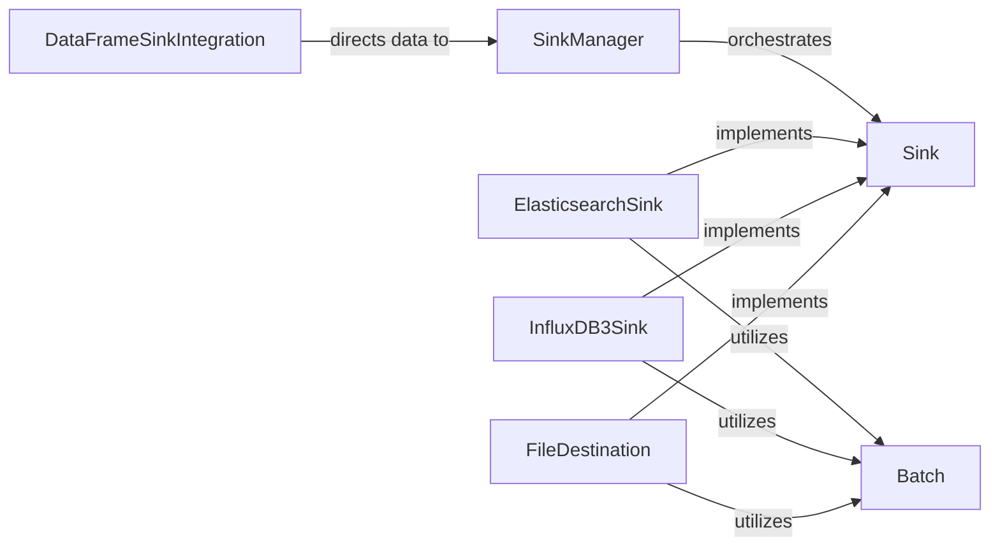

## Details

The Data Sinks subsystem is primarily defined by the quixstreams/sinks/ directory. It encompasses all modules responsible for publishing processed data from Kafka topics to various external systems, acting as the egress points for data from the streaming application.

### Sink
The foundational abstract class (quixstreams.sinks.base.sink.Sink) that defines the contract for all data sinks. It ensures a consistent API for operations such as setup, writing data, flushing buffers, and starting/stopping the sink. This aligns with the "Modular and Extensible" architectural bias, allowing new sinks to be easily integrated.

**Related Classes/Methods**:

- <a href="https://github.com/quixio/quix-streams/blob/main/quixstreams/sinks/base/sink.py" target="_blank" rel="noopener noreferrer">`quixstreams.sinks.base.sink.Sink`</a>

### SinkManager
Responsible for managing the lifecycle and orchestration of multiple Sink instances within the application (quixstreams.sinks.base.manager.SinkManager). It handles the registration, initialization, and coordination of all active sinks, ensuring they operate correctly as part of the overall data pipeline. This component embodies the "Application Orchestrator" aspect for the sink side.

**Related Classes/Methods**:

- <a href="https://github.com/quixio/quix-streams/blob/main/quixstreams/sinks/base/manager.py#L8-L23" target="_blank" rel="noopener noreferrer">`quixstreams.sinks.base.manager.SinkManager`:8-23</a>

### Batch
A utility component (quixstreams.sinks.base.batch.Batch) that collects and batches SinkItem objects. Its primary responsibility is to optimize write operations to external systems by reducing the number of individual write calls, thereby improving efficiency and throughput. This supports the "Reliability and Scalability" emphasis.

**Related Classes/Methods**:

- <a href="https://github.com/quixio/quix-streams/blob/main/quixstreams/sinks/base/batch.py" target="_blank" rel="noopener noreferrer">`quixstreams.sinks.base.batch.Batch`</a>

### DataFrameSinkIntegration
Serves as the bridge between the StreamingDataFrame processing logic and the Data Sinks subsystem (quixstreams.dataframe.dataframe.sink). It's the point where processed data from the DataFrame is directed towards the configured sinks.

**Related Classes/Methods**:

- <a href="https://github.com/quixio/quix-streams/blob/main/quixstreams/dataframe/dataframe.py" target="_blank" rel="noopener noreferrer">`quixstreams.dataframe.dataframe.sink`</a>

### ElasticsearchSink
A concrete implementation of the Sink interface for Elasticsearch (quixstreams.sinks.community.elasticsearch.ElasticsearchSink). It encapsulates the logic for connecting, authenticating, formatting data, and writing to Elasticsearch.

**Related Classes/Methods**:

- <a href="https://github.com/quixio/quix-streams/blob/main/quixstreams/sinks/community/elasticsearch.py#L38-L194" target="_blank" rel="noopener noreferrer">`quixstreams.sinks.community.elasticsearch.ElasticsearchSink`:38-194</a>

### InfluxDB3Sink
A concrete implementation of the Sink interface for InfluxDB3 (quixstreams.sinks.core.influxdb3.InfluxDB3Sink). It encapsulates the logic for connecting, authenticating, formatting data, and writing to InfluxDB3.

**Related Classes/Methods**:

- <a href="https://github.com/quixio/quix-streams/blob/main/quixstreams/sinks/core/influxdb3.py#L54-L353" target="_blank" rel="noopener noreferrer">`quixstreams.sinks.core.influxdb3.InfluxDB3Sink`:54-353</a>

### FileDestination
A base class for file-based sink implementations (quixstreams.sinks.community.file.destinations.base.FileDestination). It encapsulates the common logic for connecting, authenticating, formatting data, and writing to various file systems.

**Related Classes/Methods**:

- <a href="https://github.com/quixio/quix-streams/blob/main/quixstreams/sinks/community/file/destinations/base.py" target="_blank" rel="noopener noreferrer">`quixstreams.sinks.community.file.destinations.base.FileDestination`</a>

### [FAQ](https://github.com/CodeBoarding/GeneratedOnBoardings/tree/main?tab=readme-ov-file#faq)