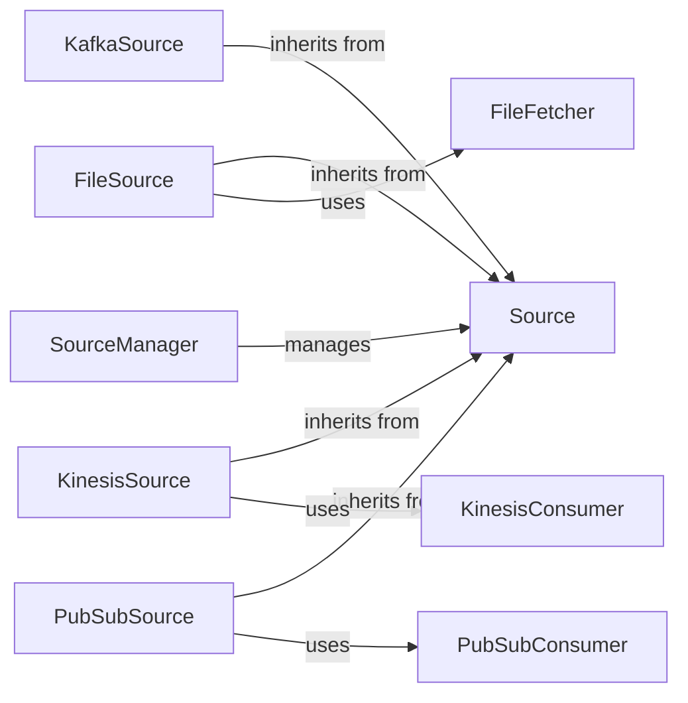

## Details

The quixstreams.sources subsystem is responsible for ingesting data from various external systems into the Quix Streams framework. It provides a flexible and extensible architecture through an abstract Source component, which defines a common interface for all data input mechanisms. The SourceManager orchestrates the lifecycle and management of these diverse data sources. Concrete implementations like KafkaSource, FileSource, KinesisSource, and PubSubSource handle specific data platforms, often leveraging dedicated consumer or fetcher components for direct interaction with their respective APIs. This design ensures modularity and allows for easy integration of new data sources.

### Source
This abstract base class defines the common interface and contract for all data ingestion mechanisms within the framework. It ensures a consistent API for different types of data sources.

**Related Classes/Methods**:

- <a href="https://github.com/quixio/quix-streams/blob/main/quixstreams/sources/base/source.py#L172-L378" target="_blank" rel="noopener noreferrer">`quixstreams.sources.base.source.Source`:172-378</a>

### SourceManager
Acts as the orchestrator for all data sources, managing their lifecycle, including starting, stopping, configuration, and handling exceptions. It provides a centralized control point for data ingress.

**Related Classes/Methods**:

- <a href="https://github.com/quixio/quix-streams/blob/main/quixstreams/sources/base/manager.py#L250-L337" target="_blank" rel="noopener noreferrer">`quixstreams.sources.base.manager.SourceManager`:250-337</a>

### KafkaSource
A primary concrete implementation responsible for ingesting messages directly from Apache Kafka topics. It translates raw Kafka messages into the framework's internal data format for processing.

**Related Classes/Methods**:

- <a href="https://github.com/quixio/quix-streams/blob/main/" target="_blank" rel="noopener noreferrer">`quixstreams.sources.core.kafka.kafka.KafkaSource`</a>

### FileSource
Provides a generalized approach for ingesting data from various file storage systems (e.g., local files, cloud storage). It internally utilizes a FileFetcher utility for efficient file retrieval.

**Related Classes/Methods**:

- <a href="https://github.com/quixio/quix-streams/blob/main/quixstreams/sources/community/file/base.py#L23-L204" target="_blank" rel="noopener noreferrer">`quixstreams.sources.community.file.base.FileSource`:23-204</a>
- <a href="https://github.com/quixio/quix-streams/blob/main/quixstreams/sources/community/file/components/file_fetcher.py#L11-L59" target="_blank" rel="noopener noreferrer">`quixstreams.sources.community.file.components.file_fetcher.FileFetcher`:11-59</a>

### KinesisSource
A concrete implementation for ingesting real-time data streams from Amazon Kinesis. It leverages a KinesisConsumer component for direct interaction with the Kinesis API.

**Related Classes/Methods**:

- <a href="https://github.com/quixio/quix-streams/blob/main/quixstreams/sources/community/kinesis/kinesis.py#L22-L160" target="_blank" rel="noopener noreferrer">`quixstreams.sources.community.kinesis.kinesis.KinesisSource`:22-160</a>
- <a href="https://github.com/quixio/quix-streams/blob/main/quixstreams/sources/community/kinesis/consumer.py#L61-L190" target="_blank" rel="noopener noreferrer">`quixstreams.sources.community.kinesis.consumer.KinesisConsumer`:61-190</a>

### PubSubSource
A concrete implementation for ingesting real-time data streams from Google Cloud Pub/Sub. It uses a PubSubConsumer component to manage interactions with the Google Cloud Pub/Sub API.

**Related Classes/Methods**:

- <a href="https://github.com/quixio/quix-streams/blob/main/quixstreams/sources/community/pubsub/pubsub.py#L20-L153" target="_blank" rel="noopener noreferrer">`quixstreams.sources.community.pubsub.pubsub.PubSubSource`:20-153</a>
- <a href="https://github.com/quixio/quix-streams/blob/main/quixstreams/sources/community/pubsub/consumer.py#L32-L185" target="_blank" rel="noopener noreferrer">`quixstreams.sources.community.pubsub.consumer.PubSubConsumer`:32-185</a>

### FileFetcher
Utility for efficient file retrieval, used by FileSource.

**Related Classes/Methods**:

- <a href="https://github.com/quixio/quix-streams/blob/main/quixstreams/sources/community/file/components/file_fetcher.py#L11-L59" target="_blank" rel="noopener noreferrer">`quixstreams.sources.community.file.components.file_fetcher.FileFetcher`:11-59</a>

### KinesisConsumer
Component for direct interaction with the Kinesis API, used by KinesisSource.

**Related Classes/Methods**:

- <a href="https://github.com/quixio/quix-streams/blob/main/quixstreams/sources/community/kinesis/consumer.py#L61-L190" target="_blank" rel="noopener noreferrer">`quixstreams.sources.community.kinesis.consumer.KinesisConsumer`:61-190</a>

### PubSubConsumer
Component to manage interactions with the Google Cloud Pub/Sub API, used by PubSubSource.

**Related Classes/Methods**:

- <a href="https://github.com/quixio/quix-streams/blob/main/quixstreams/sources/community/pubsub/consumer.py#L32-L185" target="_blank" rel="noopener noreferrer">`quixstreams.sources.community.pubsub.consumer.PubSubConsumer`:32-185</a>

### [FAQ](https://github.com/CodeBoarding/GeneratedOnBoardings/tree/main?tab=readme-ov-file#faq)