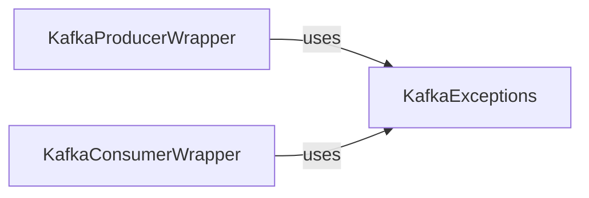

## Details

The `quixstreams.kafka` subsystem is designed to provide a robust and abstracted interface for interacting with Apache Kafka. Its core functionality revolves around two primary operational components: `KafkaProducerWrapper` and `KafkaConsumerWrapper`. The `KafkaProducerWrapper` is responsible for all aspects of sending messages to Kafka topics, including transaction management and offset handling. Conversely, the `KafkaConsumerWrapper` manages the consumption of messages, handling topic subscriptions, offset management, and controlling the flow of incoming data. Both of these critical components rely on `KafkaExceptions`, a dedicated component that defines a set of custom exception types. This ensures structured and consistent error reporting across all low-level Kafka interactions, enhancing the system's reliability and maintainability. This clear separation of concerns for message production, consumption, and error handling contributes to a modular and efficient Kafka integration layer within the project.

### KafkaProducerWrapper
Manages the production of messages to Kafka topics, handling transactions, offset sending, and transaction commits by interfacing with `librdkafka`. It is the primary component for sending data to Kafka.

**Related Classes/Methods**:

- <a href="https://github.com/quixio/quix-streams/blob/main/quixstreams/kafka/producer.py" target="_blank" rel="noopener noreferrer">`KafkaProducerWrapper`</a>

### KafkaConsumerWrapper
Manages the consumption of messages from Kafka topics, handling subscriptions, offset management, and partition assignments via `librdkafka`. It provides mechanisms to control message flow (e.g., pausing/resuming). It is the primary component for receiving data from Kafka.

**Related Classes/Methods**:

- <a href="https://github.com/quixio/quix-streams/blob/main/quixstreams/kafka/consumer.py" target="_blank" rel="noopener noreferrer">`KafkaConsumerWrapper`</a>

### KafkaExceptions
Defines a set of custom exception types for Kafka-related errors, ensuring structured and consistent error reporting across the Kafka interaction layer.

**Related Classes/Methods**:

- <a href="https://github.com/quixio/quix-streams/blob/main/quixstreams/kafka/exceptions.py" target="_blank" rel="noopener noreferrer">`KafkaExceptions`</a>

### [FAQ](https://github.com/CodeBoarding/GeneratedOnBoardings/tree/main?tab=readme-ov-file#faq)