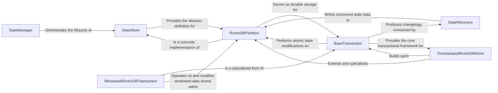

## Details

The `quixstreams.state` subsystem provides robust state management capabilities. The `StateManager` acts as the central orchestrator, overseeing the lifecycle of `StateStore` instances, which define the interface for state persistence. `RocksDBPartition` serves as a concrete, durable implementation of `StateStore`, handling low-level key-value operations. `BaseTransaction` provides the transactional framework, ensuring atomic state modifications on `RocksDBPartition` and crucially, generating consistent and durable changelogs. For fault tolerance and recovery, `StateRecovery` consumes these changelogs to restore the state within `RocksDBPartition` instances. Specialized components like `TimestampedRocksDBStore` and `WindowedRocksDBTransaction` extend these core functionalities for specific use cases like time-series data and windowed aggregations.

### StateManager
Orchestrates the entire state management lifecycle, including the creation, registration, initialization, and closing of state store instances. It also configures and manages Kafka changelog topics for state persistence and fault tolerance.

**Related Classes/Methods**:

- <a href="https://github.com/quixio/quix-streams/blob/main/quixstreams/state/manager.py" target="_blank" rel="noopener noreferrer">`StateManager`</a>

### StateStore
Defines the abstract interface and common contract for all concrete state store implementations, ensuring a consistent API for interacting with different underlying storage technologies.

**Related Classes/Methods**:

- <a href="https://github.com/quixio/quix-streams/blob/main/quixstreams/state/manager.py#L32-L361" target="_blank" rel="noopener noreferrer">`StateStore`:32-361</a>

### StateRecovery
Manages the critical process of recovering state from Kafka changelog topics by consuming and replaying changelog messages, ensuring data consistency and fault tolerance during state restoration.

**Related Classes/Methods**:

- <a href="https://github.com/quixio/quix-streams/blob/main/quixstreams/state/recovery.py" target="_blank" rel="noopener noreferrer">`StateRecovery`</a>

### RocksDBPartition
Provides the concrete, persistent key-value storage mechanism for a single Kafka partition using RocksDB, handling low-level read and write operations to the disk-backed store.

**Related Classes/Methods**:

- <a href="https://github.com/quixio/quix-streams/blob/main/quixstreams/state/rocksdb/partition.py" target="_blank" rel="noopener noreferrer">`RocksDBPartition`</a>

### BaseTransaction
Establishes the foundational transactional capabilities for state operations, managing a cache of pending changes and coordinating with changelog producers to ensure atomicity and durability of state modifications.

**Related Classes/Methods**:

- <a href="https://github.com/quixio/quix-streams/blob/main/quixstreams/state/base/transaction.py" target="_blank" rel="noopener noreferrer">`BaseTransaction`</a>

### TimestampedRocksDBStore
A specialized RocksDBPartition implementation designed for managing time-series data, offering functionalities for timestamp-based queries, range lookups, and data expiration.

**Related Classes/Methods**:

- <a href="https://github.com/quixio/quix-streams/blob/main/quixstreams/state/rocksdb/timestamped.py" target="_blank" rel="noopener noreferrer">`TimestampedRocksDBStore`</a>

### WindowedRocksDBTransaction
Provides transactional operations specifically tailored for windowed state aggregations, managing window boundaries, expiration logic, and ensuring consistent updates within defined time or count windows.

**Related Classes/Methods**:

- <a href="https://github.com/quixio/quix-streams/blob/main/quixstreams/state/rocksdb/windowed/transaction.py" target="_blank" rel="noopener noreferrer">`WindowedRocksDBTransaction`</a>

### [FAQ](https://github.com/CodeBoarding/GeneratedOnBoardings/tree/main?tab=readme-ov-file#faq)