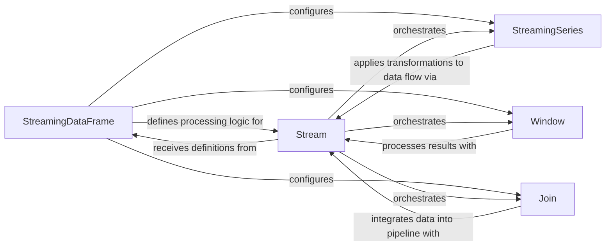

## Details

The Stream Processing Engine subsystem is the core of the `quix-streams` project, providing the declarative API and underlying mechanisms for real-time data transformations. It consumes messages from Kafka, processes them according to defined logic, and produces results.

### StreamingDataFrame
Provides the high-level, declarative API for users to define data transformations, aggregations, and routing logic on streaming data. It acts as the primary interface for building stream processing pipelines.

**Related Classes/Methods**:

- <a href="https://github.com/quixio/quix-streams/blob/main/quixstreams/dataframe/dataframe.py#L90-L2109" target="_blank" rel="noopener noreferrer">`StreamingDataFrame`:90-2109</a>

### Stream
The core internal component that manages the actual sequence and lineage of operations applied to a data stream. It represents the underlying processing graph and executes the transformations defined by `StreamingDataFrame`.

**Related Classes/Methods**:

- <a href="https://github.com/quixio/quix-streams/blob/main/quixstreams/core/stream/stream.py" target="_blank" rel="noopener noreferrer">`Stream`</a>

### StreamingSeries
Enables various element-wise and column-wise operations (arithmetic, comparison, logical, data manipulation) on individual data series (columns) within a `StreamingDataFrame`. It provides the granular data manipulation capabilities.

**Related Classes/Methods**:

- <a href="https://github.com/quixio/quix-streams/blob/main/quixstreams/dataframe/series.py#L59-L552" target="_blank" rel="noopener noreferrer">`StreamingSeries`:59-552</a>

### Window
Defines and manages windows of data for aggregations (e.g., tumbling, hopping, sliding windows). It handles the logic for collecting, aggregating, and expiring data within these windows, crucial for time-based stream processing.

**Related Classes/Methods**:

- <a href="https://github.com/quixio/quix-streams/blob/main/quixstreams/dataframe/dataframe.py#L1082-L1169" target="_blank" rel="noopener noreferrer">`Window`:1082-1169</a>

### Join
Provides mechanisms to join streaming data with other streams or external lookup tables. It manages data fetching, caching, and processing of join keys, enabling complex data correlation across streams.

**Related Classes/Methods**:

- <a href="https://github.com/quixio/quix-streams/blob/main/quixstreams/dataframe/joins/base.py#L57-L63" target="_blank" rel="noopener noreferrer">`Join`:57-63</a>

### [FAQ](https://github.com/CodeBoarding/GeneratedOnBoardings/tree/main?tab=readme-ov-file#faq)