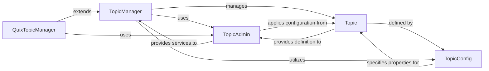

## Details

The `quix-streams` topic management subsystem employs a layered architecture to handle Kafka topic lifecycle. The `TopicManager` acts as the primary orchestrator, providing a high-level interface for defining and managing topics. It delegates the actual low-level Kafka broker interactions to the `TopicAdmin`, which wraps the `confluent-kafka` `AdminClient`. Topic definitions within the application are encapsulated by the `Topic` data model, which in turn is structured and configured by `TopicConfig` objects specifying parameters like partitions and replication factors. The `QuixTopicManager` extends the base `TopicManager` to integrate seamlessly with the Quix platform, adding platform-specific naming and authentication while still leveraging the core `TopicAdmin` for Kafka operations. This design effectively separates concerns, allowing for flexible topic definition, robust Kafka interaction, and platform-specific extensibility.

### TopicManager
The central orchestrator for Kafka topic lifecycle within the `quix-streams` application. It provides a high-level interface for defining, creating, and managing various types of topics (regular, repartition, changelog) and ensuring their compatibility for stream processing operations.

**Related Classes/Methods**:

- <a href="https://github.com/quixio/quix-streams/blob/main/quixstreams/models/topics/manager.py#L22-L474" target="_blank" rel="noopener noreferrer">`quixstreams.models.topics.manager.TopicManager`:22-474</a>

### TopicAdmin
A low-level wrapper around the `confluent-kafka` `AdminClient` for direct interaction with the Kafka Admin API. It performs fundamental administrative operations on Kafka brokers, such as creating, deleting, and altering topics.

**Related Classes/Methods**:

- <a href="https://github.com/quixio/quix-streams/blob/main/quixstreams/models/topics/admin.py#L31-L243" target="_blank" rel="noopener noreferrer">`quixstreams.models.topics.admin.TopicAdmin`:31-243</a>

### Topic
A data model representing a single Kafka topic, encapsulating its name, serialization/deserialization settings, and associated creation/broker configurations. It serves as the blueprint for Kafka topics within the application.

**Related Classes/Methods**:

- <a href="https://github.com/quixio/quix-streams/blob/main/quixstreams/models/topics/topic.py" target="_blank" rel="noopener noreferrer">`quixstreams.models.topics.topic.Topic`</a>

### TopicConfig
A data model defining the configurable parameters for a Kafka topic, such as the number of partitions, replication factor, and other extra configuration properties. It provides a structured way to specify topic settings.

**Related Classes/Methods**:

- <a href="https://github.com/quixio/quix-streams/blob/main/quixstreams/models/topics/topic.py#L40-L53" target="_blank" rel="noopener noreferrer">`quixstreams.models.topics.topic.TopicConfig`:40-53</a>

### QuixTopicManager
A specialized implementation of `TopicManager` tailored for the Quix platform. It extends the base topic management functionalities with platform-specific naming conventions, authentication, and interactions with the Quix API, ensuring seamless integration within the Quix ecosystem.

**Related Classes/Methods**:

- <a href="https://github.com/quixio/quix-streams/blob/main/quixstreams/platforms/quix/topic_manager.py#L16-L160" target="_blank" rel="noopener noreferrer">`quixstreams.platforms.quix.topic_manager.QuixTopicManager`:16-160</a>

### [FAQ](https://github.com/CodeBoarding/GeneratedOnBoardings/tree/main?tab=readme-ov-file#faq)