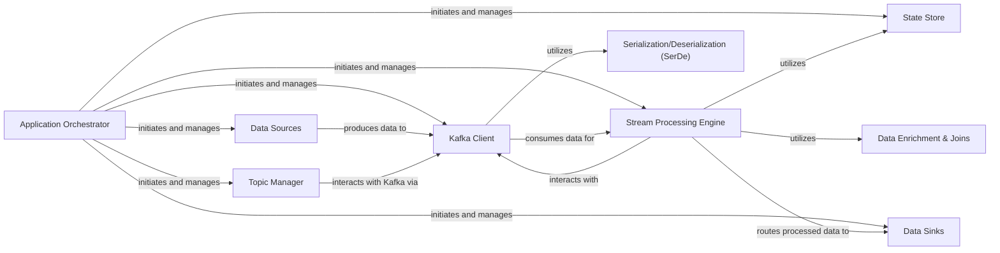

## Details

The `quixstreams` project is designed as a robust streaming data processing framework, centered around a reactive data flow paradigm. The `Application Orchestrator` acts as the central control plane, responsible for the setup and lifecycle management of the entire streaming application. It configures and initializes key components such as the `Kafka Client`, `Topic Manager`, `Stream Processing Engine`, `Data Sources`, `Data Sinks`, and `State Store`.

Data ingress begins with `Data Sources` which produce raw data into Kafka topics, facilitated by the `Kafka Client`. The `Kafka Client` is the primary interface for all Kafka interactions, handling both data consumption and production, and relies on the `Serialization/Deserialization (SerDe)` component for data format conversions.

The core of the data processing lies within the `Stream Processing Engine`. This engine consumes messages from Kafka via the `Kafka Client`, applies defined transformations, aggregations, and routing logic using its declarative API. During processing, it can leverage the `State Store` for persisting stateful operations and the `Data Enrichment & Joins` component for combining data streams or enriching them with external information. Once processed, the data is routed to `Data Sinks` for external consumption, again utilizing the `Kafka Client` for publishing to Kafka topics before being consumed by external systems. The `Topic Manager` works in conjunction with the `Kafka Client` to manage Kafka topics, ensuring proper configuration and co-partitioning for efficient stream processing operations.

# Critical Interaction Pathways

- **Application Initialization & Management**: The `Application Orchestrator` initiates and manages the `Kafka Client`, `Topic Manager`, `Stream Processing Engine`, `Data Sources`, `Data Sinks`, and `State Store`. This represents the setup and control flow of the entire application.
- **Data Ingestion Flow**: `Data Sources` produce data to the `Kafka Client`, which then makes it available for the `Stream Processing Engine`. This is the primary path for raw data entering the system.
- **Data Processing Flow**: The `Stream Processing Engine` consumes data from the `Kafka Client`, processes it (potentially interacting with `State Store` and `Data Enrichment & Joins`), and then routes the processed data to `Data Sinks` via the `Kafka Client`. This highlights the core data transformation pipeline.
- **Kafka Interaction**: The `Kafka Client` is central to all Kafka-related operations, consuming data for the `Stream Processing Engine`, being utilized by `Serialization/Deserialization (SerDe)`, and interacting with the `Topic Manager` for administrative tasks.

### Application Orchestrator [[Expand]](./Application_Orchestrator.md)
The central control unit responsible for initializing, configuring, and managing the overall lifecycle of the streaming application. It orchestrates the data flow by setting up sources, sinks, and the processing engine.

**Related Classes/Methods**:

- <a href="https://github.com/quixio/quix-streams/blob/main/quixstreams/app.py" target="_blank" rel="noopener noreferrer">`quixstreams/app.py`</a>

### Kafka Client [[Expand]](./Kafka_Client.md)
Manages all low-level interactions with Apache Kafka, including producing and consuming messages. It acts as the primary communication channel for data ingress and egress within the application.

**Related Classes/Methods**:

- <a href="https://github.com/quixio/quix-streams/blob/main/quixstreams/internal_producer.py" target="_blank" rel="noopener noreferrer">`quixstreams/internal_producer.py`</a>
- <a href="https://github.com/quixio/quix-streams/blob/main/quixstreams/internal_consumer/consumer.py" target="_blank" rel="noopener noreferrer">`quixstreams/internal_consumer/consumer.py`</a>
- <a href="https://github.com/quixio/quix-streams/blob/main/quixstreams/kafka/" target="_blank" rel="noopener noreferrer">`quixstreams/kafka/`</a>

### Stream Processing Engine [[Expand]](./Stream_Processing_Engine.md)
Provides a high-level, declarative API (StreamingDataFrame) for defining data transformations, aggregations, and routing logic on streaming data. It consumes messages from Kafka, processes them, and produces results.

**Related Classes/Methods**:

- <a href="https://github.com/quixio/quix-streams/blob/main/quixstreams/dataframe/dataframe.py" target="_blank" rel="noopener noreferrer">`quixstreams/dataframe/dataframe.py`</a>
- <a href="https://github.com/quixio/quix-streams/blob/main/quixstreams/core/stream/" target="_blank" rel="noopener noreferrer">`quixstreams/core/stream/`</a>

### Data Sources [[Expand]](./Data_Sources.md)
Modules responsible for ingesting data from various external systems into Kafka topics, serving as the entry points for raw data into the streaming application.

**Related Classes/Methods**:

- <a href="https://github.com/quixio/quix-streams/blob/main/quixstreams/sources/" target="_blank" rel="noopener noreferrer">`quixstreams/sources/`</a>

### Data Sinks [[Expand]](./Data_Sinks.md)
Modules responsible for publishing processed data from Kafka topics to various external systems, serving as the exit points for processed data from the streaming application.

**Related Classes/Methods**:

- <a href="https://github.com/quixio/quix-streams/blob/main/quixstreams/sinks/" target="_blank" rel="noopener noreferrer">`quixstreams/sinks/`</a>

### State Store [[Expand]](./State_Store.md)
Provides an interface for managing and persisting state associated with stream processing operations (e.g., aggregations, joins), supporting different storage backends.

**Related Classes/Methods**:

- <a href="https://github.com/quixio/quix-streams/blob/main/quixstreams/state/" target="_blank" rel="noopener noreferrer">`quixstreams/state/`</a>

### Serialization/Deserialization (SerDe)
Handles the conversion of data between its raw byte representation (for Kafka transport) and structured Python objects used within the application, supporting various data formats.

**Related Classes/Methods**:

- <a href="https://github.com/quixio/quix-streams/blob/main/quixstreams/models/serializers/" target="_blank" rel="noopener noreferrer">`quixstreams/models/serializers/`</a>

### Topic Manager [[Expand]](./Topic_Manager.md)
Interacts with Kafka's Admin API to manage topics, including creation, configuration, and ensuring co-partitioning for operations like joins.

**Related Classes/Methods**:

- <a href="https://github.com/quixio/quix-streams/blob/main/quixstreams/models/topics/manager.py" target="_blank" rel="noopener noreferrer">`quixstreams/models/topics/manager.py`</a>
- <a href="https://github.com/quixio/quix-streams/blob/main/quixstreams/models/topics/admin.py" target="_blank" rel="noopener noreferrer">`quixstreams/models/topics/admin.py`</a>

### Data Enrichment & Joins [[Expand]](./Data_Enrichment_Joins.md)
Facilitates the enrichment of streaming data with external information and performs join operations between different data streams.

**Related Classes/Methods**:

- <a href="https://github.com/quixio/quix-streams/blob/main/quixstreams/dataframe/joins/join_asof.py" target="_blank" rel="noopener noreferrer">`quixstreams.dataframe.joins`</a>

### [FAQ](https://github.com/CodeBoarding/GeneratedOnBoardings/tree/main?tab=readme-ov-file#faq)