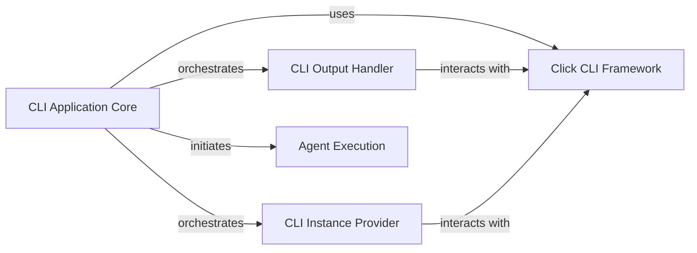

## Component Details

This component overview details the structure and interactions within the `CLI & Orchestration` subsystem of RAGbits. It encompasses the core command-line interface functionalities, output handling, instance provisioning, and the execution of high-level agent workflows. The system leverages the external Click framework for robust CLI management, ensuring a structured and user-friendly command-line experience while orchestrating complex agent-based operations.

### CLI Application Core
The central component for the `ragbits` command-line interface, responsible for parsing commands, managing the overall CLI execution flow, and orchestrating interactions with other CLI modules.

**Related Classes/Methods**:

- <a href="https://github.com/deepsense-ai/ragbits/blob/master/packages/ragbits-cli/src/ragbits/cli/__init__.py#L16-L50" target="_blank" rel="noopener noreferrer">`ragbits.packages.ragbits-cli.src.ragbits.cli:ragbits_cli` (16:50)</a>
- `ragbits.packages.ragbits-cli.src.ragbits.cli:main` (full file reference)
- `ragbits.packages.ragbits-cli.src.ragbits.cli._init_for_mkdocs` (full file reference)
- `ragbits.packages.ragbits-cli.src.ragbits.cli.autoregister` (full file reference)

### CLI Output Handler
Manages and formats CLI output, providing functions to display data in various formats like tables and JSON, and handles error reporting.

**Related Classes/Methods**:

- <a href="https://github.com/deepsense-ai/ragbits/blob/master/packages/ragbits-cli/src/ragbits/cli/state.py#L35-L84" target="_blank" rel="noopener noreferrer">`ragbits.packages.ragbits-cli.src.ragbits.cli.state:print_output_table` (35:84)</a>
- <a href="https://github.com/deepsense-ai/ragbits/blob/master/packages/ragbits-cli/src/ragbits/cli/state.py#L130-L151" target="_blank" rel="noopener noreferrer">`ragbits.packages.ragbits-cli.src.ragbits.cli.state:print_output` (130:151)</a>
- <a href="https://github.com/deepsense-ai/ragbits/blob/master/packages/ragbits-cli/src/ragbits/cli/state.py#L119-L127" target="_blank" rel="noopener noreferrer">`ragbits.packages.ragbits-cli.src.ragbits.cli.state.print_output_json` (119:127)</a>

### CLI Instance Provider
A utility for retrieving and initializing instances of configurable components, ensuring proper configuration loading and graceful error handling for the CLI.

**Related Classes/Methods**:

- <a href="https://github.com/deepsense-ai/ragbits/blob/master/packages/ragbits-cli/src/ragbits/cli/_utils.py#L24-L67" target="_blank" rel="noopener noreferrer">`ragbits.packages.ragbits-cli.src.ragbits.cli._utils:get_instance_or_exit` (24:67)</a>

### Agent Execution
Defines the core `Agent` class for orchestrating LLM interactions and prompt processing, and `AgentResult` for encapsulating agent run outputs, representing high-level workflows.

**Related Classes/Methods**:

- <a href="https://github.com/deepsense-ai/ragbits/blob/master/packages/ragbits-agents/src/ragbits/agents/_main.py#L67-L71" target="_blank" rel="noopener noreferrer">`ragbits.packages.ragbits-agents.src.ragbits.agents._main.Agent:run` (67:71)</a>
- <a href="https://github.com/deepsense-ai/ragbits/blob/master/packages/ragbits-agents/src/ragbits/agents/_main.py#L14-L22" target="_blank" rel="noopener noreferrer">`ragbits.packages.ragbits-agents.src.ragbits.agents._main.AgentResult` (14:22)</a>
- <a href="https://github.com/deepsense-ai/ragbits/blob/master/packages/ragbits-agents/src/ragbits/agents/_main.py#L34-L102" target="_blank" rel="noopener noreferrer">`ragbits.packages.ragbits-agents.src.ragbits.agents._main.Agent` (34:102)</a>

### Click CLI Framework
An external library providing fundamental functionalities for building command-line interfaces, including command parsing, argument handling, and output utilities.

**Related Classes/Methods**:

- `click.exceptions.Exit` (full file reference)
- `click.utils.echo` (full file reference)

### [FAQ](https://github.com/CodeBoarding/GeneratedOnBoardings/tree/main?tab=readme-ov-file#faq)