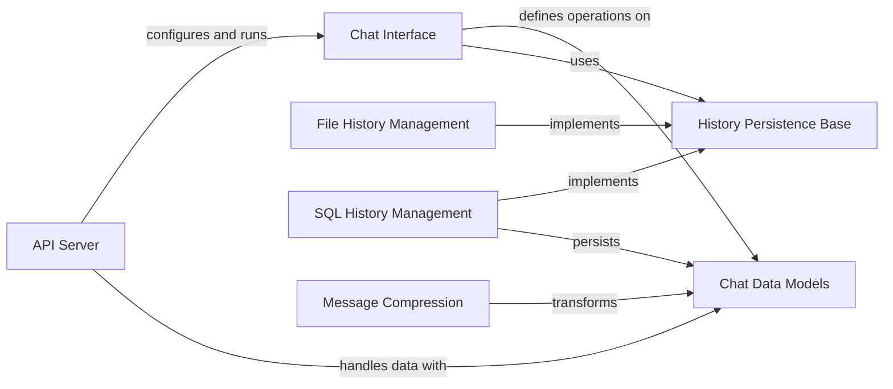

## Component Details

The Chat System provides the public API and internal interface for managing chat conversations. Its core purpose is to handle user inputs, generate appropriate responses, and maintain the state of ongoing chat sessions. Additionally, it is responsible for the persistent storage and retrieval of chat conversation history, ensuring continuity and data integrity across interactions.

### API Server
This component is responsible for setting up the FastAPI application, handling incoming HTTP requests, routing them to appropriate handlers, managing Cross-Origin Resource Sharing (CORS), and implementing custom exception handling. It serves as the primary entry point for external interactions with the chat system, processing user messages and feedback.

**Related Classes/Methods**:

- <a href="https://github.com/deepsense-ai/ragbits/blob/master/packages/ragbits-chat/src/ragbits/chat/api.py#L43-L230" target="_blank" rel="noopener noreferrer">`ragbits.packages.ragbits-chat.src.ragbits.chat.api.RagbitsAPI` (43:230)</a>
- <a href="https://github.com/deepsense-ai/ragbits/blob/master/packages/ragbits-chat/src/ragbits/chat/api.py#L48-L76" target="_blank" rel="noopener noreferrer">`ragbits.packages.ragbits-chat.src.ragbits.chat.api.RagbitsAPI:__init__` (48:76)</a>
- <a href="https://github.com/deepsense-ai/ragbits/blob/master/packages/ragbits-chat/src/ragbits/chat/api.py#L78-L93" target="_blank" rel="noopener noreferrer">`ragbits.packages.ragbits-chat.src.ragbits.chat.api.RagbitsAPI.configure_app` (78:93)</a>
- <a href="https://github.com/deepsense-ai/ragbits/blob/master/packages/ragbits-chat/src/ragbits/chat/api.py#L107-L182" target="_blank" rel="noopener noreferrer">`ragbits.packages.ragbits-chat.src.ragbits.chat.api.RagbitsAPI.setup_routes` (107:182)</a>
- <a href="https://github.com/deepsense-ai/ragbits/blob/master/packages/ragbits-chat/src/ragbits/chat/api.py#L95-L105" target="_blank" rel="noopener noreferrer">`ragbits.packages.ragbits-chat.src.ragbits.chat.api.RagbitsAPI.setup_exception_handlers` (95:105)</a>
- <a href="https://github.com/deepsense-ai/ragbits/blob/master/packages/ragbits-chat/src/ragbits/chat/api.py#L185-L202" target="_blank" rel="noopener noreferrer">`ragbits.packages.ragbits-chat.src.ragbits.chat.api.RagbitsAPI._chat_response_to_sse` (185:202)</a>
- <a href="https://github.com/deepsense-ai/ragbits/blob/master/packages/ragbits-chat/src/ragbits/chat/api.py#L205-L224" target="_blank" rel="noopener noreferrer">`ragbits.packages.ragbits-chat.src.ragbits.chat.api.RagbitsAPI._load_chat_interface` (205:224)</a>
- <a href="https://github.com/deepsense-ai/ragbits/blob/master/packages/ragbits-chat/src/ragbits/chat/api.py#L23-L30" target="_blank" rel="noopener noreferrer">`ragbits.packages.ragbits-chat.src.ragbits.chat.api.ChatMessageRequest` (23:30)</a>
- <a href="https://github.com/deepsense-ai/ragbits/blob/master/packages/ragbits-chat/src/ragbits/chat/api.py#L33-L40" target="_blank" rel="noopener noreferrer">`ragbits.packages.ragbits-chat.src.ragbits.chat.api.FeedbackRequest` (33:40)</a>

### Chat Interface
This component defines the abstract interface for core chat functionalities, including processing user messages, generating various types of responses (text, references, state updates), managing chat state, and handling user feedback. It serves as a contract for concrete chat implementations, ensuring consistent interaction logic.

**Related Classes/Methods**:

- <a href="https://github.com/deepsense-ai/ragbits/blob/master/packages/ragbits-chat/src/ragbits/chat/interface/_interface.py#L75-L217" target="_blank" rel="noopener noreferrer">`ragbits.packages.ragbits-chat.src.ragbits.chat.interface._interface.ChatInterface` (75:217)</a>
- <a href="https://github.com/deepsense-ai/ragbits/blob/master/packages/ragbits-chat/src/ragbits/chat/interface/_interface.py#L90-L94" target="_blank" rel="noopener noreferrer">`ragbits.packages.ragbits-chat.src.ragbits.chat.interface._interface.ChatInterface:__init_subclass__` (90:94)</a>
- <a href="https://github.com/deepsense-ai/ragbits/blob/master/packages/ragbits-chat/src/ragbits/chat/interface/_interface.py#L97-L99" target="_blank" rel="noopener noreferrer">`ragbits.packages.ragbits-chat.src.ragbits.chat.interface._interface.ChatInterface:create_text_response` (97:99)</a>
- <a href="https://github.com/deepsense-ai/ragbits/blob/master/packages/ragbits-chat/src/ragbits/chat/interface/_interface.py#L102-L111" target="_blank" rel="noopener noreferrer">`ragbits.packages.ragbits-chat.src.ragbits.chat.interface._interface.ChatInterface:create_reference` (102:111)</a>
- <a href="https://github.com/deepsense-ai/ragbits/blob/master/packages/ragbits-chat/src/ragbits/chat/interface/_interface.py#L114-L120" target="_blank" rel="noopener noreferrer">`ragbits.packages.ragbits-chat.src.ragbits.chat.interface._interface.ChatInterface:create_state_update` (114:120)</a>
- <a href="https://github.com/deepsense-ai/ragbits/blob/master/packages/ragbits-chat/src/ragbits/chat/interface/_interface.py#L139-L151" target="_blank" rel="noopener noreferrer">`ragbits.packages.ragbits-chat.src.ragbits.chat.interface._interface.ChatInterface:verify_state` (139:151)</a>
- <a href="https://github.com/deepsense-ai/ragbits/blob/master/packages/ragbits-chat/src/ragbits/chat/interface/_interface.py#L165-L201" target="_blank" rel="noopener noreferrer">`ragbits.packages.ragbits-chat.src.ragbits.chat.interface._interface.ChatInterface:chat` (165:201)</a>
- <a href="https://github.com/deepsense-ai/ragbits/blob/master/packages/ragbits-chat/src/ragbits/chat/interface/_interface.py#L22-L72" target="_blank" rel="noopener noreferrer">`ragbits.packages.ragbits-chat.src.ragbits.chat.interface._interface:with_chat_metadata` (22:72)</a>

### Chat Data Models
This component encapsulates the fundamental data structures used throughout the chat system. It defines the schema for various entities such as chat contexts, user messages, system responses, references, and state updates, ensuring consistent data representation across different components.

**Related Classes/Methods**:

- <a href="https://github.com/deepsense-ai/ragbits/blob/master/packages/ragbits-chat/src/ragbits/chat/interface/types.py#L84-L90" target="_blank" rel="noopener noreferrer">`ragbits.packages.ragbits-chat.src.ragbits.chat.interface.types.ChatContext` (84:90)</a>
- <a href="https://github.com/deepsense-ai/ragbits/blob/master/packages/ragbits-chat/src/ragbits/chat/interface/types.py#L47-L81" target="_blank" rel="noopener noreferrer">`ragbits.packages.ragbits-chat.src.ragbits.chat.interface.types.ChatResponse` (47:81)</a>
- <a href="https://github.com/deepsense-ai/ragbits/blob/master/packages/ragbits-chat/src/ragbits/chat/interface/types.py#L22-L27" target="_blank" rel="noopener noreferrer">`ragbits.packages.ragbits-chat.src.ragbits.chat.interface.types.Reference` (22:27)</a>
- <a href="https://github.com/deepsense-ai/ragbits/blob/master/packages/ragbits-chat/src/ragbits/chat/interface/types.py#L30-L34" target="_blank" rel="noopener noreferrer">`ragbits.packages.ragbits-chat.src.ragbits.chat.interface.types.StateUpdate` (30:34)</a>
- <a href="https://github.com/deepsense-ai/ragbits/blob/master/packages/ragbits-chat/src/ragbits/chat/interface/types.py#L15-L19" target="_blank" rel="noopener noreferrer">`ragbits.packages.ragbits-chat.src.ragbits.chat.interface.types.Message` (15:19)</a>
- <a href="https://github.com/deepsense-ai/ragbits/blob/master/packages/ragbits-chat/src/ragbits/chat/api.py#L23-L30" target="_blank" rel="noopener noreferrer">`ragbits.packages.ragbits-chat.src.ragbits.chat.api.ChatMessageRequest` (23:30)</a>
- <a href="https://github.com/deepsense-ai/ragbits/blob/master/packages/ragbits-chat/src/ragbits/chat/api.py#L33-L40" target="_blank" rel="noopener noreferrer">`ragbits.packages.ragbits-chat.src.ragbits.chat.api.FeedbackRequest` (33:40)</a>

### History Persistence Base
This component defines the abstract interface for persisting and retrieving chat conversation history, serving as a contract for concrete history persistence implementations.

**Related Classes/Methods**:

- <a href="https://github.com/deepsense-ai/ragbits/blob/master/packages/ragbits-chat/src/ragbits/chat/persistence/base.py#L16-L40" target="_blank" rel="noopener noreferrer">`ragbits.packages.ragbits-chat.src.ragbits.chat.persistence.base.HistoryPersistence` (16:40)</a>

### File History Management
This component provides mechanisms for persisting and retrieving chat conversation history using a file-based storage system. It handles the low-level operations of reading from and writing to files to maintain a record of past interactions.

**Related Classes/Methods**:

- <a href="https://github.com/deepsense-ai/ragbits/blob/master/packages/ragbits-chat/src/ragbits/chat/persistence/file.py#L8-L51" target="_blank" rel="noopener noreferrer">`ragbits.packages.ragbits-chat.src.ragbits.chat.persistence.file.FileHistoryPersistence` (8:51)</a>
- <a href="https://github.com/deepsense-ai/ragbits/blob/master/packages/ragbits-chat/src/ragbits/chat/persistence/file.py#L18-L51" target="_blank" rel="noopener noreferrer">`ragbits.packages.ragbits-chat.src.ragbits.chat.persistence.file.FileHistoryPersistence:save_interaction` (18:51)</a>
- <a href="https://github.com/deepsense-ai/ragbits/blob/master/packages/ragbits-chat/src/ragbits/chat/persistence/file.py#L14-L16" target="_blank" rel="noopener noreferrer">`ragbits.packages.ragbits-chat.src.ragbits.chat.persistence.file.FileHistoryPersistence._get_file_path` (14:16)</a>

### SQL History Management
This component manages the persistence and retrieval of chat conversation history using a SQL database. It includes functionalities for initializing the database, ensuring conversation existence, saving interactions, and retrieving conversation history, interacting with specific ORM models for data representation.

**Related Classes/Methods**:

- <a href="https://github.com/deepsense-ai/ragbits/blob/master/packages/ragbits-chat/src/ragbits/chat/persistence/sql.py#L136-L294" target="_blank" rel="noopener noreferrer">`ragbits.packages.ragbits-chat.src.ragbits.chat.persistence.sql.SQLHistoryPersistence` (136:294)</a>
- <a href="https://github.com/deepsense-ai/ragbits/blob/master/packages/ragbits-chat/src/ragbits/chat/persistence/sql.py#L145-L171" target="_blank" rel="noopener noreferrer">`ragbits.packages.ragbits-chat.src.ragbits.chat.persistence.sql.SQLHistoryPersistence:__init__` (145:171)</a>
- <a href="https://github.com/deepsense-ai/ragbits/blob/master/packages/ragbits-chat/src/ragbits/chat/persistence/sql.py#L186-L227" target="_blank" rel="noopener noreferrer">`ragbits.packages.ragbits-chat.src.ragbits.chat.persistence.sql.SQLHistoryPersistence:save_interaction` (186:227)</a>
- <a href="https://github.com/deepsense-ai/ragbits/blob/master/packages/ragbits-chat/src/ragbits/chat/persistence/sql.py#L229-L244" target="_blank" rel="noopener noreferrer">`ragbits.packages.ragbits-chat.src.ragbits.chat.persistence.sql.SQLHistoryPersistence._ensure_conversation_exists` (229:244)</a>
- <a href="https://github.com/deepsense-ai/ragbits/blob/master/packages/ragbits-chat/src/ragbits/chat/persistence/sql.py#L246-L279" target="_blank" rel="noopener noreferrer">`ragbits.packages.ragbits-chat.src.ragbits.chat.persistence.sql.SQLHistoryPersistence:get_conversation_interactions` (246:279)</a>
- <a href="https://github.com/deepsense-ai/ragbits/blob/master/packages/ragbits-chat/src/ragbits/chat/persistence/sql.py#L282-L294" target="_blank" rel="noopener noreferrer">`ragbits.packages.ragbits-chat.src.ragbits.chat.persistence.sql.SQLHistoryPersistence:from_config` (282:294)</a>
- <a href="https://github.com/deepsense-ai/ragbits/blob/master/packages/ragbits-chat/src/ragbits/chat/persistence/sql.py#L124-L130" target="_blank" rel="noopener noreferrer">`ragbits.packages.ragbits-chat.src.ragbits.chat.persistence.sql.SQLHistoryPersistenceOptions` (124:130)</a>
- <a href="https://github.com/deepsense-ai/ragbits/blob/master/packages/ragbits-chat/src/ragbits/chat/persistence/sql.py#L41-L69" target="_blank" rel="noopener noreferrer">`ragbits.packages.ragbits-chat.src.ragbits.chat.persistence.sql.create_conversation_model` (41:69)</a>
- <a href="https://github.com/deepsense-ai/ragbits/blob/master/packages/ragbits-chat/src/ragbits/chat/persistence/sql.py#L72-L121" target="_blank" rel="noopener noreferrer">`ragbits.packages.ragbits-chat.src.ragbits.chat.persistence.sql.create_chat_interaction_model` (72:121)</a>
- <a href="https://github.com/deepsense-ai/ragbits/blob/master/packages/ragbits-chat/src/ragbits/chat/persistence/sql.py#L53-L67" target="_blank" rel="noopener noreferrer">`ragbits.packages.ragbits-chat.src.ragbits.chat.persistence.sql.create_conversation_model.Conversation` (53:67)</a>
- <a href="https://github.com/deepsense-ai/ragbits/blob/master/packages/ragbits-chat/src/ragbits/chat/persistence/sql.py#L87-L119" target="_blank" rel="noopener noreferrer">`ragbits.packages.ragbits-chat.src.ragbits.chat.persistence.sql.create_chat_interaction_model.ChatInteraction` (87:119)</a>

### Message Compression
This component is responsible for compressing chat messages, primarily to optimize the input provided to language models or for efficient storage. It includes logic for transforming message history into a more compact or relevant format.

**Related Classes/Methods**:

- <a href="https://github.com/deepsense-ai/ragbits/blob/master/packages/ragbits-chat/src/ragbits/chat/history/compressors/llm.py#L40-L86" target="_blank" rel="noopener noreferrer">`ragbits.packages.ragbits-chat.src.ragbits.chat.history.compressors.llm.StandaloneMessageCompressor` (40:86)</a>
- <a href="https://github.com/deepsense-ai/ragbits/blob/master/packages/ragbits-chat/src/ragbits/chat/history/compressors/llm.py#L59-L86" target="_blank" rel="noopener noreferrer">`ragbits.packages.ragbits-chat.src.ragbits.chat.history.compressors.llm.StandaloneMessageCompressor:compress` (59:86)</a>
- <a href="https://github.com/deepsense-ai/ragbits/blob/master/packages/ragbits-chat/src/ragbits/chat/history/compressors/llm.py#L8-L14" target="_blank" rel="noopener noreferrer">`ragbits.packages.ragbits-chat.src.ragbits.chat.history.compressors.llm.LastMessageAndHistory` (8:14)</a>
- <a href="https://github.com/deepsense-ai/ragbits/blob/master/packages/ragbits-chat/src/ragbits/chat/history/compressors/llm.py#L17-L37" target="_blank" rel="noopener noreferrer">`ragbits.packages.ragbits-chat.src.ragbits.chat.history.compressors.llm.StandaloneMessageCompressorPrompt` (17:37)</a>

### [FAQ](https://github.com/CodeBoarding/GeneratedOnBoardings/tree/main?tab=readme-ov-file#faq)