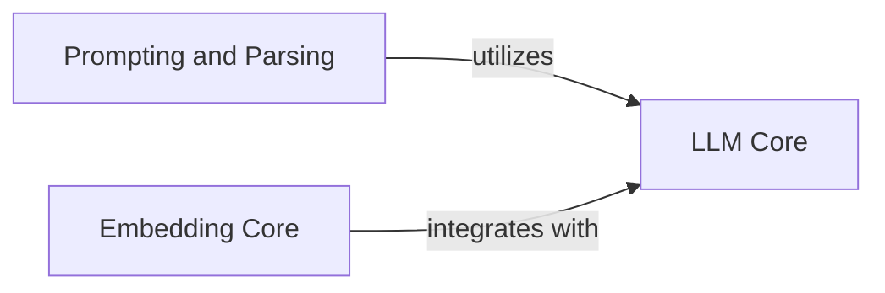

## Component Details

The Core AI Services component provides fundamental interfaces for interacting with Large Language Models (LLMs) for text generation, streaming, and token counting, and manages the creation of dense and sparse vector embeddings from diverse data types. It also handles the construction, rendering, and parsing of prompts for LLMs.

### LLM Core
Provides the foundational interfaces and concrete implementations for interacting with various Large Language Models (LLMs), including text generation, streaming, and token counting. It also defines a robust exception hierarchy for LLM-related errors.

**Related Classes/Methods**:

- <a href="https://github.com/deepsense-ai/ragbits/blob/master/packages/ragbits-core/src/ragbits/core/llms/litellm.py#L45-L360" target="_blank" rel="noopener noreferrer">`ragbits.packages.ragbits-core.src.ragbits.core.llms.litellm.LiteLLM` (45:360)</a>
- <a href="https://github.com/deepsense-ai/ragbits/blob/master/packages/ragbits-core/src/ragbits/core/llms/mock.py#L21-L75" target="_blank" rel="noopener noreferrer">`ragbits.packages.ragbits-core.src.ragbits.core.llms.mock.MockLLM` (21:75)</a>
- <a href="https://github.com/deepsense-ai/ragbits/blob/master/packages/ragbits-core/src/ragbits/core/llms/local.py#L42-L216" target="_blank" rel="noopener noreferrer">`ragbits.packages.ragbits-core.src.ragbits.core.llms.local.LocalLLM` (42:216)</a>
- <a href="https://github.com/deepsense-ai/ragbits/blob/master/packages/ragbits-core/src/ragbits/core/llms/base.py#L42-L320" target="_blank" rel="noopener noreferrer">`ragbits.packages.ragbits-core.src.ragbits.core.llms.base.LLM` (42:320)</a>
- <a href="https://github.com/deepsense-ai/ragbits/blob/master/packages/ragbits-core/src/ragbits/core/llms/exceptions.py#L1-L8" target="_blank" rel="noopener noreferrer">`ragbits.packages.ragbits-core.src.ragbits.core.llms.exceptions.LLMError` (1:8)</a>
- <a href="https://github.com/deepsense-ai/ragbits/blob/master/packages/ragbits-core/src/ragbits/core/llms/exceptions.py#L16-L17" target="_blank" rel="noopener noreferrer">`ragbits.packages.ragbits-core.src.ragbits.core.llms.exceptions.LLMConnectionError:__init__` (16:17)</a>
- <a href="https://github.com/deepsense-ai/ragbits/blob/master/packages/ragbits-core/src/ragbits/core/llms/exceptions.py#L25-L27" target="_blank" rel="noopener noreferrer">`ragbits.packages.ragbits-core.src.ragbits.core.llms.exceptions.LLMStatusError:__init__` (25:27)</a>
- <a href="https://github.com/deepsense-ai/ragbits/blob/master/packages/ragbits-core/src/ragbits/core/llms/exceptions.py#L35-L36" target="_blank" rel="noopener noreferrer">`ragbits.packages.ragbits-core.src.ragbits.core.llms.exceptions.LLMResponseError:__init__` (35:36)</a>
- <a href="https://github.com/deepsense-ai/ragbits/blob/master/packages/ragbits-core/src/ragbits/core/llms/exceptions.py#L44-L45" target="_blank" rel="noopener noreferrer">`ragbits.packages.ragbits-core.src.ragbits.core.llms.exceptions.LLMEmptyResponseError:__init__` (44:45)</a>
- <a href="https://github.com/deepsense-ai/ragbits/blob/master/packages/ragbits-core/src/ragbits/core/llms/exceptions.py#L53-L54" target="_blank" rel="noopener noreferrer">`ragbits.packages.ragbits-core.src.ragbits.core.llms.exceptions.LLMNotSupportingImagesError:__init__` (53:54)</a>

### Embedding Core
Manages the creation of dense and sparse vector embeddings from diverse data types, integrating with various embedding models. It also includes a dedicated exception handling mechanism for embedding-related errors.

**Related Classes/Methods**:

- <a href="https://github.com/deepsense-ai/ragbits/blob/master/packages/ragbits-core/src/ragbits/core/embeddings/dense/litellm.py#L31-L168" target="_blank" rel="noopener noreferrer">`ragbits.packages.ragbits-core.src.ragbits.core.embeddings.dense.litellm.LiteLLMEmbedder` (31:168)</a>
- <a href="https://github.com/deepsense-ai/ragbits/blob/master/packages/ragbits-core/src/ragbits/core/embeddings/dense/fastembed.py#L20-L84" target="_blank" rel="noopener noreferrer">`ragbits.packages.ragbits-core.src.ragbits.core.embeddings.dense.fastembed.FastEmbedEmbedder` (20:84)</a>
- <a href="https://github.com/deepsense-ai/ragbits/blob/master/packages/ragbits-core/src/ragbits/core/embeddings/dense/vertex_multimodal.py#L24-L198" target="_blank" rel="noopener noreferrer">`ragbits.packages.ragbits-core.src.ragbits.core.embeddings.dense.vertex_multimodal.VertexAIMultimodelEmbedder` (24:198)</a>
- <a href="https://github.com/deepsense-ai/ragbits/blob/master/packages/ragbits-core/src/ragbits/core/embeddings/dense/local.py#L25-L91" target="_blank" rel="noopener noreferrer">`ragbits.packages.ragbits-core.src.ragbits.core.embeddings.dense.local.LocalEmbedder` (25:91)</a>
- <a href="https://github.com/deepsense-ai/ragbits/blob/master/packages/ragbits-core/src/ragbits/core/embeddings/sparse/fastembed.py#L11-L80" target="_blank" rel="noopener noreferrer">`ragbits.packages.ragbits-core.src.ragbits.core.embeddings.sparse.fastembed.FastEmbedSparseEmbedder` (11:80)</a>
- <a href="https://github.com/deepsense-ai/ragbits/blob/master/packages/ragbits-core/src/ragbits/core/embeddings/exceptions.py#L1-L8" target="_blank" rel="noopener noreferrer">`ragbits.packages.ragbits-core.src.ragbits.core.embeddings.exceptions.EmbeddingError` (1:8)</a>
- <a href="https://github.com/deepsense-ai/ragbits/blob/master/packages/ragbits-core/src/ragbits/core/embeddings/exceptions.py#L16-L17" target="_blank" rel="noopener noreferrer">`ragbits.packages.ragbits-core.src.ragbits.core.embeddings.exceptions.EmbeddingConnectionError:__init__` (16:17)</a>
- <a href="https://github.com/deepsense-ai/ragbits/blob/master/packages/ragbits-core/src/ragbits/core/embeddings/exceptions.py#L25-L27" target="_blank" rel="noopener noreferrer">`ragbits.packages.ragbits-core.src.ragbits.core.embeddings.exceptions.EmbeddingStatusError:__init__` (25:27)</a>
- <a href="https://github.com/deepsense-ai/ragbits/blob/master/packages/ragbits-core/src/ragbits/core/embeddings/exceptions.py#L35-L36" target="_blank" rel="noopener noreferrer">`ragbits.packages.ragbits-core.src.ragbits.core.embeddings.exceptions.EmbeddingResponseError:__init__` (35:36)</a>
- <a href="https://github.com/deepsense-ai/ragbits/blob/master/packages/ragbits-core/src/ragbits/core/embeddings/exceptions.py#L44-L45" target="_blank" rel="noopener noreferrer">`ragbits.packages.ragbits-core.src.ragbits.core.embeddings.exceptions.EmbeddingEmptyResponseError:__init__` (44:45)</a>
- <a href="https://github.com/deepsense-ai/ragbits/blob/master/packages/ragbits-core/src/ragbits/core/embeddings/base.py#L37-L92" target="_blank" rel="noopener noreferrer">`ragbits.packages.ragbits-core.src.ragbits.core.embeddings.base.Embedder` (37:92)</a>

### Prompting and Parsing
Handles the construction, rendering, and parsing of prompts for LLMs, including template management, input/output type detection, and structured response parsing. It also provides utilities for prompt discovery and CLI interactions.

**Related Classes/Methods**:

- <a href="https://github.com/deepsense-ai/ragbits/blob/master/packages/ragbits-core/src/ragbits/core/prompt/prompt.py#L21-L356" target="_blank" rel="noopener noreferrer">`ragbits.packages.ragbits-core.src.ragbits.core.prompt.prompt.Prompt` (21:356)</a>
- <a href="https://github.com/deepsense-ai/ragbits/blob/master/packages/ragbits-core/src/ragbits/core/prompt/base.py#L11-L47" target="_blank" rel="noopener noreferrer">`ragbits.packages.ragbits-core.src.ragbits.core.prompt.base.BasePrompt` (11:47)</a>
- <a href="https://github.com/deepsense-ai/ragbits/blob/master/packages/ragbits-core/src/ragbits/core/prompt/discovery.py#L12-L74" target="_blank" rel="noopener noreferrer">`ragbits.packages.ragbits-core.src.ragbits.core.prompt.discovery.PromptDiscovery` (12:74)</a>
- <a href="https://github.com/deepsense-ai/ragbits/blob/master/packages/ragbits-core/src/ragbits/core/prompt/parsers.py#L19-L35" target="_blank" rel="noopener noreferrer">`ragbits.packages.ragbits-core.src.ragbits.core.prompt.parsers:int_parser` (19:35)</a>
- <a href="https://github.com/deepsense-ai/ragbits/blob/master/packages/ragbits-core/src/ragbits/core/prompt/parsers.py#L51-L67" target="_blank" rel="noopener noreferrer">`ragbits.packages.ragbits-core.src.ragbits.core.prompt.parsers:float_parser` (51:67)</a>
- <a href="https://github.com/deepsense-ai/ragbits/blob/master/packages/ragbits-core/src/ragbits/core/prompt/parsers.py#L70-L88" target="_blank" rel="noopener noreferrer">`ragbits.packages.ragbits-core.src.ragbits.core.prompt.parsers:bool_parser` (70:88)</a>
- <a href="https://github.com/deepsense-ai/ragbits/blob/master/packages/ragbits-core/src/ragbits/core/prompt/parsers.py#L91-L123" target="_blank" rel="noopener noreferrer">`ragbits.packages.ragbits-core.src.ragbits.core.prompt.parsers:build_pydantic_parser` (91:123)</a>
- <a href="https://github.com/deepsense-ai/ragbits/blob/master/packages/ragbits-core/src/ragbits/core/prompt/parsers.py#L9-L16" target="_blank" rel="noopener noreferrer">`ragbits.packages.ragbits-core.src.ragbits.core.prompt.parsers.ResponseParsingError` (9:16)</a>
- <a href="https://github.com/deepsense-ai/ragbits/blob/master/packages/ragbits-core/src/ragbits/core/prompt/exceptions.py#L1-L8" target="_blank" rel="noopener noreferrer">`ragbits.packages.ragbits-core.src.ragbits.core.prompt.exceptions.PromptError` (1:8)</a>
- <a href="https://github.com/deepsense-ai/ragbits/blob/master/packages/ragbits-core/src/ragbits/core/prompt/exceptions.py#L16-L19" target="_blank" rel="noopener noreferrer">`ragbits.packages.ragbits-core.src.ragbits.core.prompt.exceptions.PromptWithImagesOfInvalidFormat:__init__` (16:19)</a>
- <a href="https://github.com/deepsense-ai/ragbits/blob/master/packages/ragbits-core/src/ragbits/core/prompt/_cli.py#L65-L80" target="_blank" rel="noopener noreferrer">`ragbits.packages.ragbits-core.src.ragbits.core.prompt._cli:search` (65:80)</a>
- <a href="https://github.com/deepsense-ai/ragbits/blob/master/packages/ragbits-core/src/ragbits/core/prompt/_cli.py#L84-L90" target="_blank" rel="noopener noreferrer">`ragbits.packages.ragbits-core.src.ragbits.core.prompt._cli:render` (84:90)</a>
- <a href="https://github.com/deepsense-ai/ragbits/blob/master/packages/ragbits-core/src/ragbits/core/prompt/_cli.py#L94-L112" target="_blank" rel="noopener noreferrer">`ragbits.packages.ragbits-core.src.ragbits.core.prompt._cli:execute` (94:112)</a>

### [FAQ](https://github.com/CodeBoarding/GeneratedOnBoardings/tree/main?tab=readme-ov-file#faq)