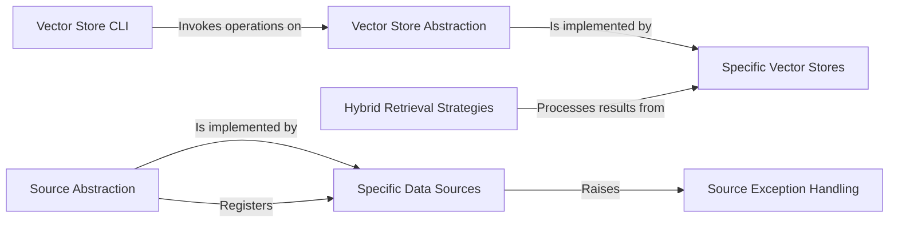

## Component Details

The Data Management subsystem provides a comprehensive solution for handling vector data and integrating with various external and local data sources. It offers a standardized interface for interacting with different vector database implementations, enabling storage, querying, and management of vector data. Additionally, it includes robust mechanisms for connecting to and retrieving data from diverse sources, ensuring data accessibility and flexibility within the system. The subsystem is structured into distinct components that manage CLI interactions, abstract vector store operations, implement specific database integrations, provide hybrid retrieval strategies, abstract data source interactions, implement specific data source connectors, and handle source-related exceptions.

### Vector Store CLI
Provides a command-line interface for users to interact with vector stores. It handles parsing CLI arguments and orchestrating calls to the underlying vector store functionalities for operations like listing, removing, and querying entries.

**Related Classes/Methods**:

- `ragbits.packages.ragbits-core.src.ragbits.core.vector_stores._cli` (full file reference)
- <a href="https://github.com/deepsense-ai/ragbits/blob/master/packages/ragbits-core/src/ragbits/core/vector_stores/_cli.py#L53-L72" target="_blank" rel="noopener noreferrer">`ragbits.packages.ragbits-core.src.ragbits.core.vector_stores._cli:list_entries` (53:72)</a>
- <a href="https://github.com/deepsense-ai/ragbits/blob/master/packages/ragbits-core/src/ragbits/core/vector_stores/_cli.py#L80-L97" target="_blank" rel="noopener noreferrer">`ragbits.packages.ragbits-core.src.ragbits.core.vector_stores._cli:remove` (80:97)</a>
- <a href="https://github.com/deepsense-ai/ragbits/blob/master/packages/ragbits-core/src/ragbits/core/vector_stores/_cli.py#L101-L128" target="_blank" rel="noopener noreferrer">`ragbits.packages.ragbits-core.src.ragbits.core.vector_stores._cli:query` (101:128)</a>

### Vector Store Abstraction
Defines the core interfaces, data models (Entry, Result, Options), and base classes for all vector store implementations, including those that integrate with dense or general embedders. This component ensures consistency and provides a common API for interacting with different vector store backends.

**Related Classes/Methods**:

- <a href="https://github.com/deepsense-ai/ragbits/blob/master/packages/ragbits-core/src/ragbits/core/vector_stores/base.py#L84-L143" target="_blank" rel="noopener noreferrer">`ragbits.packages.ragbits-core.src.ragbits.core.vector_stores.base.VectorStore` (84:143)</a>
- <a href="https://github.com/deepsense-ai/ragbits/blob/master/packages/ragbits-core/src/ragbits/core/vector_stores/base.py#L155-L221" target="_blank" rel="noopener noreferrer">`ragbits.packages.ragbits-core.src.ragbits.core.vector_stores.base.VectorStoreWithDenseEmbedder` (155:221)</a>
- <a href="https://github.com/deepsense-ai/ragbits/blob/master/packages/ragbits-core/src/ragbits/core/vector_stores/base.py#L224-L291" target="_blank" rel="noopener noreferrer">`ragbits.packages.ragbits-core.src.ragbits.core.vector_stores.base.VectorStoreWithEmbedder` (224:291)</a>
- <a href="https://github.com/deepsense-ai/ragbits/blob/master/packages/ragbits-core/src/ragbits/core/vector_stores/base.py#L19-L40" target="_blank" rel="noopener noreferrer">`ragbits.packages.ragbits-core.src.ragbits.core.vector_stores.base.VectorStoreEntry` (19:40)</a>
- <a href="https://github.com/deepsense-ai/ragbits/blob/master/packages/ragbits-core/src/ragbits/core/vector_stores/base.py#L43-L59" target="_blank" rel="noopener noreferrer">`ragbits.packages.ragbits-core.src.ragbits.core.vector_stores.base.VectorStoreResult` (43:59)</a>
- <a href="https://github.com/deepsense-ai/ragbits/blob/master/packages/ragbits-core/src/ragbits/core/vector_stores/base.py#L62-L78" target="_blank" rel="noopener noreferrer">`ragbits.packages.ragbits-core.src.ragbits.core.vector_stores.base.VectorStoreOptions` (62:78)</a>
- <a href="https://github.com/deepsense-ai/ragbits/blob/master/packages/ragbits-core/src/ragbits/core/vector_stores/base.py#L146-L152" target="_blank" rel="noopener noreferrer">`ragbits.packages.ragbits-core.src.ragbits.core.vector_stores.base.EmbeddingType` (146:152)</a>

### Specific Vector Stores
Contains concrete implementations of vector stores for different backend technologies such as ChromaDB, PostgreSQL with pgvector, and Qdrant. These implementations handle the specific interactions and data formats required by their respective database systems.

**Related Classes/Methods**:

- <a href="https://github.com/deepsense-ai/ragbits/blob/master/packages/ragbits-core/src/ragbits/core/vector_stores/chroma.py#L29-L320" target="_blank" rel="noopener noreferrer">`ragbits.packages.ragbits-core.src.ragbits.core.vector_stores.chroma.ChromaVectorStore` (29:320)</a>
- <a href="https://github.com/deepsense-ai/ragbits/blob/master/packages/ragbits-core/src/ragbits/core/vector_stores/pgvector.py#L45-L471" target="_blank" rel="noopener noreferrer">`ragbits.packages.ragbits-core.src.ragbits.core.vector_stores.pgvector.PgVectorStore` (45:471)</a>
- <a href="https://github.com/deepsense-ai/ragbits/blob/master/packages/ragbits-core/src/ragbits/core/vector_stores/qdrant.py#L33-L361" target="_blank" rel="noopener noreferrer">`ragbits.packages.ragbits-core.src.ragbits.core.vector_stores.qdrant.QdrantVectorStore` (33:361)</a>

### Hybrid Retrieval Strategies
Implements algorithms for combining scores or results from multiple retrieval methods, such as distribution-based score fusion, to enhance the overall quality of retrieved information.

**Related Classes/Methods**:

- <a href="https://github.com/deepsense-ai/ragbits/blob/master/packages/ragbits-core/src/ragbits/core/vector_stores/hybrid_strategies.py#L123-L176" target="_blank" rel="noopener noreferrer">`ragbits.packages.ragbits-core.src.ragbits.core.vector_stores.hybrid_strategies.DistributionBasedScoreFusion` (123:176)</a>

### Source Abstraction
Defines the abstract interface for all data sources, including methods for fetching and listing data. It also manages a registry for different source protocols and provides a mechanism to resolve URIs to appropriate source implementations, ensuring a unified way to access various data origins.

**Related Classes/Methods**:

- <a href="https://github.com/deepsense-ai/ragbits/blob/master/packages/ragbits-core/src/ragbits/core/sources/base.py#L20-L105" target="_blank" rel="noopener noreferrer">`ragbits.packages.ragbits-core.src.ragbits.core.sources.base.Source` (20:105)</a>
- <a href="https://github.com/deepsense-ai/ragbits/blob/master/packages/ragbits-core/src/ragbits/core/sources/base.py#L108-L141" target="_blank" rel="noopener noreferrer">`ragbits.packages.ragbits-core.src.ragbits.core.sources.base.SourceDiscriminator` (108:141)</a>
- <a href="https://github.com/deepsense-ai/ragbits/blob/master/packages/ragbits-core/src/ragbits/core/sources/base.py#L144-L193" target="_blank" rel="noopener noreferrer">`ragbits.packages.ragbits-core.src.ragbits.core.sources.base.SourceResolver` (144:193)</a>

### Specific Data Sources
Provides concrete implementations for fetching and listing data from various external and local sources, including Git repositories, AWS S3 buckets, Google Cloud Storage, Azure Blob Storage, Hugging Face datasets, web URLs, and local files. Each implementation handles the specific protocols and APIs for its respective data source.

**Related Classes/Methods**:

- <a href="https://github.com/deepsense-ai/ragbits/blob/master/packages/ragbits-core/src/ragbits/core/sources/hf.py#L19-L146" target="_blank" rel="noopener noreferrer">`ragbits.packages.ragbits-core.src.ragbits.core.sources.hf.HuggingFaceSource` (19:146)</a>
- <a href="https://github.com/deepsense-ai/ragbits/blob/master/packages/ragbits-core/src/ragbits/core/sources/git.py#L22-L213" target="_blank" rel="noopener noreferrer">`ragbits.packages.ragbits-core.src.ragbits.core.sources.git.GitSource` (22:213)</a>
- <a href="https://github.com/deepsense-ai/ragbits/blob/master/packages/ragbits-core/src/ragbits/core/sources/azure.py#L21-L192" target="_blank" rel="noopener noreferrer">`ragbits.packages.ragbits-core.src.ragbits.core.sources.azure.AzureBlobStorageSource` (21:192)</a>
- <a href="https://github.com/deepsense-ai/ragbits/blob/master/packages/ragbits-core/src/ragbits/core/sources/web.py#L14-L91" target="_blank" rel="noopener noreferrer">`ragbits.packages.ragbits-core.src.ragbits.core.sources.web.WebSource` (14:91)</a>
- <a href="https://github.com/deepsense-ai/ragbits/blob/master/packages/ragbits-core/src/ragbits/core/sources/s3.py#L19-L187" target="_blank" rel="noopener noreferrer">`ragbits.packages.ragbits-core.src.ragbits.core.sources.s3.S3Source` (19:187)</a>
- <a href="https://github.com/deepsense-ai/ragbits/blob/master/packages/ragbits-core/src/ragbits/core/sources/local.py#L12-L92" target="_blank" rel="noopener noreferrer">`ragbits.packages.ragbits-core.src.ragbits.core.sources.local.LocalFileSource` (12:92)</a>
- <a href="https://github.com/deepsense-ai/ragbits/blob/master/packages/ragbits-core/src/ragbits/core/sources/gcs.py#L16-L134" target="_blank" rel="noopener noreferrer">`ragbits.packages.ragbits-core.src.ragbits.core.sources.gcs.GCSSource` (16:134)</a>

### Source Exception Handling
Defines a hierarchy of custom exception classes to provide specific error information related to data source operations, such as connection issues, source not found errors, or download failures. This allows for more granular and robust error handling within the system.

**Related Classes/Methods**:

- <a href="https://github.com/deepsense-ai/ragbits/blob/master/packages/ragbits-core/src/ragbits/core/sources/exceptions.py#L1-L8" target="_blank" rel="noopener noreferrer">`ragbits.packages.ragbits-core.src.ragbits.core.sources.exceptions.SourceError` (1:8)</a>
- <a href="https://github.com/deepsense-ai/ragbits/blob/master/packages/ragbits-core/src/ragbits/core/sources/exceptions.py#L11-L17" target="_blank" rel="noopener noreferrer">`ragbits.packages.ragbits-core.src.ragbits.core.sources.exceptions.SourceConnectionError` (11:17)</a>
- <a href="https://github.com/deepsense-ai/ragbits/blob/master/packages/ragbits-core/src/ragbits/core/sources/exceptions.py#L16-L17" target="_blank" rel="noopener noreferrer">`ragbits.packages.ragbits-core.src.ragbits.core.sources.exceptions.SourceConnectionError:__init__` (16:17)</a>
- <a href="https://github.com/deepsense-ai/ragbits/blob/master/packages/ragbits-core/src/ragbits/core/sources/exceptions.py#L20-L27" target="_blank" rel="noopener noreferrer">`ragbits.packages.ragbits-core.src.ragbits.core.sources.exceptions.SourceNotFoundError` (20:27)</a>
- <a href="https://github.com/deepsense-ai/ragbits/blob/master/packages/ragbits-core/src/ragbits/core/sources/exceptions.py#L25-L27" target="_blank" rel="noopener noreferrer">`ragbits.packages.ragbits-core.src.ragbits.core.sources.exceptions.SourceNotFoundError:__init__` (25:27)</a>
- <a href="https://github.com/deepsense-ai/ragbits/blob/master/packages/ragbits-core/src/ragbits/core/sources/exceptions.py#L30-L38" target="_blank" rel="noopener noreferrer">`ragbits.packages.ragbits-core.src.ragbits.core.sources.exceptions.SourceDownloadError` (30:38)</a>
- <a href="https://github.com/deepsense-ai/ragbits/blob/master/packages/ragbits-core/src/ragbits/core/sources/exceptions.py#L35-L38" target="_blank" rel="noopener noreferrer">`ragbits.packages.ragbits-core.src.ragbits.core.sources.exceptions.SourceDownloadError:__init__` (35:38)</a>

### [FAQ](https://github.com/CodeBoarding/GeneratedOnBoardings/tree/main?tab=readme-ov-file#faq)