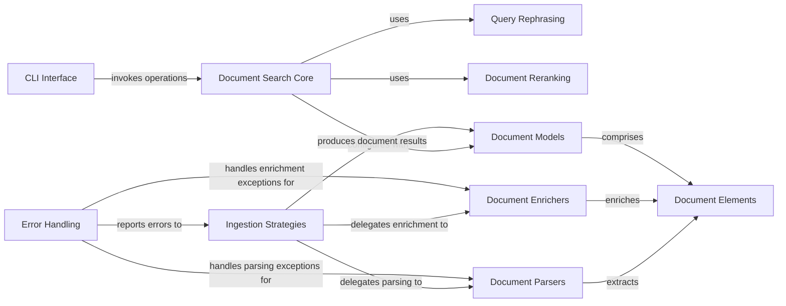

## Component Details

The Document Processing System is the core component responsible for managing the entire lifecycle of documents, from ingestion and parsing to enrichment, indexing, and retrieval. It orchestrates document search operations, enhances search results through query rephrasing and document reranking, and defines the fundamental data structures for documents and their constituent elements. The system also provides a command-line interface for user interaction and robust error handling for various processing stages.

### Document Search Core
The primary component responsible for orchestrating document search operations, managing the end-to-end process of ingesting documents (parsing, enriching, indexing), and improving search results by rephrasing user queries and reranking retrieved documents. It also defines the structured representation of documents and their constituent elements.

**Related Classes/Methods**:

- <a href="https://github.com/deepsense-ai/ragbits/blob/master/packages/ragbits-document-search/src/ragbits/document_search/_main.py#L62-L273" target="_blank" rel="noopener noreferrer">`ragbits.packages.ragbits-document-search.src.ragbits.document_search._main.DocumentSearch` (62:273)</a>

### CLI Interface
This component handles the command-line interface for document search, allowing users to initiate search and ingest operations.

**Related Classes/Methods**:

- <a href="https://github.com/deepsense-ai/ragbits/blob/master/packages/ragbits-document-search/src/ragbits/document_search/cli.py#L69-L92" target="_blank" rel="noopener noreferrer">`ragbits.packages.ragbits-document-search.src.ragbits.document_search.cli:search` (69:92)</a>
- <a href="https://github.com/deepsense-ai/ragbits/blob/master/packages/ragbits-document-search/src/ragbits/document_search/cli.py#L96-L109" target="_blank" rel="noopener noreferrer">`ragbits.packages.ragbits-document-search.src.ragbits.document_search.cli:ingest` (96:109)</a>

### Query Rephrasing
This component is responsible for rephrasing user queries using LLM models to improve retrieval accuracy.

**Related Classes/Methods**:

- <a href="https://github.com/deepsense-ai/ragbits/blob/master/packages/ragbits-document-search/src/ragbits/document_search/retrieval/rephrasers/llm.py#L69-L141" target="_blank" rel="noopener noreferrer">`ragbits.packages.ragbits-document-search.src.ragbits.document_search.retrieval.rephrasers.llm.LLMQueryRephraser` (69:141)</a>
- <a href="https://github.com/deepsense-ai/ragbits/blob/master/packages/ragbits-document-search/src/ragbits/document_search/retrieval/rephrasers/llm.py#L24-L53" target="_blank" rel="noopener noreferrer">`ragbits.packages.ragbits-document-search.src.ragbits.document_search.retrieval.rephrasers.llm.LLMQueryRephraserPrompt` (24:53)</a>
- <a href="https://github.com/deepsense-ai/ragbits/blob/master/packages/ragbits-document-search/src/ragbits/document_search/retrieval/rephrasers/llm.py#L15-L21" target="_blank" rel="noopener noreferrer">`ragbits.packages.ragbits-document-search.src.ragbits.document_search.retrieval.rephrasers.llm.LLMQueryRephraserPromptInput` (15:21)</a>
- <a href="https://github.com/deepsense-ai/ragbits/blob/master/packages/ragbits-document-search/src/ragbits/document_search/retrieval/rephrasers/base.py#L19-L39" target="_blank" rel="noopener noreferrer">`ragbits.packages.ragbits-document-search.src.ragbits.document_search.retrieval.rephrasers.base.QueryRephraser` (19:39)</a>

### Document Reranking
This component reranks retrieved documents based on their relevance to the query, often utilizing LLM models for scoring.

**Related Classes/Methods**:

- <a href="https://github.com/deepsense-ai/ragbits/blob/master/packages/ragbits-document-search/src/ragbits/document_search/retrieval/rerankers/llm.py#L57-L177" target="_blank" rel="noopener noreferrer">`ragbits.packages.ragbits-document-search.src.ragbits.document_search.retrieval.rerankers.llm.LLMReranker` (57:177)</a>
- <a href="https://github.com/deepsense-ai/ragbits/blob/master/packages/ragbits-document-search/src/ragbits/document_search/retrieval/rerankers/llm.py#L27-L40" target="_blank" rel="noopener noreferrer">`ragbits.packages.ragbits-document-search.src.ragbits.document_search.retrieval.rerankers.llm.RerankerPrompt` (27:40)</a>
- <a href="https://github.com/deepsense-ai/ragbits/blob/master/packages/ragbits-document-search/src/ragbits/document_search/retrieval/rerankers/llm.py#L18-L24" target="_blank" rel="noopener noreferrer">`ragbits.packages.ragbits-document-search.src.ragbits.document_search.retrieval.rerankers.llm.RerankerInput` (18:24)</a>
- <a href="https://github.com/deepsense-ai/ragbits/blob/master/packages/ragbits-document-search/src/ragbits/document_search/retrieval/rerankers/base.py#L30-L56" target="_blank" rel="noopener noreferrer">`ragbits.packages.ragbits-document-search.src.ragbits.document_search.retrieval.rerankers.base.Reranker` (30:56)</a>

### Ingestion Strategies
This component defines and implements various strategies for ingesting documents, including batched processing.

**Related Classes/Methods**:

- <a href="https://github.com/deepsense-ai/ragbits/blob/master/packages/ragbits-document-search/src/ragbits/document_search/ingestion/strategies/batched.py#L30-L261" target="_blank" rel="noopener noreferrer">`ragbits.packages.ragbits-document-search.src.ragbits.document_search.ingestion.strategies.batched.BatchedIngestStrategy` (30:261)</a>
- <a href="https://github.com/deepsense-ai/ragbits/blob/master/packages/ragbits-document-search/src/ragbits/document_search/ingestion/strategies/batched.py#L21-L27" target="_blank" rel="noopener noreferrer">`ragbits.packages.ragbits-document-search.src.ragbits.document_search.ingestion.strategies.batched.IngestTaskResult` (21:27)</a>
- <a href="https://github.com/deepsense-ai/ragbits/blob/master/packages/ragbits-document-search/src/ragbits/document_search/ingestion/strategies/base.py#L79-L268" target="_blank" rel="noopener noreferrer">`ragbits.packages.ragbits-document-search.src.ragbits.document_search.ingestion.strategies.base.IngestStrategy` (79:268)</a>

### Document Parsers
This component provides functionalities for parsing various document types, including unstructured, text, and image documents.

**Related Classes/Methods**:

- <a href="https://github.com/deepsense-ai/ragbits/blob/master/packages/ragbits-document-search/src/ragbits/document_search/ingestion/parsers/unstructured.py#L35-L248" target="_blank" rel="noopener noreferrer">`ragbits.packages.ragbits-document-search.src.ragbits.document_search.ingestion.parsers.unstructured.UnstructuredDocumentParser` (35:248)</a>
- <a href="https://github.com/deepsense-ai/ragbits/blob/master/packages/ragbits-document-search/src/ragbits/document_search/ingestion/parsers/docling.py#L20-L156" target="_blank" rel="noopener noreferrer">`ragbits.packages.ragbits-document-search.src.ragbits.document_search.ingestion.parsers.docling.DoclingDocumentParser` (20:156)</a>
- <a href="https://github.com/deepsense-ai/ragbits/blob/master/packages/ragbits-document-search/src/ragbits/document_search/ingestion/parsers/base.py#L52-L73" target="_blank" rel="noopener noreferrer">`ragbits.packages.ragbits-document-search.src.ragbits.document_search.ingestion.parsers.base.TextDocumentParser` (52:73)</a>
- <a href="https://github.com/deepsense-ai/ragbits/blob/master/packages/ragbits-document-search/src/ragbits/document_search/ingestion/parsers/base.py#L76-L97" target="_blank" rel="noopener noreferrer">`ragbits.packages.ragbits-document-search.src.ragbits.document_search.ingestion.parsers.base.ImageDocumentParser` (76:97)</a>

### Document Enrichers
This component enriches document elements, such as images, with additional information.

**Related Classes/Methods**:

- <a href="https://github.com/deepsense-ai/ragbits/blob/master/packages/ragbits-document-search/src/ragbits/document_search/ingestion/enrichers/image.py#L36-L107" target="_blank" rel="noopener noreferrer">`ragbits.packages.ragbits-document-search.src.ragbits.document_search.ingestion.enrichers.image.ImageElementEnricher` (36:107)</a>

### Document Models
This component defines the data structures for documents and their metadata, including methods for creating and inferring document types.

**Related Classes/Methods**:

- <a href="https://github.com/deepsense-ai/ragbits/blob/master/packages/ragbits-document-search/src/ragbits/document_search/documents/document.py#L52-L161" target="_blank" rel="noopener noreferrer">`ragbits.packages.ragbits-document-search.src.ragbits.document_search.documents.document.DocumentMeta` (52:161)</a>
- <a href="https://github.com/deepsense-ai/ragbits/blob/master/packages/ragbits-document-search/src/ragbits/document_search/documents/document.py#L164-L187" target="_blank" rel="noopener noreferrer">`ragbits.packages.ragbits-document-search.src.ragbits.document_search.documents.document.Document` (164:187)</a>
- <a href="https://github.com/deepsense-ai/ragbits/blob/master/packages/ragbits-document-search/src/ragbits/document_search/documents/document.py#L190-L203" target="_blank" rel="noopener noreferrer">`ragbits.packages.ragbits-document-search.src.ragbits.document_search.documents.document.TextDocument` (190:203)</a>
- <a href="https://github.com/deepsense-ai/ragbits/blob/master/packages/ragbits-document-search/src/ragbits/document_search/documents/document.py#L14-L49" target="_blank" rel="noopener noreferrer">`ragbits.packages.ragbits-document-search.src.ragbits.document_search.documents.document.DocumentType` (14:49)</a>

### Document Elements
This component defines the data structures for elements within documents, such as text and image elements, and provides methods for managing their identifiers.

**Related Classes/Methods**:

- <a href="https://github.com/deepsense-ai/ragbits/blob/master/packages/ragbits-document-search/src/ragbits/document_search/documents/element.py#L22-L137" target="_blank" rel="noopener noreferrer">`ragbits.packages.ragbits-document-search.src.ragbits.document_search.documents.element.Element` (22:137)</a>
- <a href="https://github.com/deepsense-ai/ragbits/blob/master/packages/ragbits-document-search/src/ragbits/document_search/documents/element.py#L160-L208" target="_blank" rel="noopener noreferrer">`ragbits.packages.ragbits-document-search.src.ragbits.document_search.documents.element.ImageElement` (160:208)</a>

### Error Handling
This component provides a centralized mechanism for handling various errors and exceptions across the document search subsystem.

**Related Classes/Methods**:

- <a href="https://github.com/deepsense-ai/ragbits/blob/master/packages/ragbits-document-search/src/ragbits/document_search/ingestion/strategies/base.py#L25-L46" target="_blank" rel="noopener noreferrer">`ragbits.packages.ragbits-document-search.src.ragbits.document_search.ingestion.strategies.base.IngestError` (25:46)</a>
- <a href="https://github.com/deepsense-ai/ragbits/blob/master/packages/ragbits-document-search/src/ragbits/document_search/ingestion/parsers/exceptions.py#L4-L11" target="_blank" rel="noopener noreferrer">`ragbits.packages.ragbits-document-search.src.ragbits.document_search.ingestion.parsers.exceptions.ParserError` (4:11)</a>
- <a href="https://github.com/deepsense-ai/ragbits/blob/master/packages/ragbits-document-search/src/ragbits/document_search/ingestion/parsers/exceptions.py#L19-L21" target="_blank" rel="noopener noreferrer">`ragbits.packages.ragbits-document-search.src.ragbits.document_search.ingestion.parsers.exceptions.ParserNotFoundError:__init__` (19:21)</a>
- <a href="https://github.com/deepsense-ai/ragbits/blob/master/packages/ragbits-document-search/src/ragbits/document_search/ingestion/parsers/exceptions.py#L29-L32" target="_blank" rel="noopener noreferrer">`ragbits.packages.ragbits-document-search.src.ragbits.document_search.ingestion.parsers.exceptions.ParserDocumentNotSupportedError:__init__` (29:32)</a>
- <a href="https://github.com/deepsense-ai/ragbits/blob/master/packages/ragbits-document-search/src/ragbits/document_search/ingestion/enrichers/exceptions.py#L4-L11" target="_blank" rel="noopener noreferrer">`ragbits.packages.ragbits-document-search.src.ragbits.document_search.ingestion.enrichers.exceptions.EnricherError` (4:11)</a>
- <a href="https://github.com/deepsense-ai/ragbits/blob/master/packages/ragbits-document-search/src/ragbits/document_search/ingestion/enrichers/exceptions.py#L19-L21" target="_blank" rel="noopener noreferrer">`ragbits.packages.ragbits-document-search.src.ragbits.document_search.ingestion.enrichers.exceptions.EnricherNotFoundError:__init__` (19:21)</a>
- <a href="https://github.com/deepsense-ai/ragbits/blob/master/packages/ragbits-document-search/src/ragbits/document_search/ingestion/enrichers/exceptions.py#L29-L32" target="_blank" rel="noopener noreferrer">`ragbits.packages.ragbits-document-search.src.ragbits.document_search.ingestion.enrichers.exceptions.EnricherElementNotSupportedError:__init__` (29:32)</a>

### [FAQ](https://github.com/CodeBoarding/GeneratedOnBoardings/tree/main?tab=readme-ov-file#faq)