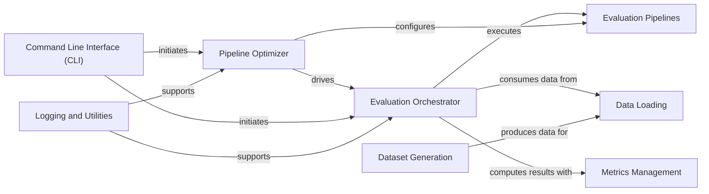

## Component Details

The Evaluation System is the overarching framework for evaluating RAG systems. Its main flow involves the Evaluation Orchestrator executing various Evaluation Pipelines, consuming data provided by the Data Loading component, and computing results using the Metrics Management component. The Pipeline Optimizer can drive the Evaluation Orchestrator to optimize pipeline parameters. Dataset Generation produces data that can be loaded by the Data Loading component. The Command Line Interface (CLI) serves as the primary entry point for users to initiate evaluations, optimizations, and dataset generation. Logging and Utilities support both the Evaluation Orchestrator and Pipeline Optimizer by handling result logging and other common tasks.

### Evaluation Orchestrator
This component is responsible for coordinating the entire evaluation process. It takes an evaluation pipeline, a dataloader, and a set of metrics, then executes the pipeline, handles errors, and computes overall performance and metrics.

**Related Classes/Methods**:

- <a href="https://github.com/deepsense-ai/ragbits/blob/master/packages/ragbits-evaluate/src/ragbits/evaluate/evaluator.py#L63-L224" target="_blank" rel="noopener noreferrer">`ragbits.evaluate.evaluator.Evaluator` (63:224)</a>
- <a href="https://github.com/deepsense-ai/ragbits/blob/master/packages/ragbits-evaluate/src/ragbits/evaluate/evaluator.py#L33-L41" target="_blank" rel="noopener noreferrer">`ragbits.evaluate.evaluator.EvaluatorResult` (33:41)</a>
- <a href="https://github.com/deepsense-ai/ragbits/blob/master/packages/ragbits-evaluate/src/ragbits/evaluate/evaluator.py#L22-L29" target="_blank" rel="noopener noreferrer">`ragbits.evaluate.evaluator.EvaluationTimePerf` (22:29)</a>

### Pipeline Optimizer
This component focuses on optimizing the configuration of evaluation pipelines. It uses an objective function to iteratively adjust pipeline parameters, aiming to maximize or minimize a defined metric, and manages trials using Optuna.

**Related Classes/Methods**:

- <a href="https://github.com/deepsense-ai/ragbits/blob/master/packages/ragbits-evaluate/src/ragbits/evaluate/optimizer.py#L28-L210" target="_blank" rel="noopener noreferrer">`ragbits.evaluate.optimizer.Optimizer` (28:210)</a>

### Evaluation Pipelines
This component defines the various types of evaluation workflows, such as question answering or document search. Each pipeline encapsulates the logic for processing input data and generating specific evaluation results.

**Related Classes/Methods**:

- <a href="https://github.com/deepsense-ai/ragbits/blob/master/packages/ragbits-evaluate/src/ragbits/evaluate/pipelines/question_answer.py#L40-L96" target="_blank" rel="noopener noreferrer">`ragbits.evaluate.pipelines.question_answer.QuestionAnswerPipeline` (40:96)</a>
- <a href="https://github.com/deepsense-ai/ragbits/blob/master/packages/ragbits-evaluate/src/ragbits/evaluate/pipelines/document_search.py#L38-L106" target="_blank" rel="noopener noreferrer">`ragbits.evaluate.pipelines.document_search.DocumentSearchPipeline` (38:106)</a>
- <a href="https://github.com/deepsense-ai/ragbits/blob/master/packages/ragbits-evaluate/src/ragbits/evaluate/pipelines/base.py#L30-L64" target="_blank" rel="noopener noreferrer">`ragbits.evaluate.pipelines.base.EvaluationPipeline` (30:64)</a>

### Dataset Generation
This component is responsible for programmatically creating and preparing datasets for evaluation. It can involve multiple steps, including corpus generation and filtering, often leveraging language models.

**Related Classes/Methods**:

- <a href="https://github.com/deepsense-ai/ragbits/blob/master/packages/ragbits-evaluate/src/ragbits/evaluate/dataset_generator/pipeline.py#L88-L141" target="_blank" rel="noopener noreferrer">`ragbits.evaluate.dataset_generator.pipeline.DatasetGenerationPipeline` (88:141)</a>
- <a href="https://github.com/deepsense-ai/ragbits/blob/master/packages/ragbits-evaluate/src/ragbits/evaluate/dataset_generator/pipeline.py#L45-L85" target="_blank" rel="noopener noreferrer">`ragbits.evaluate.dataset_generator.pipeline.DatasetGenerationPipelineConfig` (45:85)</a>
- <a href="https://github.com/deepsense-ai/ragbits/blob/master/packages/ragbits-evaluate/src/ragbits/evaluate/dataset_generator/pipeline.py#L28-L42" target="_blank" rel="noopener noreferrer">`ragbits.evaluate.dataset_generator.pipeline.TaskConfig` (28:42)</a>
- <a href="https://github.com/deepsense-ai/ragbits/blob/master/packages/ragbits-evaluate/src/ragbits/evaluate/dataset_generator/pipeline.py#L15-L25" target="_blank" rel="noopener noreferrer">`ragbits.evaluate.dataset_generator.pipeline.LLMConfigForTask` (15:25)</a>
- <a href="https://github.com/deepsense-ai/ragbits/blob/master/packages/ragbits-evaluate/src/ragbits/evaluate/dataset_generator/tasks/corpus_generation.py#L15-L67" target="_blank" rel="noopener noreferrer">`ragbits.evaluate.dataset_generator.tasks.corpus_generation.CorpusGenerationStep` (15:67)</a>
- <a href="https://github.com/deepsense-ai/ragbits/blob/master/packages/ragbits-evaluate/src/ragbits/evaluate/dataset_generator/tasks/filter/dont_know.py#L14-L34" target="_blank" rel="noopener noreferrer">`ragbits.evaluate.dataset_generator.tasks.filter.dont_know.DontKnowFilter` (14:34)</a>

### Metrics Management
This component provides a framework for defining, collecting, and computing various performance metrics from evaluation results. It allows for the aggregation and weighting of individual metrics to derive an overall score.

**Related Classes/Methods**:

- <a href="https://github.com/deepsense-ai/ragbits/blob/master/packages/ragbits-evaluate/src/ragbits/evaluate/metrics/question_answer.py#L45-L104" target="_blank" rel="noopener noreferrer">`ragbits.evaluate.metrics.question_answer.QuestionAnswerMetric` (45:104)</a>
- <a href="https://github.com/deepsense-ai/ragbits/blob/master/packages/ragbits-evaluate/src/ragbits/evaluate/metrics/question_answer.py#L25-L42" target="_blank" rel="noopener noreferrer">`ragbits.evaluate.metrics.question_answer._MetricLMM` (25:42)</a>
- <a href="https://github.com/deepsense-ai/ragbits/blob/master/packages/ragbits-evaluate/src/ragbits/evaluate/metrics/document_search.py#L12-L72" target="_blank" rel="noopener noreferrer">`ragbits.evaluate.metrics.document_search.DocumentSearchMetric` (12:72)</a>
- <a href="https://github.com/deepsense-ai/ragbits/blob/master/packages/ragbits-evaluate/src/ragbits/evaluate/metrics/base.py#L44-L89" target="_blank" rel="noopener noreferrer">`ragbits.evaluate.metrics.base.MetricSet` (44:89)</a>
- <a href="https://github.com/deepsense-ai/ragbits/blob/master/packages/ragbits-evaluate/src/ragbits/evaluate/metrics/base.py#L13-L41" target="_blank" rel="noopener noreferrer">`ragbits.evaluate.metrics.base.Metric` (13:41)</a>

### Data Loading
This component handles the ingestion of raw data from various sources and transforms it into a structured format suitable for evaluation pipelines. It ensures data integrity and adherence to required schemas.

**Related Classes/Methods**:

- <a href="https://github.com/deepsense-ai/ragbits/blob/master/packages/ragbits-evaluate/src/ragbits/evaluate/dataloaders/base.py#L25-L95" target="_blank" rel="noopener noreferrer">`ragbits.evaluate.dataloaders.base.DataLoader` (25:95)</a>
- <a href="https://github.com/deepsense-ai/ragbits/blob/master/packages/ragbits-evaluate/src/ragbits/evaluate/dataloaders/exceptions.py#L4-L12" target="_blank" rel="noopener noreferrer">`ragbits.evaluate.dataloaders.exceptions.DataLoaderError` (4:12)</a>
- <a href="https://github.com/deepsense-ai/ragbits/blob/master/packages/ragbits-evaluate/src/ragbits/evaluate/dataloaders/exceptions.py#L20-L25" target="_blank" rel="noopener noreferrer">`ragbits.evaluate.dataloaders.exceptions.DataLoaderIncorrectFormatDataError:__init__` (20:25)</a>

### Logging and Utilities
This component provides a collection of helper functions for common tasks such as logging evaluation and optimization results to local files or external platforms like Neptune, and handling configuration.

**Related Classes/Methods**:

- <a href="https://github.com/deepsense-ai/ragbits/blob/master/packages/ragbits-evaluate/src/ragbits/evaluate/utils.py#L20-L50" target="_blank" rel="noopener noreferrer">`ragbits.evaluate.utils:log_evaluation_to_file` (20:50)</a>
- <a href="https://github.com/deepsense-ai/ragbits/blob/master/packages/ragbits-evaluate/src/ragbits/evaluate/utils.py#L104-L129" target="_blank" rel="noopener noreferrer">`ragbits.evaluate.utils:log_optimization_to_file` (104:129)</a>
- <a href="https://github.com/deepsense-ai/ragbits/blob/master/packages/ragbits-evaluate/src/ragbits/evaluate/utils.py#L132-L149" target="_blank" rel="noopener noreferrer">`ragbits.evaluate.utils._save_json` (132:149)</a>
- `ragbits.evaluate.factories:basic_document_search_factory` (full file reference)

### Command Line Interface (CLI)
This component provides a user-friendly command-line interface for interacting with the `ragbits-evaluate` subsystem, enabling users to trigger evaluations, optimizations, and dataset generation processes.

**Related Classes/Methods**:

- `ragbits.evaluate.cli` (full file reference)

### [FAQ](https://github.com/CodeBoarding/GeneratedOnBoardings/tree/main?tab=readme-ov-file#faq)